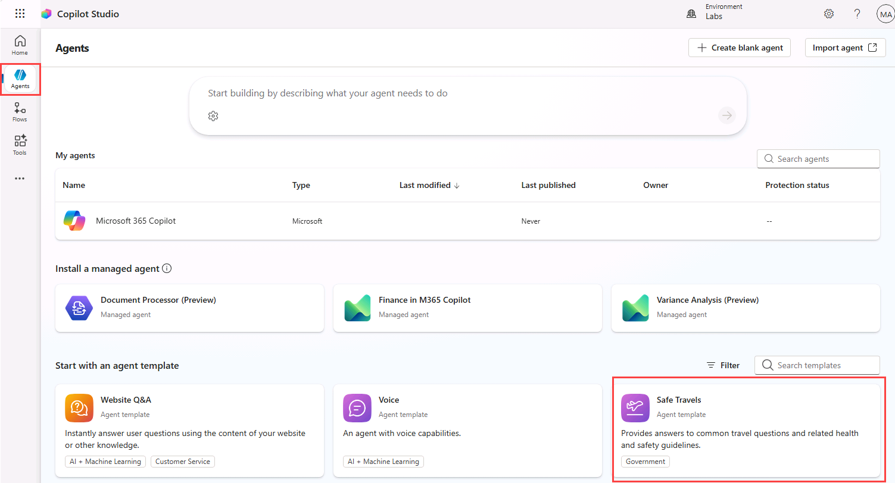
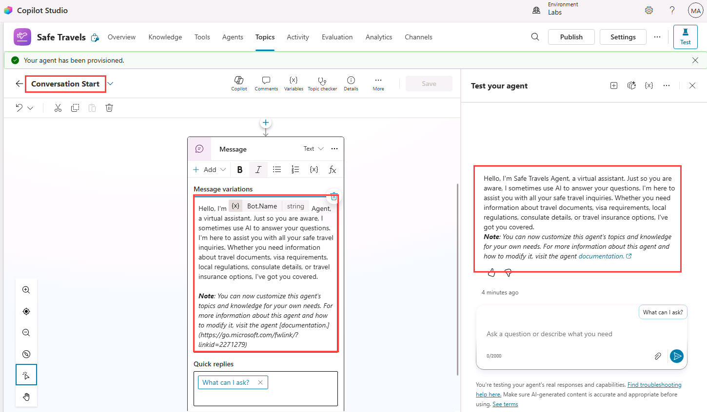
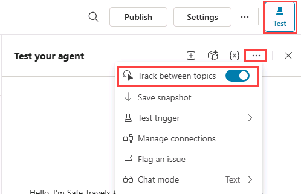
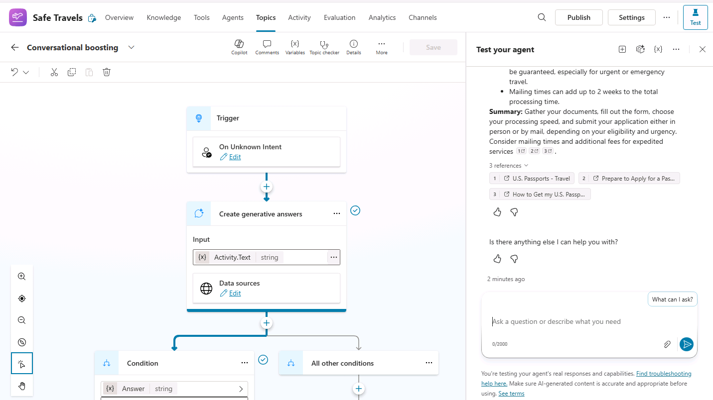
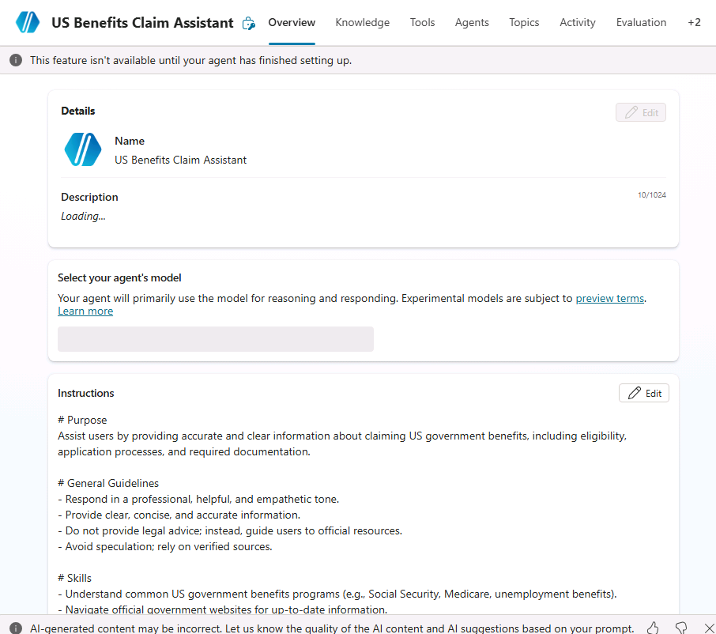
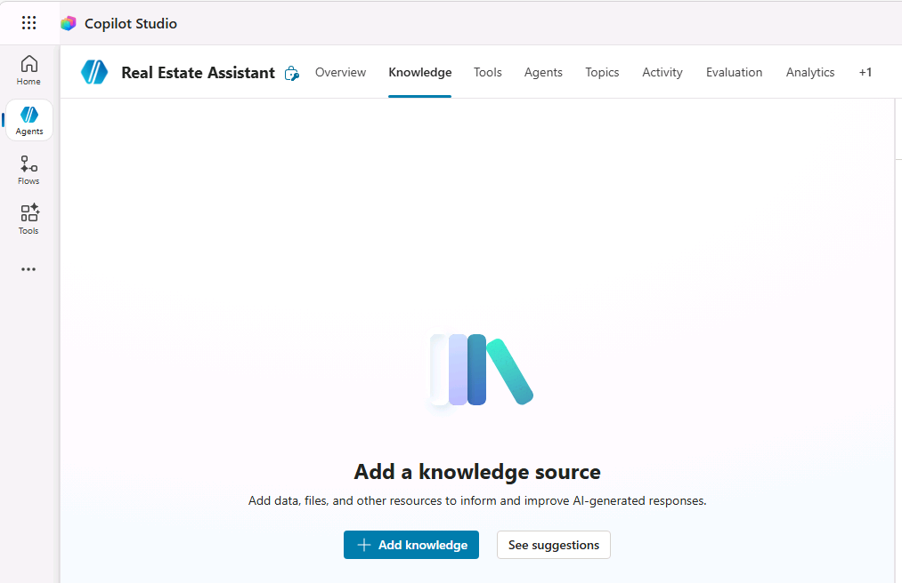
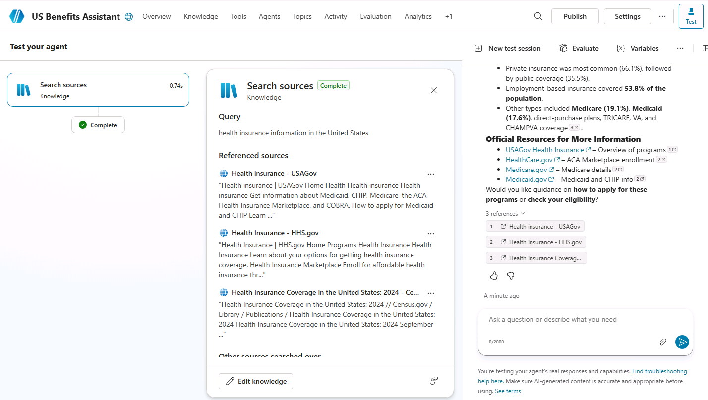
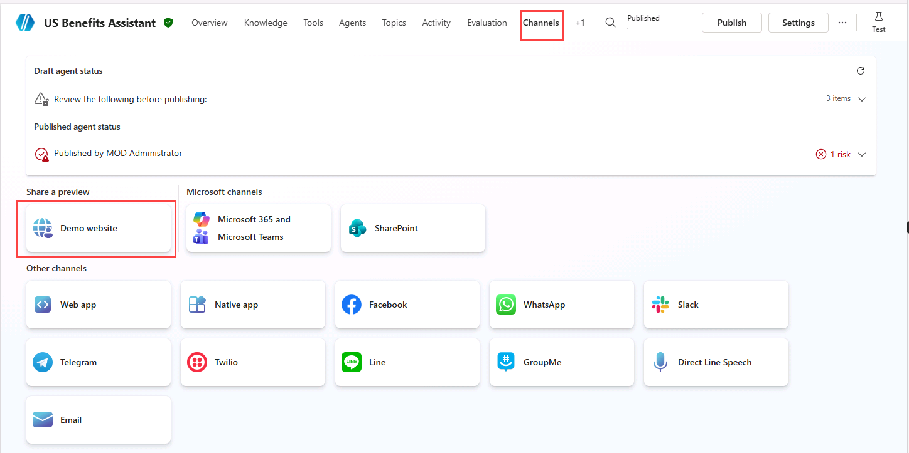

---
lab:
  title: Create agents with Copilot Studio
  module: Create agents in Microsoft Copilot Studio
  description: In this exercise, you will access the Microsoft Copilot Studio portal, select the appropriate environment, and create a new agent.
  duration: 45 minutes
  level: 200
  islab: true
  primarytopics:
    - Microsoft Copilot
    - Microsoft Copilot Studio
---

# Create agents with Copilot Studio

## Scenario

In this exercise, you will:

- Create an agent from a template
- Create and name an agent
- Define how the agent should behave using instructions
- Add a public website as a knowledge source
- Publish the agent and test with the Demo website

This exercise will take approximately **45** minutes to complete.

## What you will learn

- How to create an agent from a template
- How to create an agent using natural language
- How agent instructions influence generative behavior
- How Generative AI answers work with configured knowledge
- How to publish an agent to Microsoft Teams

## High-level lab steps

- Create an agent from a template
- Create an agent using Copilot
- Define agent behavior using instructions
- Add Generative AI knowledge sources
- Publish the agent
  
## Prerequisites

- Have a Microsoft Entra Id account
- Have a Copilot Studio license or have signed up for a [free trial](https://go.microsoft.com/fwlink/p/?linkid=2252605).

## Key concept: Agent components and behavior

When generative AI is enabled, the agent uses instructions, knowledge, and tools to answer questions dynamically.

## Exercise 1 - Create a Power Platform environment

### Task 1.1 - Power Platform Admin Center

Before you start the lab exercises, you must create a development environment for you to work in.

1. Open a web browser, navigate to `https://admin.powerplatform.microsoft.com/manage/environments`, and sign in using your credentials for this exercise.

1. If prompted, choose the option to stay signed in.

1. Close any pop-up messages that are displayed.

### Task 1.2 - Add Dataverse to the default environment

1. Select the ellipses (**...**) for the **Contoso (default)** environment and select **Add Dataverse**.

   

1. Leave all of the default settings and select **Add**.

### Task 1.3 - Create a new environment

1. In the **Environments** page, select **+ New** to create a new environment with the following settings:

   - **Type**: Developer
   - **Region**: ***default** region*
   - **Name**: *Your name*
   - **Environment group**: *None*
   - **Make this a Managed Environment**: *No*
   - **Get new features early**: *No*
   - **Create on behalf**: *No*

   

1. Select **Next** and in the **Add Dataverse** section:

   - **Language**: *English*
   - **Currency**: *USD ($)*
   - **Deploy sample apps and data**: *No*

1. Select  **Save** and wait until the state of your environment is **Ready** (you can use the **Refresh** button to update the display).

   

1. In a new browser tab, navigate to `https://copilotstudio.microsoft.com/` and sign in if prompted.

1. Select **Get Started**, if prompted leaving the default country/region.

1. Skip any welcome messages.

1. In the upper right corner of the page, switch environments by using the Environment Selector and select the environment you created above from the list.

   

### Task 1.4 - Create a solution

1. In the left navigation pane select the ellipses (**...**), and select **Solutions**.

1. You should see several solutions including the *Default Solution* and the *Common Data Services Default Solution*.

   

1. Select **+ New solution**.

1. In the **Display name** text box, enter **`Lab Exercises`**

1. Verify that **Name** is automatically populated.

1. Select **+ New publisher** below the **Publisher** drop-down.

1. For **Display name**, enter `Fabrikam`

1. For **Name**, enter `fabrikam`

1. For **Prefix**, enter `fab`

   

1. Select **Save**.

1. Verify that **Fabrikam (fabrikam)** is selected in the **Publisher** drop-down.

1. Select **Set as your preferred solution**.

   

1. Select **Create**.

1. Close the **Solutions** browser tab.

1. Refresh the **Copilot Studio** page.

## Exercise 2 - Create an agent from a template

In this exercise, you will create an agent by using a template to create the agent, and then test the agent.

### Task 2.1 – Create an agent from the Safe Travels template

1. In the **Copilot Studio** home page `https://copilotstudio.microsoft.com/`, select **Agents** in the left-hand navigation.

1. Under **Start with an agent template** section, select the **Safe Travels** template.

   

1. In the upper-right of the page, select  the ellipses (**...**) and select **Edit advanced settings**.

1. Validate that the selected *Solution* is **Lab Exercises** and the *Schema name* prefix is **fab** and select **Cancel**.

1. In the upper-right of the page, select **Create**.

1. In the **Overview** tab, review the name, description, and agent instructions.

1. Select the **Knowledge** tab and review the public website that has been added as a knowledge source.

1. In the upper-right of the page, select the **Settings** button.

1. Note that **Orchestration** is set to **No - Use classic orchestration, limiting responses to the content and behavior defined in your agent's topics**.

1. In the upper-right of the Settings page, select **X** to close settings.

1. Select the **Topics** tab and select the **System** filter.

1. Select the **Conversational Start** topic. Review the contents of the **Message** node. Note that the contents of the message are displayed in the Test panel.

   

1. In the drop-down in the upper-left of the page that is showing Conversation Start, select the custom **What can I ask** topic.

### Task 2.2 – Test the agent

1. If the **Test panel** is not visible, select the **Test** icon in the upper-right of the page.

1. In the **Test** panel, select the ellipses (**...**) next to the variables **{x}** icon, and toggle **Track between topics** to **On**.

   

1. Enter the following prompt:

   ```prompt
   Hello
   ```

   The **Greeting** topic should be selected and the response is provided from the message node in the Greeting topic.

1. At the top of the Test panel, select the **Start new test session** icon **+**.

1. Enter the following prompt:

   ```prompt
   What can I ask?
   ```

   The **What Can I Ask** topic should be selected, and three options should be provided in the response.

1. Select the **How do I get a passport?** option.

   The **Conversational boosting** topic should be selected, and the response is provided from the public website knowledge source with references listed.

   

1. Enter the following prompt:

   ```prompt
   What is Copilot Studio?
   ```

   The **Fallback** topic should be selected, and agent should ask you to try rephrasing.

1. Repeat the same prompt twice more.

   The agent should redirect to the **Escalate** topic.

1. Select **Agents** in the left-hand navigation. The **Safe Travels** agent should be listed.

## Exercise 3 - Create an agent using Copilot

In this exercise, you will create a new agent using natural language to answer questions about government benefits.

### Task 3.1 – Create an agent to answer questions about government benefits

1. In the **Copilot Studio** home page `https://copilotstudio.microsoft.com/`.

1. Make sure that you are in the environment that you created.

1. Select **Agents** in the left-hand navigation.

1. In the bottom-left of the *Start building by describing what you agent needs to do* prompt window, select the **Agent Settings** icon, which is displayed as a **Cog** image.

   

1. Leave **English** set as the primary language for the agent.

1. Select the **Lab Exercises** *solution*.

1. Enter `govbenefitsagent` for the *Schema name*.

1. Select **Update**.

1. In the *Start building by describing what you agent needs to do* prompt, Enter the following prompt:

   ```prompt
   You are an agent that assists with questions related claiming US government benefits.
   ```

1. Select the **Send** icon.

   Your agent will be created.

   

   Once you agent has been provisioned, you may proceed with configuring your agent.

### Task 3.2 – Configure the Overview tab

1. Select the **Overview** tab for the agent.

1. In the **Details** section, select **Edit**.

1. In the **Name** text box, enter **`US Benefits Assistant`**.

1. In the **Description** text box, enter **`Helps users with questions related to US government benefit programs`**.

1. Select **Save**.

1. In *Select your agent's model*, select **GPT-5 Auto**.

1. In the **Instructions** section, select **Edit**.

1. Under *# General Guidelines* in the agent instructions, add the following:

   ```prompt
   - Do not provide legal advice.
   ```

1. Select **Save**.

   > **Note**: Agent instructions guide how the agent should behave, but they do not strictly enforce behavior. In later labs, you will learn how to change behavior by using topics, knowledge, and generative answers with restricted knowledge sources.

1. In the **Suggested prompts** section, select **Add suggested prompts**.

1. For *Title*, enter `Health`.

1. For *Prompt*, enter `What health assistance programs are available for me?`.

1. Select **Save**.

### Task 3.3 – Add a public website as a knowledge source

1. Select the **Knowledge** tab.

   

1. Select **+ Add knowledge**.

1. Select **Public websites**.

1. In the **Public website link** text box, enter **`https://www.usa.gov/benefits`**. This official government public website has details on benefits programs that could be useful for your agent.

1. Select **Add**.

1. For *Name*, enter `Government benefits`.

1. For *Description*, enter `This knowledge source contains information on government programs that may help you pay for food, housing, health care, and other basic living expenses.`.

1. Select **Add to agent**.

### Task 3.4 – Agent settings

1. In the upper-right of the page, select the **Settings** button.

1. Note that **Orchestration** is set to **Yes - Responses will be dynamic, using available tools and knowledge as appropriate**.

1. In the Responses section, enter `

   ```prompt
   - For process related answer respond with a single sentence.
   - For data-related answers respond with bullet points.
   ```

1. In the **Knowledge** section, set **Allow ungrounded responses** to **Off**.

1. In the **Knowledge** section, set **Use information from the Web** to **On**.

1. Select **Save**

1. In the left-hand side of the **Settings** page, select **Security**.

1. Select **Authentication**.

1. Select **No authentication**.

1. Select **Save** and select **Save** again.

1. In the upper-right of the Settings page, select **X** to close settings.

### Task 3.5 – Test the agent

1. If the **Test panel** is not visible, select the **Test** icon in the upper-right of the page.

1. In the **Test** panel, select the ellipses (**...**) next to the variables **{x}** icon, and toggle **Show activity map when testing** to **On** and **Track between topics** to **Off**.

   

1. At the top of the Test panel, select the **Start new test session** icon **+**.

1. Enter the following prompt:

   ```prompt
   What health insurance information is available?
   ```

   The **Activity map** topic should be displayed, showing that knowledge sources were used to generate the response.

   

1. Close the Test panel.

### Task 3.6 – Publish the agent to the Demo website

1. In the action bar of the agent, select the **Publish** button and select **Publish** again.

1. Select the **Channels** tab.

   

1. Select the **Demo website** channel. This is an appropriate channel for users to test your agent.

1. In the **Demo website** pane, enter the following settings:

   - **Welcome message**: `Ask me about government benefit programs`
   - **Conversation starters**:

      ```prompt
      "Hello"
      "What programs am I entitled to?"
      "What is social security?"
      ```

1. Select **Save**.

1. Select **Open demo website**.

1. Enter the following prompt:

   ```prompt
   What welfare and assistance can I claim for?
   ```

   The response should be based on the information in the knowledge source you added, and include a citation reference.

1. Try a few more questions and view the responses from your agent. It will have limited functionality, but should be able to provide relevant answers to questions about benefits.

## Summary

In this lab, you created an agent and defined its expected behavior using instructions. You also added a public website as a knowledge source and tested your agent with questions that the knowledge source could help answer. While these instructions guide generative responses, later labs will show how to use using topics, knowledge, and tools.
