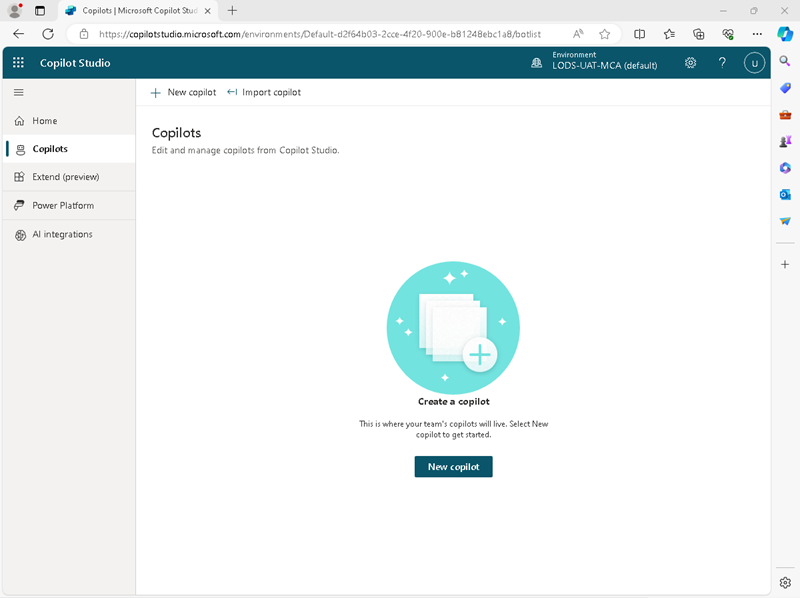
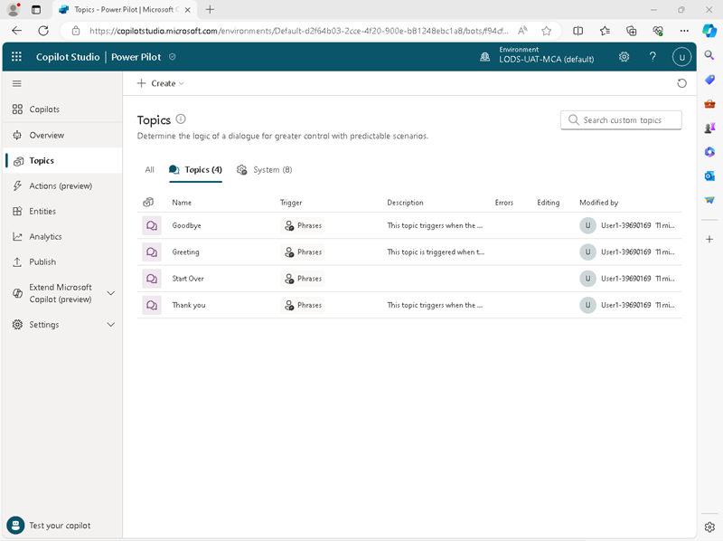
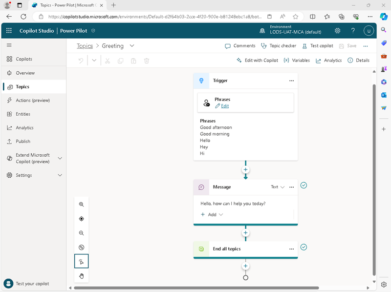
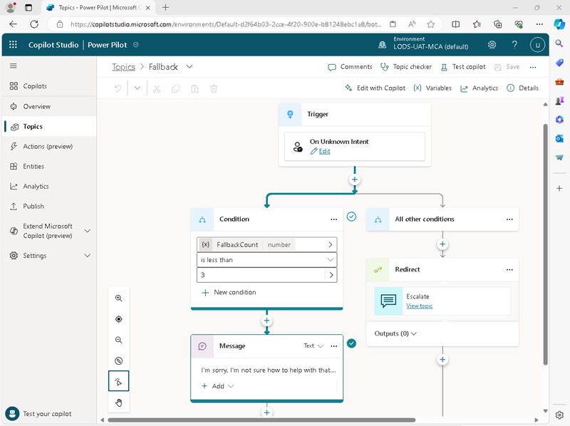
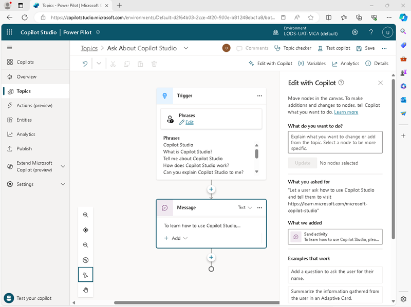
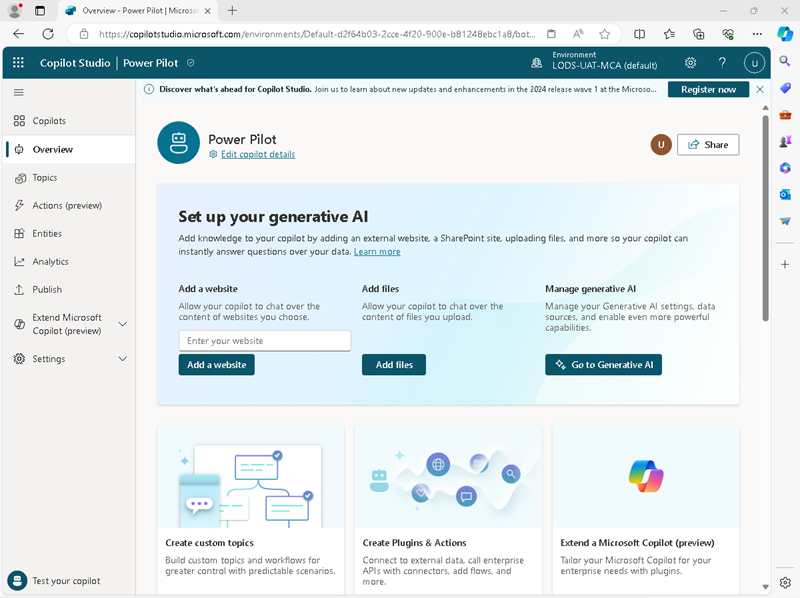
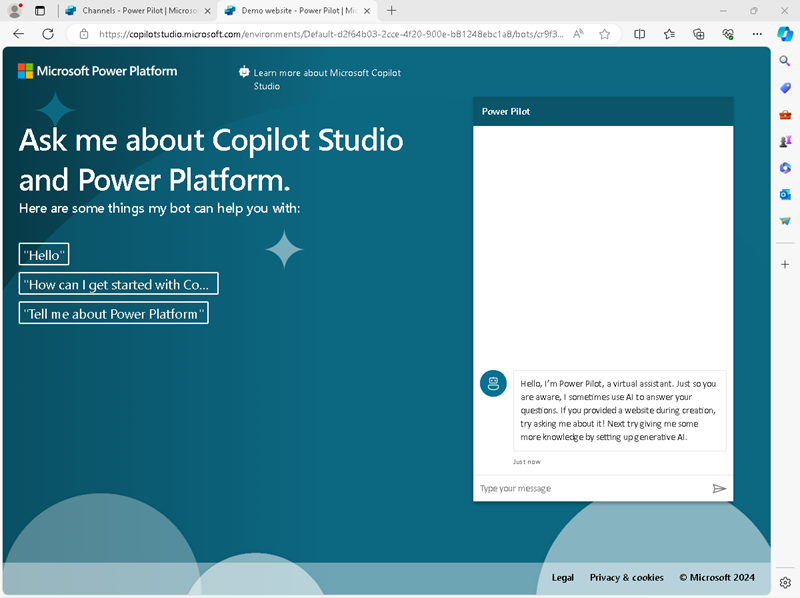

---
lab:
    title: 'Lab: Create a copilot'
---

# Create a copilot with Copilot Studio

In this exercise, you’ll use Copilot Studio to create a simple copilot that can
answer questions based on topics that you define, and use generative AI to
generate answers based on information in a web site.

This exercise will take approximately 45 minutes to complete.

   > **Note**
   > To complete this exercise, you’ll need a work or school account with
[access to Copilot
Studio](https://learn.microsoft.com/microsoft-copilot-studio/requirements-licensing-subscriptions).
If you don’t already have access to Copilot Studio, depending on the
configuration of your Microsoft 365 organization, you may be able to [create a
trial account](https://aka.ms/trypva).

## Create a copilot

Let’s start by using Copilot Studio to create a new copilot. The copilot will
initially have very limited capabilities, which you’ll extend later in the
exercise.

1.  In a web browser, navigate to [Copilot Studio](https://copilotstudio.microsoft.com/) at
    `https://copilotstudio.microsoft.com/`, signing in with your work or school
    account if prompted.

2.  Select **Start free trial** if prompted.

3.  In the navigation pane on the left, select **Copilots** to view the Copilots page, like this:

    

4.  Select the option to create a **New copilot**, and then setup a new copilot
    with the following settings:

    -   **Copilot name**: `Power Pilot`

    -   **Language**: English (United States) (en-US)

    -   **Website**: *Leave this blank (for now)*

    -   **Advanced options**:

        -   **Copilot icon**: *Choose any icon*

        -   **Lesson topics**: Unselected *(not including lesson topics will
            provide a simple starting point for your copilot)*

        -   **Solution**: Common Data Services Default Solution

        -   **Schema name**: powerPilot

5.  Create the copilot and wait for it to be ready. When it has been
    provisioned, it will look similar to this:

    

6.  In the navigation pane on the left, select **Test your copilot**.

7.  In the **Test copilot** pane, enter the message `Hello`, and view the
    response, which should be an appropriate welcome greeting.

8.  Now enter the message `How do I use Copilot Studio?`, and view the resulting
    response. This time, the response is not quite so helpful. You’ll address
    this in the next procedure.

9. Close the Test copilot pane.

## Add a topic to your copilot

The conversational capabilities of your copilot are limited by the *topics* it
understands. Topics are the basic building blocks of a copilot in Copilot
Studio, and determine how responses are triggered during chat sessions.

1.  In the navigation pane on the left, select the **Topics** page to see the
    topics defined in your copilot.
    
    

    The copilot has a few standard conversational topics on the **Topics** tab,
    and some additional system topics on the **System** tab. These topics are
    triggered by common phrases entered by the user or by specific events, such
    as errors or the intent of a user-entered phrase being unknown.

3.  On the **Topics** tab, select the **Greeting** topic to view it on the
    *authoring canvas*, which is a visual designer for creating and editing
    topics and looks similar to this:

    

    The *Greeting* topic is triggered by an input in which one of the following
    phrases is present:

    -   *Good afternoon*

    -   *Good morning*

    -   *Hello*

    -   *Hey*

    -   *Hi*

        The response to this trigger is to return a message to the user saying
        *Hello. How can I help you today?*. The inclusion of this topic in the
        copilot in the copilot explains the response you saw previously when
        testing it.

4.  Return to the **Topics** page, and on the **System** tab, select the
    **Fallback** topic to view it on the authoring canvas; where it looks like
    this:

    

    The *Fallback* topic is triggered when the user enters a phrase for which
    the intent is unknown (there’s no topic with a trigger that understands what
    the user is asking). This topic has a more complex flow than the *Greeting*
    topic: It starts by checking a condition to see if the fallback count (the
    number of times the user has attempted to ask the question) is less than 3,
    and if so it reponds with the message *I’m sorry. I’m not sure how to help
    with that. Can you try rephrasing?* (which you may remember as the reponse
    when you asked how to use Copilot Studio). If the intent is still not
    understood on the third attempt, the topic redirects the conversation flow
    to the *Escalate* topic, which can be used to enable the user to speak to a
    human operator.

5.  Return to the **Topics** page. Then in the **+ Create** menu, select
    **Topic** \> **Create from description with copilot**.

6.  In the **Create a description with copilot** dialog box, name the new topic
    `Ask About Copilot Studio` and enter the following text to tell copilot what
    the topic should do:

    `Let the user ask how to use Copilot Studio, and tell them to visit
    https://learn.microsoft.com/microsoft-copilot-studio.`

7. Select **Create**.

8.  After a short wait, a new topic named *Ask About Copilot Studio* should be
    created and opened in the authoring canvas, where it should look similar to
    this:

    

    The new topic should be triggered by phrases that ask about Copilot Studio,
    and respond with a message telling the user to visit the Copilot Studio
    documentation web page.

9.  Use the **Save** button (at the top right) to save the new topic in your
    copilot.

10.  Use the **Test copilot** button to re-open the **Test copilot** pane, and
    enter the text `How do I use Copilot Studio?`. Then view the response, which
    should be based on the topic you just added (even though the text you
    entered doesn’t match any of the phrases in the trigger exactly - it should
    be close enough semantically to trigger the topic).

   > **Note**
   > It’s worth pausing for a second here to think about what you’ve
    just done. You’ve created a copilot in Copilot Studio, in which you used a
    copilot to automatically add a topic that enables a user to ask about
    Copilot Studio! Mind-blowing stuff!

## Add Generative AI support

You can add topics for all of the inputs that you expect a user to enter; but
you can’t realistically expect to know every question that will be asked. The
*Fallback* topic at least ensures that the user is informed that their question
wasn’t understood; but it would be better if the copilot had access to some
knowledge that isn’t “hard-coded” in its topic definitions, and which could be
used to generate appropriate responses to questions.

To support this scenario, you can enable *Generative answers*; which uses a
generative AI model to try to answer a user question based on a source of data,
such as a web site.

1.  In the navigation pane on the left, select the **Overview** page. Once
    again, you can close the **Test copilot** pane to see the page more easily:

    

2.  In the **Set up your generative AI** section, under **Add a website**, enter
    `https://www.microsoft.com/en-us/power-platform` and add it to the copilot.

    After a short time, the **Generative AI** page will be displayed with the
    URL you entered added to the websites for this copilot.

4.  Scroll to the bottom of the **Generative AI** page until you see a box in
    which you can enter **Instructions** to describe how the copilot should
    behave. These instructions are used in the prompt for a generative model to
    influence the responses that are returned. Enter the following instructions:

    `Answer the user's question politely, finishing with the phrase "This
    response was generated using AI.".`

5.  Use the **Save** button (at the top left) to save the changes you have made.
    The copilot is configured to boost conversational capability with generative
    AI (which may take a few seconds).

6.  Open the **Test copilot** pane and enter the question `What are components of
    Power Platform?.`

7.  View the response, which should be based on information from the website you
    entered (with references) and end with the phrase *This response was
    generated using AI.*.

## Publish your copilot

Now that you have a working copilot, you can publish it for people to use. The
available channels through which you can deliver your copilot depend on the type
of authentication you want to use to restrict access to it. In this case, you’ll
enable access for anyone and then publish the copilot for use in a demo web
page.

1.  In the navigation pane on the left, expand **Settings** and select
    **Security**.

2.  On the **Security** page, select **Authentication**. Then select the option
    for **No authentication** and save the changes to the configuration
    (confirming that you want to enable access to the copilot for anyone).

3.  Close the **Authentication** pane. Then, in the navigation pane on the left,
    select **Publish**.

4.  On the **Publish** page, select **Publish**, and publish your copilot.
    Publishing will take a minute or so.

5.  After your copilot has been published, in the navigation pane on the left,
    in the **Settings** section, select **Channels**.

6.  Review the list of channels through which you can deliver your copilot, and
    then select **Demo website**. This is an appropriate channel for users to
    test your copilot.

7.  In the **Demo website** pane, enter the following settings:

    -   **Welcome message**: `Ask me about Copilot Studio and Power Platform.`

    -   **Conversation starters**: `"Hello" "How can I get started with Copilot Studio?" "Tell me about Power Platform"`
      
8.  Select **Save** to save the settings

9.  **Copy** the link to your copilot demo website to the clipboard.

10.  In a new browser tab, navigate to the URL you copied to open the demo
    website, which should look similar to this:

    

11. Enter the message `What is Copilot Studio?` and view the response, which
    should be based on the topic you created.

12. Enter the message `What is Power Platform?` and view the response, which
    should be generated by AI based on the Power Platform website.

13. Try a few more questions and view the responses from your copilot. It will
    have limited functionality, but should be able to provide relevant answers
    to questions about using Copilot Studio or Power Platform.

## Challenge

Now that you’ve seen how to use Copilot Studio to create a simple copilot, it’s
time to apply what you’ve learned on your own. Try creating a new copilot that
answers questions about Microsoft training and credentials.

-   The copilot can use any language you prefer.

-   Questions about training should be answered with a message instructing the
    user to visit `https://learn.microsoft.com/training/`

-   Questions about credentials or certification should result in AI-generated
    answers based on the contents of the
    `https://learn.microsoft.com/en-us/credentials/` website (or the version of
    that website in your preferred language at
    `https://learn.microsoft.com/\<locale-code\>/credentials/`).

-   The copilot should be published so that users can test it in a demo website.
