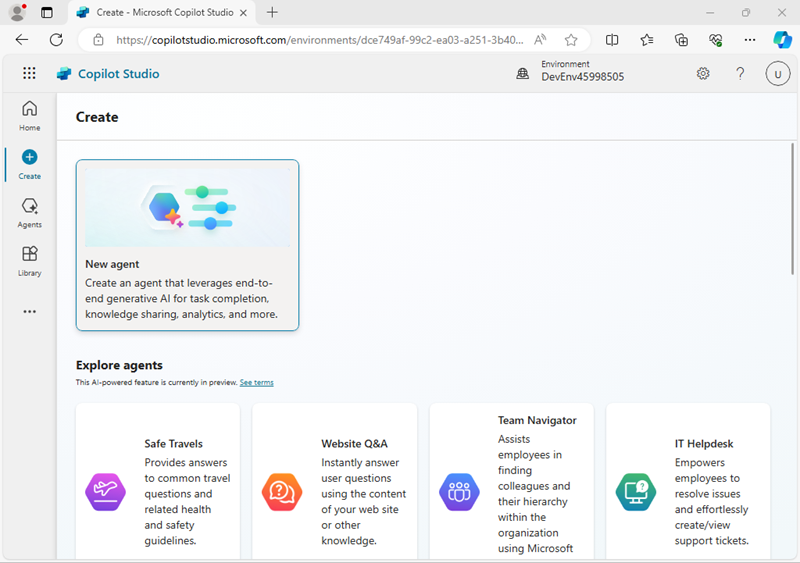
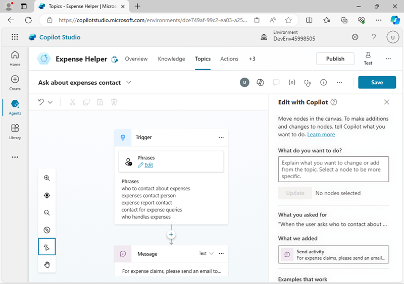
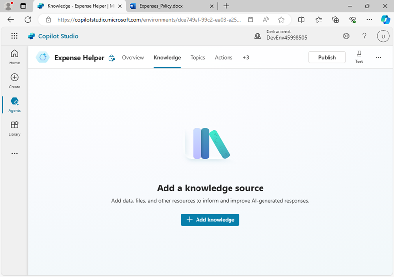
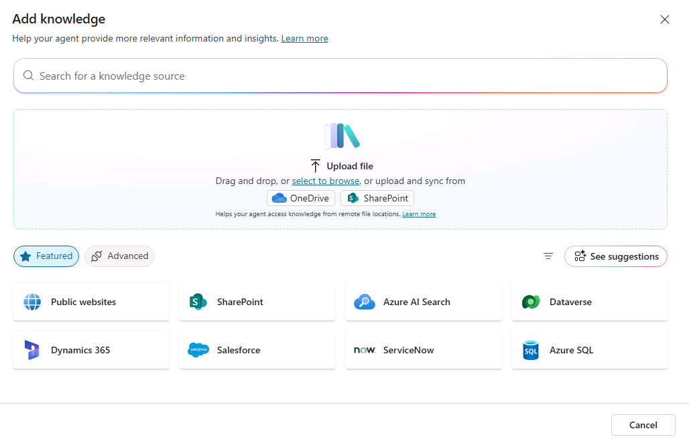

---
lab:
    title: 'Create an agent with Copilot Studio'
---

# Create an agent with Copilot Studio

In this exercise, you’ll use Copilot Studio to create a simple agent that can answer employee questions about expense policies in a fictional corporation.

This exercise will take approximately **45** minutes to complete.

> **Note**: This exercise assumes you already have a Copilot Studio license or have signed up for a [free trial](https://go.microsoft.com/fwlink/p/?linkid=2252605).

## Create a copilot

Let’s start by using Copilot Studio to create a new agent. The agent will initially have very limited capabilities, which you’ll extend later in the exercise.

1. In a web browser, navigate to [Copilot Studio](https://copilotstudio.microsoft.com/) at `https://copilotstudio.microsoft.com/`, signing in with your work or school account if prompted. Skip any welcome messages.

    > **Note**: The first time you open Copilot Studio, it may display a chat interface to create your first agent. If this happens, click the **...** menu at the top right (next to the **Create** button) and select **Cancel agent creation** to leave the chat interface and view the Copilot Studio home page.

1. View the Copilot Studio home page, which should look similar to this:

    

    On the home page, you can start creating an agent and view agents you have recently worked on. The Power Apps **environment** in which your agents are defined is shown at the top of the page. You can also navigate to the **Create** page for more agent creation options and the **Agents** page to view all of your existing agents.

    > **Note**: In addition to agents you have created, you may see **Copilot for Microsoft 365**, which you can use Copilot Studio to extend.

1. In the navigation pane on the left, select **Create** to view a page on which you can create a new agent, like this:

    

    You can create a completely new agent or start with a template. In this exercise, you'll create a brand new agent.

1. Select the option to create a **New agent**. Copilot Studio responds by providing a chat interface in which you can describe the functionality of the agent you want to build.

    >**Tip**: You can use the **Skip to Configure** option to skip the chat-based agent creation experience. In this exercise, we'll use the chat interface.

1. Enter the following prompt:

    ```prompt
    Create an agent to help employees with expense claims.
    ```

1. Review the response from Copilot Studio. The chat pane should look similar to the following:

    

1. Continue the conversation to define your agent, which should:
    - Have an appropriate name
    - Use a friendly, professional tone.
    - Not use any publicly accessible websites to get its information (you'll add a source of knowledge for your copilot later).
    - Avoid providing any tax advice.
    
    When you're done, a preview of the chat interface for your agent is displayed beside the conversation used to create it.

1. When you're ready, select **Create** at the top right to create your agent. After a short while, it will be displayed like this (you can unpin the pane on the left to see it more clearly):

    

1. In the **Test your agent** pane, enter the following prompt:

    ```prompt
    Hello
    ```

    Review the response, which should be an appropriate message.

1. Now try the following prompt:

    ```prompt
    Who should I contact about submitting an expense claim?
    ```

    This time the response may be appropriate, but it's also likely to be fairly generic. In a real organization, you'd want the agent to provide an email address of phone number for the user to contact.

1. Let's try another prompt:

    ```prompt
    What's the expense limit for a hotel stay?
    ```

    Again, the response may be appropriate but generic. In a real organization, you'd want the agent to provide a more specific response based on the company's expense policies.

1. Close the **Test your agent** pane.

## Manage *topics* in your agent

You can use *topics* to provide explicit responses to *triggers*, such as common questions or requests that you expect your users to enter.

1. In the page for your agent, select the **Topics** tab to see its topics.

    
    
    The agent has a few ***Custom*** topics that are triggered by input from the user, and some additional ***System*** topics that are triggered by specific events, such as errors or unexpected input. You can filter the topics by category or use the **All** filter to see them all.

1. Select the **Greeting** custom topic to view it on the *authoring canvas*, which is a visual designer for creating and editing topics and looks similar to this:

    

    The *Greeting* topic is triggered by an input in which one of the following
    phrases is present:

    - *Good afternoon*
    - *Good morning*
    - *Hello*
    - *Hey*
    - *Hi*

    The response to this trigger is to return a message to the user saying *Hello. How can I help you today?*. The inclusion of this topic in the agent explains the response you saw previously when testing it.

1. Return to the **Topics** page, and view the **System** topics. Note that these include topics for common events in a conversation. In particular, note the following system topics:
    - **Conversational boosting**: This topic is triggered when the user submits a message for which the agent can't identify a corresponding topic (the user's *intent* is unknown). The topic then attempts to respond to the user's message by using generative AI.
    - **Fallback**: This topic is a "fail-safe" topic that responds when the intent is unknown and an appropriate conversational AI response can't be generated. The fallback topic includes logic to enable the user to try again up to three times before gracefully ending the conversation, often by escalating to a human operator.
1. Return to the **Topics** page, and in the **+ Add a topic** menu, select
    **Topic** \> **Create from description with copilot**.

1. In the **Create a description with copilot** dialog box, name the new topic `Ask about expenses contact` and enter the following text to tell copilot what the topic should do:

    ```prompt
    When the user asks who to contact about expense claims, tell them to send an email to finance@contoso.com.
    ```

1. Select **Create**.

1. After a short wait, a new topic named *Ask about expenses contact* should be created and opened in the authoring canvas, where it should look similar to this:

    

    The new topic should be triggered by phrases that ask about a contact for expenses, and respond with a message telling the user to send an email to the appropriate address.

1. Use the **Save** button (at the top right) to save the new topic in your
copilot.

1. Open the **Test** pane, and enter the following prompt:

    ```prompt
    Who should I contact about submitting an expense claim?
    ```

    View the response, which should be based on the topic you just added (even though the text you entered doesn’t match any of the phrases in the trigger exactly - it should be close enough semantically to trigger the topic).

## Add a knowledge source for Generative AI responses

You can add topics for all of the inputs that you expect a user to enter; but you can’t realistically expect to anticipate every question that will be asked. Currently, your agent uses a *Conversation boosting* topic to generate AI responses from a language model, but this results in generic answers. You need to provide a source of knowledge in which the generative AI responses can be *grounded* to provide more relevant information.

1. Open a new browser tab and download the [expenses policy document](https://raw.githubusercontent.com/MicrosoftLearning/mslearn-copilotstudio/main/expenses/Expenses_Policy.docx) file from `https://github.com/MicrosoftLearning/mslearn-copilotstudio/raw/main/expenses/Expenses_Policy.docx`, saving it locally. This document contains details of the expenses policy for the fictional Contoso corporation.

1. Return to the browser tab for Copilot Studio, and close the **Test your agent** pane to see the page more easily, then select the **Knowledge** tab to see the knowledge sources defined in your agent (currently there should be none).

    

1. Select **+ Add knowledge**, and note the multiple types of knowledge source that you can add to your agent.

    

1. In the **Upload files** section, upload the expense policy document you downloaded previously and add it to your agent's knowledge.

    > **Note**: After uploading the file, you will need to wait while it is indexed; which may take 10 minutes (or longer). Now might be a good time to take a coffee break while you review the [expenses policy document](https://github.com/MicrosoftLearning/mslearn-copilotstudio/raw/main/expenses/Expenses_Policy.docx) at `https://github.com/MicrosoftLearning/mslearn-copilotstudio/raw/main/expenses/Expenses_Policy.docx` in another browser tab!

1. When the file is ready, view the **Topics** page and open the **Conversational boosting** system topic. Recall that this topic is triggered by an unknown intent, and then tries to create a generative AI response based on data sources containing knowledge; such as the file you uploaded.

    > **Note**: If no relevant answer is found in the custom knowledge sources you have added, the topic may use the knowledge inherent in the language model to provide a more generic answer. You can configure the topic to restrict its search to specific knowledge stores if you want greater control over the generative AI responses it returns.

1. Expand the **Test** pane and restart the conversation. Then enter the following prompt:

    ```prompt
    What's the expense limit for a hotel stay?
    ```

    The response should be based on the information in the knowledge source you uploaded, and include a citation reference.

    

1. Try asking some follow-up questions, such as:
    - `What about flights?`
    - `What guidelines are there for entertainment expenses?`

## Publish your agent

Now that you have a working agent, you can publish it for people to use. The available channels through which you can deliver your agent depend on the type of authentication you want to use to restrict access to it. In this case, you’ll enable access for anyone and then publish the agent for use in a demo web page.

1. Hide the **Test your agent** pane. Then, at the top of the page, select the **Channels** tab and review the channels to which you can deploy your agent. The available channels depend on the authentication settings for your agent.
1. Select **Settings** at the top of the page.
1. In the **Settings** pane, on the **Security** page, select **Authentication**. Then select the option for **No authentication** and **Save** the changes to the configuration (confirming that you want to enable access to the agent for anyone).
1. Close the **Settings** pane. Then, view the **Channels** page.
1. At the top of the page, select **Publish**. Then, on the **Publish** page, select **Publish**, and publish your agent. Publishing will take a minute or so.
1. After your agent has been published, verify the **Publish status** on the **Channels** page.

    

1. Select the **Demo website** channel. This is an appropriate channel for users to test your agent.
1. In the **Demo website** pane, enter the following settings:
    - **Welcome message**: `Ask me about Expense claims`
    - **Conversation starters**:
    
        ```prompt
        "Hello"
        "Who should I contact with expense enquiries?"
        "What are the expense limits for flights?"`
        ```

1. Select **Save** to save the settings. Then **Copy** the link to your agent demo website to the clipboard.
1. In a new browser tab, navigate to the URL you copied to open the demo website, which should look similar to this:

    

1. Enter the message `What are the expense limits for meals?` and view the response.
1. Try a few more questions and view the responses from your agent. It will have limited functionality, but should be able to provide relevant answers to questions about expense claims.

## Challenge

Now that you’ve seen how to use Copilot Studio to create a simple agent, it’s
time to apply what you’ve learned on your own. Try creating an agent that provides answers to questions about Microsoft Copilot!

- Create a new agent.
- Use the `https://www.microsoft.com/en-us/microsoft-copilot/` website as a knowledge source.
- Do not include lesson topics.
- Publish the agent so that users can test it in a demo website.

> **Tip**: If you need help, consult the [Copilot Studio documentation](https://learn.microsoft.com/microsoft-copilot-studio/) at `https://learn.microsoft.com/microsoft-copilot-studio/`.
