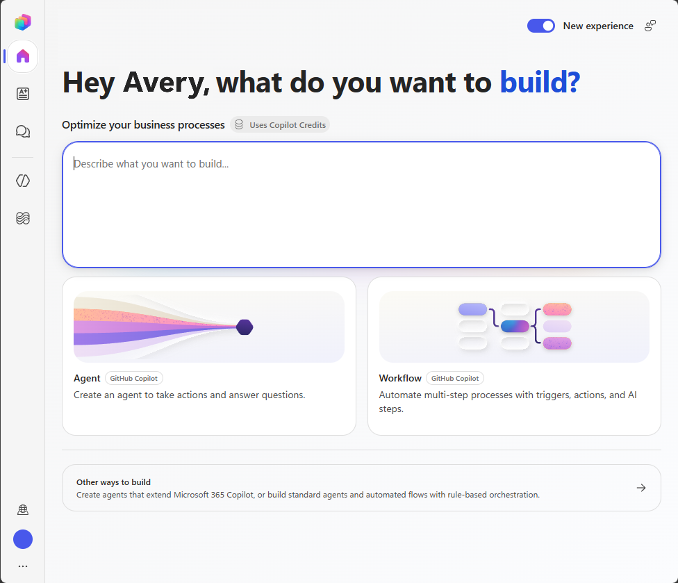

---
lab:
  title: Create an equipment recommendation agent
  module: Ground and extend agents with knowledge, tools, and skills
  description: Create an agent that uses policy knowledge, current SharePoint inventory, and a supplied skill to recommend workplace equipment.
  duration: 50 minutes
  level: 200
  islab: true
  primarytopics:
    - Microsoft Copilot Studio
    - Agents
---

## Scenario

In this exercise, you create the **Contoso Equipment Advisor**, an agent powered by the GitHub Copilot harness. You create a small SharePoint inventory list, add an equipment policy as knowledge, configure a SharePoint connector tool, upload a supplied recommendation skill, and refine the skill description after testing.

This exercise takes approximately **50 minutes** to complete.

## What you'll learn

- How to add and validate policy knowledge.
- How to configure a SharePoint connector tool for current data.
- How to add a supplied skill to an agent.
- How to refine a skill description based on test results.

## High-level lab steps

- Create an equipment inventory in SharePoint.
- Prepare an equipment policy and supplied skill.
- Create and configure an agent.
- Add policy knowledge and an inventory tool.
- Add, test, and refine the supplied skill.

## Prerequisites

To complete this exercise, you need:

- A Microsoft Entra work or school account.
- [Access to Copilot Studio](https://learn.microsoft.com/microsoft-copilot-studio/requirements-licensing-subscriptions).
- Permission to create an agent in a Power Platform environment.
- Access to a SharePoint site where you can create a list and use the SharePoint connector.
- Access to a solution in the environment if your organization requires agents to be created in a solution.

> [!NOTE]
> Building and testing an agent powered by the GitHub Copilot harness might consume Copilot Credits.

## Exercise 1 - Create the equipment inventory

Create a standalone data source for this exercise.

1. Open the SharePoint site that you use for the exercise, and then select **New** > **List**. Under **Create from blank**, select **List**.

   > [!NOTE]
   > If you don't have a SharePoint site, create one or request access to an existing site before proceeding.

1. Enter `PL7008 Equipment Inventory <your initials>` as the list name, replacing `<your initials>` with a unique value, and then select **Create**.

1. Keep the default **Title** column. Select **+ Add column** and create the following columns:

   | Column name | Type |
   | --- | --- |
   | Category | Single line of text |
   | BestFor | Multiple lines of text |
   | Location | Single line of text |
   | UnitPrice | Currency |
   | UnitsAvailable | Number |
   | AccessibilityNotes | Multiple lines of text |

1. Select **+ New** and add the following items to the list:

   | Title | Category | BestFor | Location | UnitPrice | UnitsAvailable | AccessibilityNotes |
   | --- | --- | --- | --- | ---: | ---: | --- |
   | Contoso Standard 14 | Laptop | General productivity and hybrid work | Seattle | 950 | 12 | Supports external keyboard, mouse, and two displays |
   | Contoso Performance 15 | Laptop | Data analysis and local development | Seattle | 1,450 | 4 | Supports external keyboard, mouse, and three displays |
   | Contoso Travel 13 | Laptop | Frequent travel and presentations | Chicago | 1,100 | 0 | Lightweight chassis and one external display |
   | Contoso Focus 27 | Monitor | General productivity and document work | Seattle | 320 | 8 | Height-adjustable stand and low-blue-light mode |
   | Contoso Wide 34 | Monitor | Large spreadsheets and side-by-side analysis | Seattle | 680 | 2 | Height-adjustable stand; confirm desk width before ordering |

1. Copy the SharePoint site address and note the exact list name. You use both values when you configure the connector tool. For example, a site address might be `https://contoso.sharepoint.com/sites/sitename`.

## Exercise 2 - Prepare the equipment policy

1. Open a text editor and create a file named `contoso-equipment-policy.md`.

1. Add the following content to the file:

   ```markdown
   # Contoso equipment policy

   This fictional policy supports a training exercise.

   ## General rules

   Recommend only equipment that is currently available in the employee's work location. A recommendation doesn't reserve or order an item. If no compliant item is available, state that no matching item is in stock and direct the employee to the IT procurement team.

   Ask for the employee's role, work location, primary work scenario, and accessibility requirements before making a final recommendation. Don't infer an accessibility need.

   ## Laptop standards

   - General productivity and hybrid roles use a standard laptop when one is available.
   - Data analysts and developers can use a performance laptop when their work includes local data processing, development tools, or large models.
   - Frequent travelers can use a travel laptop when it is available in their location.

   ## Monitor standards

   - General productivity roles can use one 27-inch monitor.
   - Data analysis roles can use one ultrawide monitor when the employee works regularly with large spreadsheets or side-by-side datasets.
   - Confirm desk width before recommending an ultrawide monitor.

   ## Accessibility and exceptions

   Explain relevant accessibility features from the inventory without deciding whether they meet an individual's needs. Direct requests for ergonomic assessments, assistive technology, policy exceptions, or equipment that isn't listed to the IT procurement team at it-procurement@contoso.com.
   ```

1. Save the file in a location you can access during the exercise.

## Exercise 3 - Prepare the supplied skill

1. Create another file named `equipment-recommendation.md`.

1. Add the following supplied skill content to the file:

   ```markdown
   ---
   name: equipment-recommendation
   description: Use when a user asks for a laptop or monitor recommendation.
   ---

   # Equipment recommendation

   Help a user select approved Contoso equipment without placing an order.

   ## Required inputs

   Before making a final recommendation, collect:

   - Employee role.
   - Work location.
   - Primary work scenario.
   - Accessibility requirements, if any.

   Ask only for information that isn't already available in the conversation.

   ## Steps

   1. Use the Contoso equipment policy knowledge source to identify the applicable rules.
   2. Use the Get equipment inventory tool to retrieve current inventory.
   3. Consider only items in the employee's location with UnitsAvailable greater than zero.
   4. Compare the eligible items with the employee's role, work scenario, and stated requirements.
   5. Recommend one item for each requested category and explain why it fits.

   ## Decision rules

   - Don't recommend an out-of-stock item.
   - Don't claim that a recommendation reserves or orders equipment.
   - Don't infer accessibility needs or decide whether a feature meets an individual's needs.
   - When no compliant item is available, state that result and provide the IT procurement contact from the policy.

   ## Success criteria

   A complete response cites the policy, reflects current inventory, explains the match, and identifies any missing information or required escalation.
   ```

1. Save the file in the same location as the `contoso-equipment-policy.md` file so that you can access both files during the exercise.

## Exercise 4 - Create the agent



1. Go to [Microsoft Copilot Studio](https://copilotstudio.microsoft.com/) at `https://copilotstudio.microsoft.com/` and sign in.

1. Confirm that the correct environment is selected.

1. On the **Home** page, select **Agent**. Alternatively, select **Agents** in the left navigation, and then select **New agent**.

1. In the **Name** field, enter `Contoso Equipment Advisor <your initials>`.

1. If your organization requires a solution, in the upper-right corner, select **More options** (**...**), and then select **Settings**. In **Agent settings** > **Agent details**, select the solution provided for the exercise from the **Solution** list.

1. In **Instructions**, enter the following text:

   ```prompt
   You are the Contoso Equipment Advisor. Help employees understand equipment standards and identify currently available equipment.

   Use configured knowledge for Contoso policy. Use tools for current inventory. Cite the source used for each policy statement. Don't invent equipment, availability, prices, policy exceptions, or order status.

   Use a concise, professional tone. Ask for missing information before making a final recommendation. For ergonomic assessments, assistive technology, policy exceptions, or unlisted equipment, direct the employee to the IT procurement team.

   Don't place, promise, or imply an order. Politely decline requests unrelated to workplace equipment.
   ```

1. Select **Save**.

## Exercise 5 - Add policy knowledge

1. On the **Build** tab, select the **Knowledge** section to open the **Add knowledge** dialog.

1. Select **Drag and drop or click to upload**, and then upload `contoso-equipment-policy.md`.

1. Select **Add to agent** and wait for the upload to finish.

1. Under the **Knowledge** section, select `contoso-equipment-policy.md`. In the **Edit knowledge source** dialog, enter `Contoso equipment policy` as the name and `Approved equipment standards by role, work scenario, location, and accessibility need. This source doesn't contain current inventory or stock levels` as the description.

1. Select **Save** to apply the changes to the knowledge source.

## Exercise 6 - Add the inventory connector tool

1. On the **Build** tab, select the **Tools** section to open the **Add a tool** dialog.

1. Select **Connectors**, search for `SharePoint`, and under **SharePoint**, select **See (x) more** to expand the list of available actions.

1. Select the **Get items** action, and then select **+ Add** to create your SharePoint connection.

1. In the **Tools** section, select the newly added SharePoint connector. In the **Details** section, set the tool name to `Get equipment inventory` and the tool description to `Retrieves the current Contoso equipment inventory, including category, location, price, available units, intended use, and accessibility notes. Use for equipment availability and recommendation requests. This tool reads inventory and doesn't reserve or order items.`

1. In the **Inputs** section, configure the values as follows:

   | Input | How is this filled? | Value |
   | --- | --- | --- |
   | Site address | Value | The SharePoint site address that you copied. |
   | List name | Value | `PL7008 Equipment Inventory <your initials>` |

1. Leave all remaining optional inputs unchanged. The list is intentionally small, so the tool can return all exercise items for the agent to compare.

1. Keep the completion behavior that lets the agent use the tool results to generate a contextual response. Select **Done**, and then select **Save**.

> [!NOTE]
> Connector fields can vary by connector version. If the action shows additional required inputs, configure them so that the action returns all items from the exercise list.

## Exercise 7 - Test knowledge and the tool

1. Select the **Preview** tab.

1. Start a new conversation by entering `What is the equipment rule for a data analyst who works with large spreadsheets?` and submit it.

1. Verify that the response uses and cites the policy. It should explain the performance laptop and ultrawide monitor rules without claiming that either item is available.

1. Start a new conversation, enter `Which laptops are currently available in Seattle?` and submit it.

1. If prompted, select **Allow** to grant the agent permission to use SharePoint. You may need to grant permission more than once.

1. Verify that the agent uses the **Get equipment inventory** tool and reports only laptops with available units in Seattle.

1. Start a new conversation, enter `Which travel laptop can I get in Chicago?` and submit it.

1. Verify that the agent reports that no travel laptops are currently available in Chicago and doesn't recommend the out-of-stock travel laptop.

## Exercise 8 - Add and test the supplied skill

1. Return to the **Build** tab and select the **Skills** section.

1. Select **Upload a skill**, upload `equipment-recommendation.md`, and confirm that the skill appears under **Skills**.

1. Select the **Preview** tab, start a new conversation, enter `Recommend a laptop for a data analyst in Seattle who runs local data models. I don't have any accessibility requirements` and submit it.

1. Verify that the skill guides the agent to consult the policy, retrieve inventory, and recommend the available performance laptop with an explanation.

1. Start a new conversation, enter `Help me outfit a new data analyst's home office in Seattle for large spreadsheets. There are no accessibility requirements` and submit it.

1. Inspect the activity details. The skill's initial description mentions only a laptop or monitor recommendation, so the broader setup request might not activate it or might produce an incomplete result.

> [!NOTE]
> Generative behavior can vary. If the skill activates and produces a complete result, use `Plan an approved equipment setup for a new analyst in Seattle` as the broader activation test.

## Exercise 9 - Refine the skill description

1. Open `equipment-recommendation.md` in a text editor.

1. In the metadata section at the top of the file, replace the `description` value with:

   ```yaml
   description: Use when a user asks for an approved workplace equipment recommendation, compares equipment for a role or work scenario, or plans a laptop, monitor, or complete work setup.
   ```

1. Save the file.

1. Select the **Build** tab. In the agent's **Skills** section, open the uploaded skill, select **(...)** > **Replace**, and replace it with the updated file. If the replace option isn't available, delete the original skill and upload the updated file.

1. Return to the **Preview** tab, start a new conversation, and repeat the home-office setup prompt.

1. Verify that the agent gathers any missing information, uses the policy and the Get equipment inventory tool, recommends only available items, and explains why each item fits.

1. Start another new conversation, enter `How do I bake a loaf of bread?` and submit the prompt.

1. Verify that the equipment skill doesn't activate and that the agent states that the unrelated request is outside its scope.

## Review and clean up

Your exercise is complete when the agent:

- Uses the supplied instructions and has a unique name.
- Uses the equipment policy as knowledge and includes citations.
- Uses the SharePoint connector tool for current inventory.
- Doesn't recommend out-of-stock equipment.
- Uses the supplied skill for a complete workplace setup after you refine its description.
- Doesn't activate the skill for an unrelated request.

If your instructor or environment owner doesn't require the assets for review, delete the agent and the SharePoint list that you created for the exercise.
