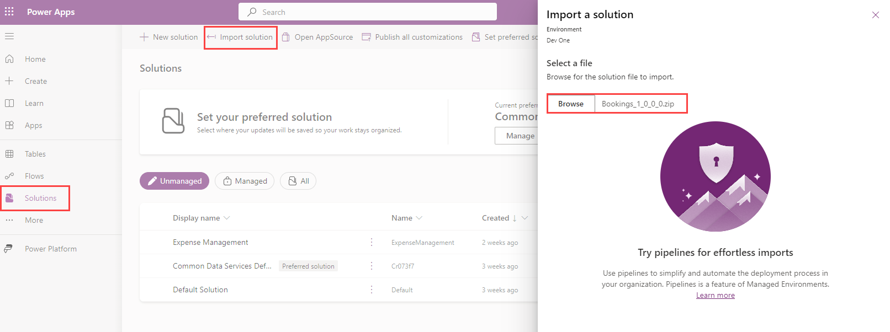
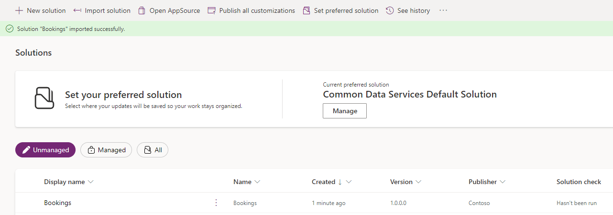
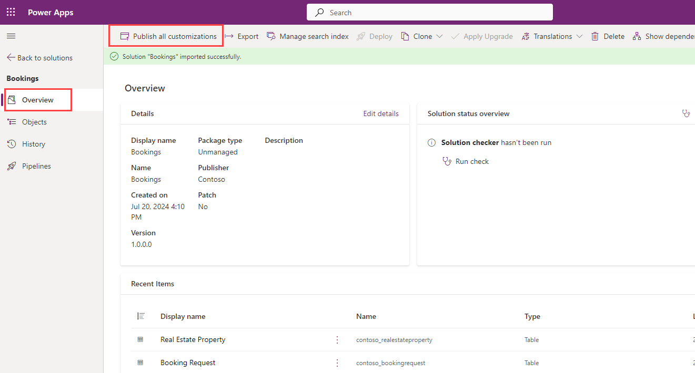
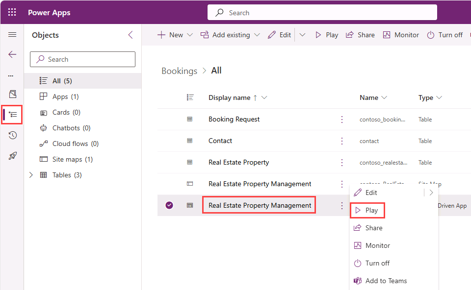
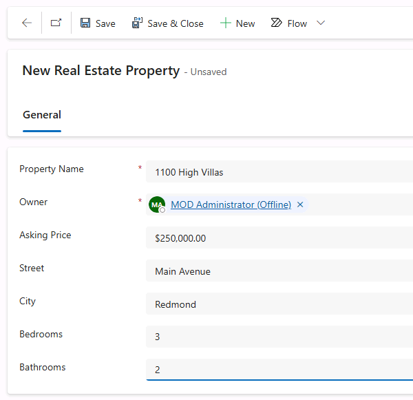

---
lab:
    title: 'Import Dataverse solution'
    module: 'Course Introduction'
---

# Import Dataverse solution

In this exercise, you'll import a Dataverse solution to use for the following labs.

> **Note**: This exercise assumes you already have a Copilot Studio license or have signed up for a [free trial](https://go.microsoft.com/fwlink/p/?linkid=2252605) and have a Power Apps environment to work in.

## Exercise 1 – Import solution

In this exercise, you will import a Dataverse solution into your environment that contains the tables needed for the labs.

### Task 1.1 – Sign in to Power Apps

1. In a new browser tab, navigate to `https://make.powerapps.com`.

1. If prompted for credentials, sign in with your email address and password if prompted.

1. If prompted for contact information, set the Country/region and select **Get Started**.

1. In the upper-right of the screen, verify that the **Environment** is set to your environment. This is where you will be working for the entirety of the labs. If it is not, select the appropriate environment.

### Task 1.2 – Download solution

1. Go to [**Bookings_1_0_0_0.zip**](../../Allfiles/Bookings_1_0_0_0.zip) in GitHub. The file is located at `https://github.com/MicrosoftLearning/mslearn-copilotstudio/blob/main/Allfiles/Bookings_1_0_0_0.zip`

1. Select the **ellipses (...)** near the top-right and select **Download**.

### Task 1.3 – Import solution

1. Go to `https://make.powerapps.com`.

1. Make sure you are in the appropriate environment.

1. In the left navigation, select **Solutions**.

1. In the top bar, select **Import solution**.

1. Select **Browse** and locate the **Bookings_1_0_0_0.zip** file and select **Open**.

    

1. Select **Next**.

1. Select **Import**.

    The solution will import in the background. This may take a few minutes.

    

    > **Alert:** Wait until the solution has finished importing before continuing to the next step.

1. When the solution has imported successfully, open the **Bookings** solution.

1. In the left navigation, select the **Overview** tab.

    

1. Select **Publish all customizations**.

### Task 1.4 – Test data

1. In the left navigation of the Bookings solution, select the **Objects** tab.

1. Select the **ellipsis …** menu for the **Real Estate Property Management** Model-Driven App, and select **Play**.

    

1. Select **+ New**.

1. Enter the following data:

    - **Property Name:** `1100 High Villas`
    - **Asking Price:** `250,000`
    - **Street:** `Main Avenue`
    - **City:** `Redmond`
    - **Bedrooms:** `3`
    - **Bathrooms:** `2`

    

1. Select **Save & Close**.

1. Select **+ New**.

1. Enter the following data:

    - **Property Name:** `555 Oak Lane`
    - **Asking Price:** `300,000`
    - **Street:** `Oak Lane`
    - **City:** `Denver`
    - **Bedrooms:** `4`
    - **Bathrooms:** `3`

    

1. Select **Save & Close**.
