---
lab:
  title: Manage topics in Copilot Studio agents
  module: Design agent conversations using topics
  description: In this lab, you will use Copilot to create an agent, create a topic from a description, add nodes, use entities, and manage variables.
  duration: 45 minutes
  level: 200
  islab: true
  primarytopics:
    - Microsoft Copilot Studio
---

# Manage topics in Copilot Studio agents

## Scenario

In this exercise, you will:

- Create an agent
- Manage existing topics
- Create and edit topics using Copilot
- Configure variable scope
- Create a topic manually
- Create and edit nodes
- Test the agent

This exercise will take approximately **45** minutes to complete.

## What you will learn

- How topics complement generative AI responses
- When topics are used to enforce structured conversations
- How to create and refine topics using natural language
- How to use variables

## High-level lab steps

- Create an agent using Copilot
- Review and disable unnecessary topics
- Create a topic using Copilot
- Edit topic content using natural language
- Test topic behavior
  
## Prerequisites

- Have a Microsoft Entra Id account
- Have a Copilot Studio license or have signed up for a [free trial](https://go.microsoft.com/fwlink/p/?linkid=2252605).

## Key concept: Topics and generative AI

When generative AI is enabled, the agent may answer questions dynamically without triggering a topic. This is expected behavior.

Topics are used when you need to:

- Collect required information step by step
- Control the order of questions
- Store responses in variables
- Ensure predictable outcomes

## Exercise 1 - Create a Power Platform environment

### Task 1.1 - Power Platform Admin Center

Before you start the lab exercises, you must create a development environment for you to work in.

1. Open a web browser, navigate to `https://admin.powerplatform.microsoft.com/manage/environments`, and sign in using your credentials for this exercise.

1. If prompted, choose the option to stay signed in.

1. Close any pop-up messages that are displayed.

### Task 1.2 - Add Dataverse to the default environment

1. Select the ellipses (**...**) for the **Contoso (default)** environment and select **Add Dataverse**.

   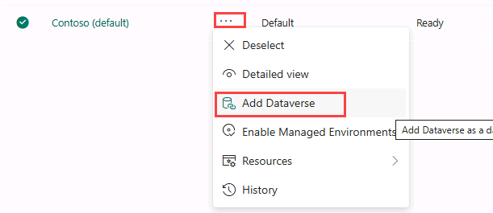

1. Leave all of the default settings and select **Add**.

### Task 1.3 - Create a new environment

1. In the **Environments** page, select **+ New** to create a new environment with the following settings:

   - **Type**: Developer
   - **Region**: default region
   - **Name**: *Your name*
   - **Environment group**: None
   - **Make this a Managed Environment**: No
   - **Get new features early**: No
   - **Create on behalf**: No

   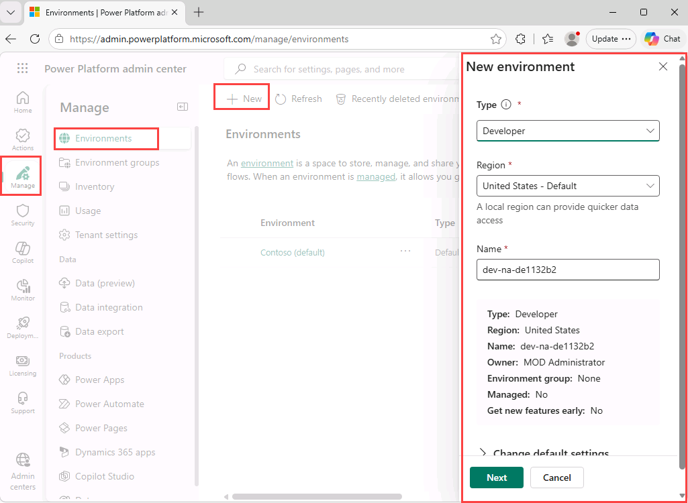

1. Select **Next** and in the **Add Dataverse** section:

   - **Language**: English (United States)
   - **Currency**: USD ($)
   - **Deploy sample apps and data**: No

1. Select **Save** and wait until the state of your environment is **Ready** (you can use the **Refresh** button to update the display).

   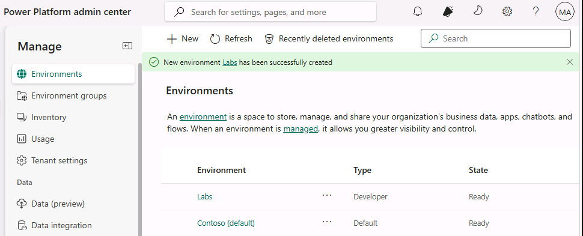

1. In a new browser tab, navigate to `https://copilotstudio.microsoft.com/` and sign in if prompted.

1. Select **Get Started**, if prompted leaving the default country/region.

1. Skip any welcome messages.

1. In the upper right corner of the page, switch environments by using the Environment Selector and select the environment you created above from the list.

   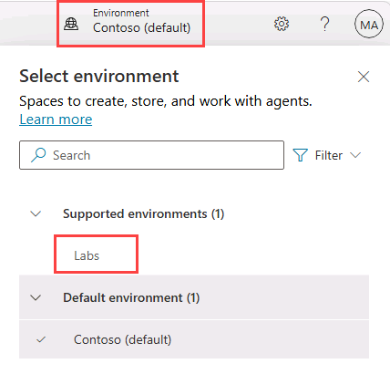

### Task 1.4 - Create a solution

1. In the left navigation pane, select the ellipses (**...**), and select **Solutions**.

1. You should see several solutions including the *Default Solution* and the *Common Data Services Default Solution*.

   

1. Select **+ New solution**.

1. In the **Display name** text box, enter **`Lab Exercises`**

1. Verify that **Name** is automatically populated.

1. Select **+ New publisher** below the **Publisher** drop-down.

1. For **Display name**, enter `Fabrikam`

1. For **Name**, enter `fabrikam`

1. For **Prefix**, enter `fab`

   

1. Select **Save**.

1. Verify that **Fabrikam (fabrikam)** is selected in the **Publisher** drop-down.

1. Select the **Set as your preferred solution** checkbox.

   

1. Select **Create**.

1. Close the **Solutions** browser tab.

1. Refresh the **Copilot Studio** page.

## Exercise 2 - Create an agent

In this exercise, you will create a new agent using natural language to answer questions about government benefits.

### Task 2.1 – Create an agent to review insurance claims

1. In the **Copilot Studio** home page `https://copilotstudio.microsoft.com/`, verify that you are in the environment that you created.

1. Select **Agents** in the left-hand navigation.

1. In the bottom-left of the *Start building by describing what your agent needs to do* text box, select the **Agent Settings** icon, which is displayed as a **Cog** image.

   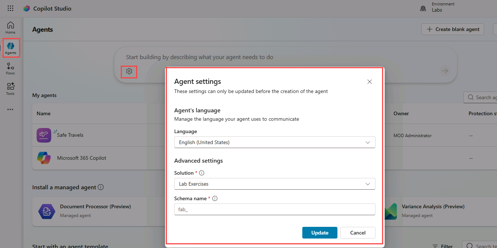

1. Leave **English (United States)** set as the primary language for the agent.

1. In the **Solution** drop-down, select **Lab Exercises**.

1. Enter `insuranceagent` for the *Schema name*.

1. Select **Update**.

1. In the *Start building by describing what your agent needs to do* text box, Enter the following prompt:

   ```prompt
   You are an agent that assists with reviewing insurance claims including damage assessment details and repair estimates.
   ```

1. Select the **Send** icon.

   Once your agent has been provisioned, you may proceed with configuring your agent.

## Exercise 3 - Manage topics

In this exercise, you will disable the Escalate system topic as the agent will not have human representatives to hand-off to.

### Task 3.1 – Disable topics

1. Select the **Topics** tab.

1. Select the **System** filter.

1. Locate the **Escalate** topic.

1. Toggle **Enabled** to **Off** for the **Escalate** topic.

   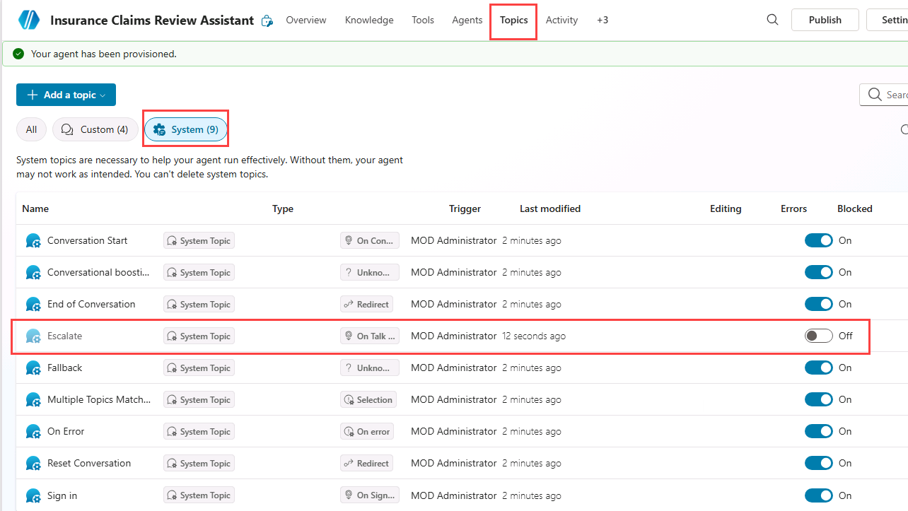

Disabling unused topics helps reduce ambiguity when multiple topics or generative responses could handle the same request.

## Exercise 4 - Create a topic with natural language

In this exercise, you will use Copilot to create a topic from a description. This allows generative AI to draft the initial structure, which you can then refine.

### Task 4.1 – Add a topic from description

1. Select **+ Add a topic** and select **Add from description with Copilot**. A new dialog appears.

   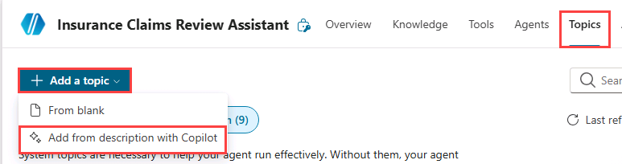

   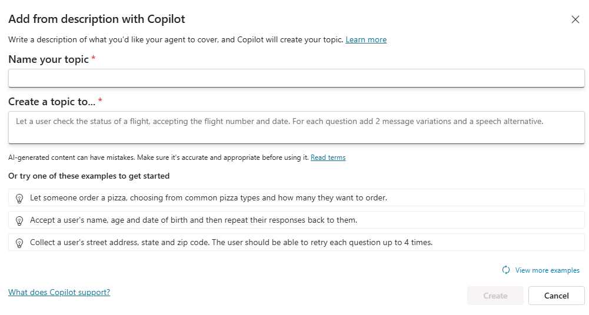

1. In the **Name your topic** text box, enter **`Customer Details`**.

1. In the **Create a topic to...** text box, enter **`Ask the customer for their name and email address`**.

1. Select **Create**.

1. Select **Save**.

### Task 4.2 – Edit nodes using natural language

1. If the **Test your agent** panel is open, close the panel.

1. If the **Edit with Copilot** panel is not shown on the right side of the **Customer Details** pane, select the **Copilot** icon in the upper part of the authoring canvas.

   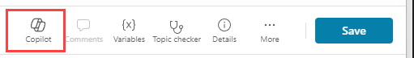

1. Select the second **Question** node **What is your email address?**

   

1. In the **Edit with Copilot** panel, in the **What do you want to do?** field, enter the following text:

   `Change "What is your email address?" to say thank you to the Name variable from the previous node and then proceed to ask the email address question.`

1. Select **Update**.

   

   

   > [!NOTE]
   > The message should be updated to include the *Name* variable from the prior node, and should look similar to the screenshot above. If Edit with Copilot did not update the question node correctly, select **Undo**, and retry with a different prompt.

1. Select **Save**.

### Task 4.3 – Add an adaptive card node using natural language

In addition to adding updating existing nodes, you can use Copilot to add new ones.

1. Select an empty area on the authoring canvas so no node is selected.

1. In the **Edit with Copilot** panel, in the **What do you want to do?** field, enter the following text:

   `Summarize the information collected in an adaptive card`

1. Select **Update**.

   A message node with an Adaptive Card is added to the end of the topic.

   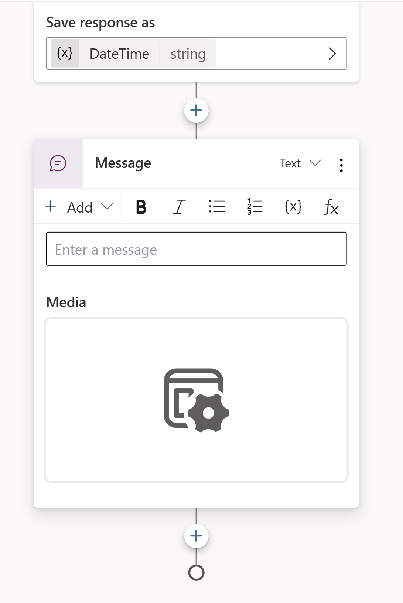

1. Select the **Media** box in the Adaptive Card. The Adaptive Card properties should appear on the right of the page.

   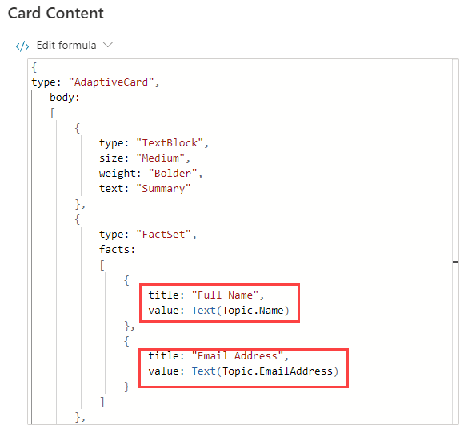

   Your Adaptive Card formula should look similar to the one above. If it doesn't, then you can paste in the formula below:

   ```powerfx
   {
   type: "AdaptiveCard", 
       body: 
       [
           {
               type: "TextBlock",
               size: "Medium",
               weight: "Bolder",
               text: "Summary"
           },
           {
               type: "FactSet",
               facts: 
               [
                   {
                       title: "Full Name",
                       value: Text(Topic.Name)
                   },
                   {
                       title: "Email Address",
                       value: Text(Topic.EmailAddress)
                   }
               ]
           },
           {
               type: "TextBlock",
               text: "Thank you for providing the information."
           }
       ]
   }
   ```

### Task 4.4 – Add a question node using natural language

1. Make sure that no node is selected by selecting the empty space in the authoring canvas.

1. Select the **Copilot** icon to reopen the **Edit with Copilot** pane.

1. In the **What do you want to do?** field, enter the following text:

   `Add a new multiple choice question to prompt the user if the details are correct with two options Yes or No`

1. Select **Update**.

1. A new question node is added to the end of the topic with options for the user to select.

   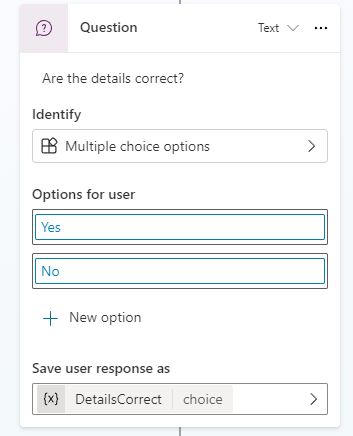

1. Select **Save**.

## Exercise 5 - Variable scope

Enable variables to be be accessed by other topics.

### Task 5.1 - Configure the scope of the variables

1. Select the **Topics** tab.

1. Select the **Customer Details** topic.

1. Select **Variables** in the top bar to open the Variables pane (you may need to select **More** \> **Variables**).

1. Select and expand **Topic** variables.

1. Select the right-hand check boxes for the three topic variables. This enables the variables in this topic to be available for other topics to use.

  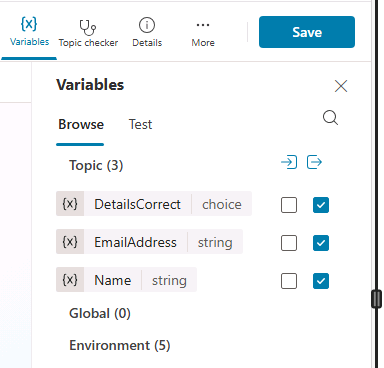

1. Select **Save**.

## Exercise 6 - Create a topic from blank

In this exercise, you will create the **Estimate Repair** topic, add nodes, and call the Customer Details topic.

### Task 6.1 - Create a topic from blank

1. Select the **Topics** tab.

1. Select **+ Add a topic** and select **From blank**.

1. Select the **Details** icon to open the Topic details dialog (you may need to select **More** \> **Details**).

1. In the **Name** field, enter the following text:

   `Estimate Repair`

1. In the **Model description** field, enter the following text:

   `Use this topic when a repair estimate for an insurance claim must be booked with the customer`

   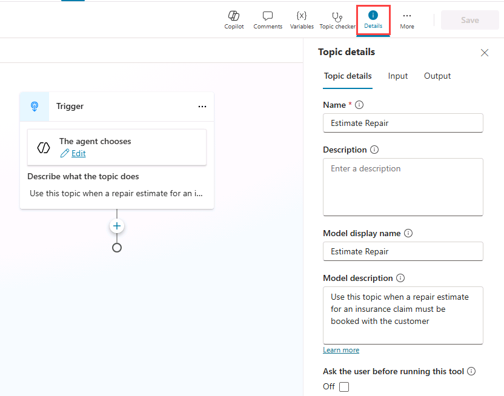

1. Select **Save**.

### Task 6.2 - Verify trigger type

1. Select the **Trigger** node at the top of the topic. Confirm the trigger type is set to **The agent chooses**.

   > **Note** With generative orchestration enabled, the agent uses this description to decide when to use the topic.

### Task 6.3 - Add a message node

1. Select the the **+** icon under the Trigger node and select **Send a message**.

   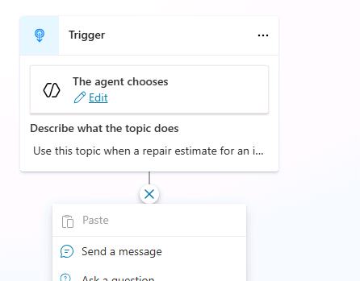

1. In the **Enter a message** field, enter the following text:

   `Hi, I can help you with booking a repair estimate.`

1. Select **Save**.

### Task 6.4 - Route to the Customer Details topic

1. Select the the **+** icon under the **Message** node

1. Select **Topic management** \> **Go to another topic** \> **Customer Details**.

   

1. Select **Save**.

### Task 6.5 - Add condition node

1. Select the the **+** icon under the **Topic** node and select **Add a condition**.

1. In the **Condition** node, select the **DetailsCorrect** variable.

1. Select **is equal to**.

1. Select **Yes**.

   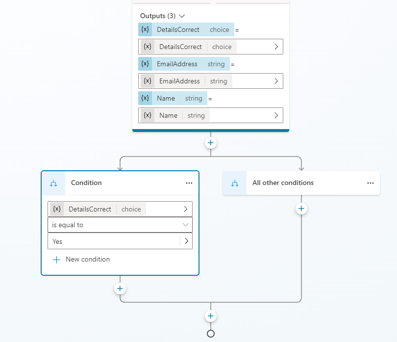

1. Select **Save**.

### Task 6.6 - Add question nodes

1. Select the the **+** icon under the left **Condition** node and select **Ask a question**.

1. In the **Enter a message** field, enter the following text:

   `What date and time do you book the repair estimate?`

1. Select **Date and time** for **Identify**.

1. Select the variable in **Save user response as** and enter **`VisitDateTime`** for **Variable name**

1. Select the **+** icon under the left **Question** node and select **Send a message**.

1. In the **Enter a message** field, enter the following text:

   `Great! Let me get that scheduled for you.`

1. After that message node, add a node to end the topics by selecting **Topic Management** \> **End all topics**.

1. Select **Save**.

### Task 6.7 - Update agent instructions

1. Select the **Overview** tab.

1. In the **Instructions** section, select **Edit**.

1. Under *# Skills* in the agent instructions, add the following `Use the ` and then enter the `/` character and select the **Repair Estimate** topic and then enter ` when a repair estimate is required.`

   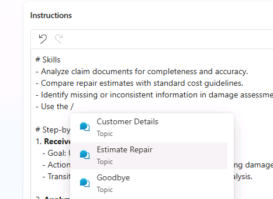

1. Select **Save**.

## Exercise 7 - Test the agent

In this exercise, you will test topic routing and confirm the conversation follows the expected step-by-step flow.

### Task 7.1 - Test the Book Showing topic

1. Select the **Test** icon in the upper-right of the page to open the testing panel.

1. In the **Test** panel, select the ellipses (**...**) next to the variables **{x}** icon, and toggle **Show activity map when testing** to **On** and **Track between topics** to **Off**.

   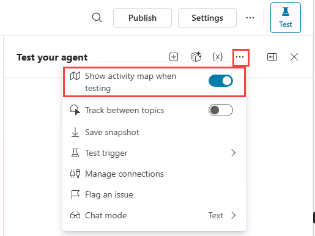

1. At the top of the Test panel, select the **Start new test session** icon **+**.

1. When the **Conversation Start** message appears, your agent will start a conversation. In response, let's try to trigger the topic that you've created:

   `I need to book a repair estimate`

1. The agent should respond with the "What is your name?" question from the **Customer Details** topic.

   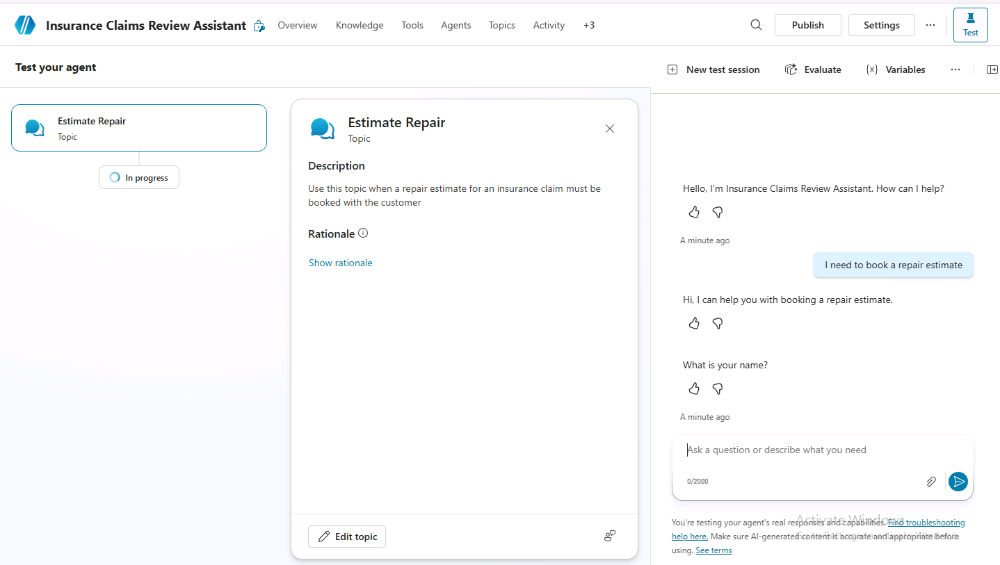

1. Provide a name.

1. Provide an email address.

1. After you supply the information, an Adaptive Card displays the information that you entered and asks if the details are correct. Select **Yes**.

   Notice that you were routed back to the **Estimate Repair** topic.

1. Enter `Tomorrow 10:00 AM` to the **What date and time do you want to book the repaid estimate?** prompt.

## Summary

In this lab, you created the Customer Details and Estimate Repair topics and used nodes to enforce a structured, step-by-step interaction while generative AI remained enabled. You also configured variable scope so information collected in Customer Details can be used across topics.
