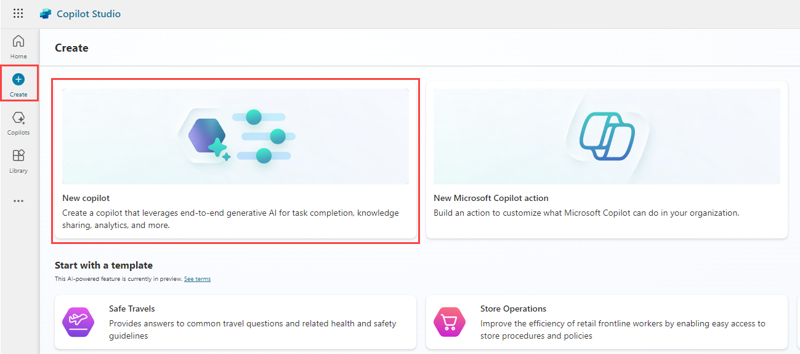
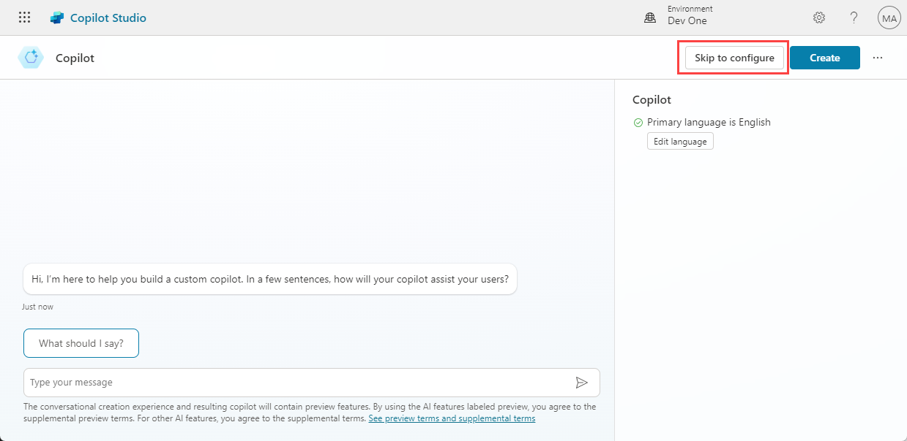
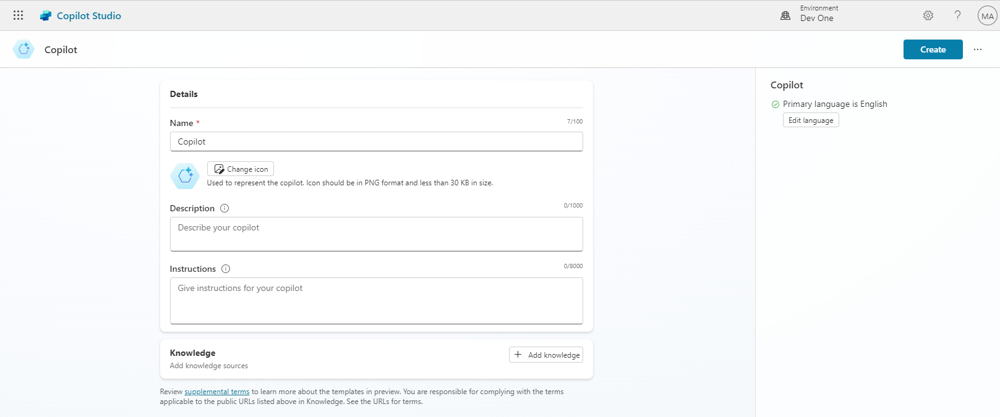
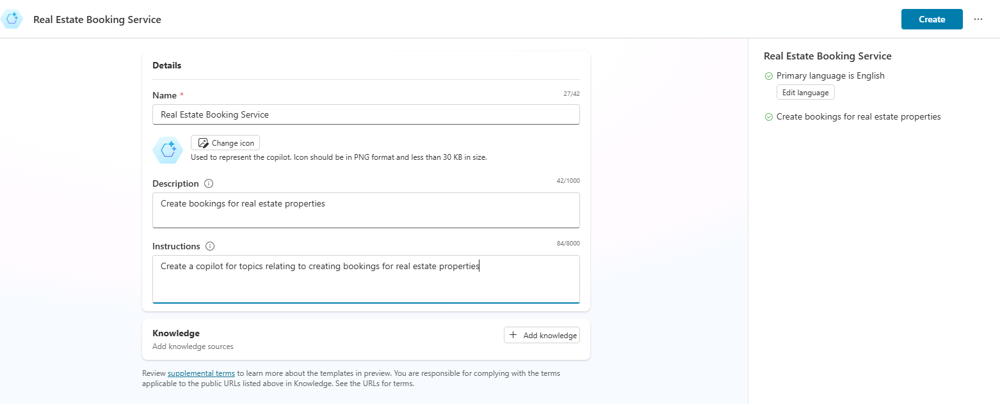
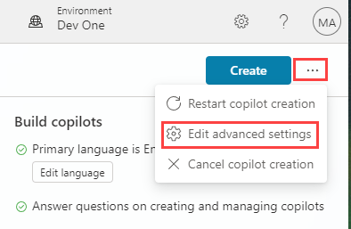
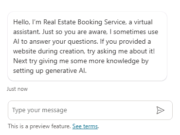
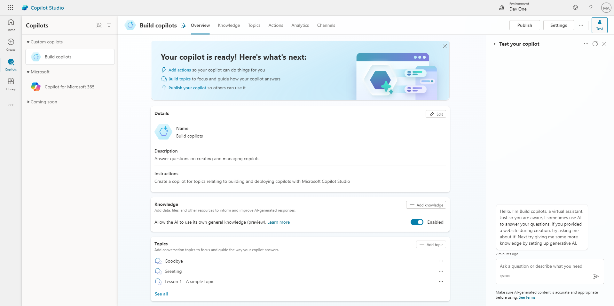
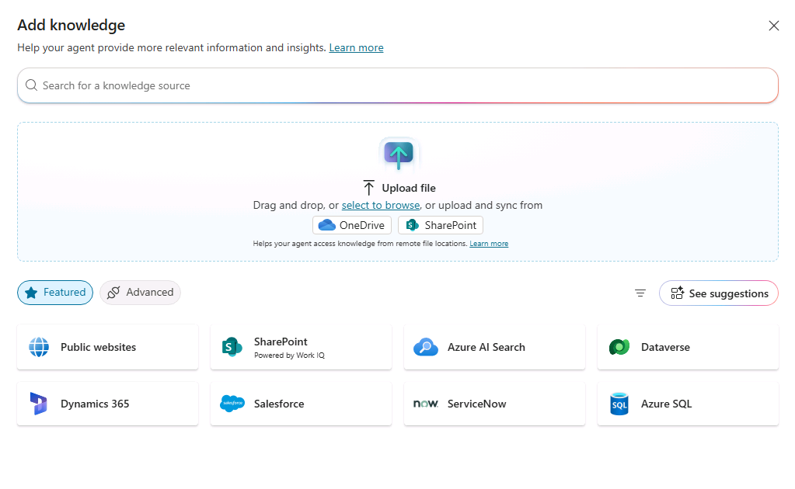
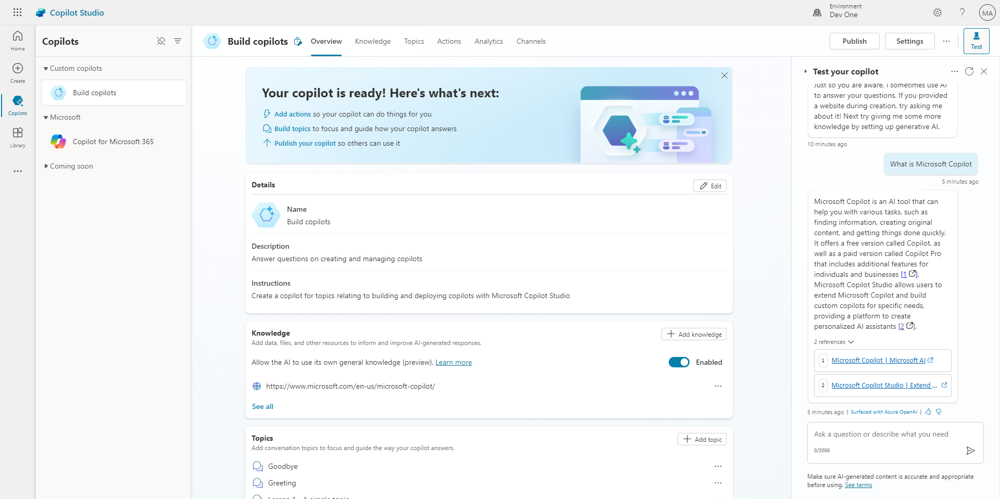

---
lab:
    title: 'Create a copilot'
    module: 'Build an initial copilot with Microsoft Copilot Studio'
---

# Build an initial copilot

## Scenario

In this lab, you will:

- Create and name a copilot
- Add description for what the copilot should do
- Configure Generative AI answers

## What you will learn

- How to create a a copilot using natural language
- How to configure Generative AI answers for a copilot

## High-level lab steps

- Create a new copilot
- Tell your copilot what its primary purpose is and how it should act
- Add Generative AI instructions
  
## Prerequisites

- Must have completed **Lab: Import Dataverse solution**

## Exercise 1 - Create copilot

In this exercise, you will access the Microsoft Copilot Studio portal, the Developer environment and create a new copilot.

### Task 1.1 – Microsoft Copilot Studio portal

1. In a new tab, navigate to the Microsoft Copilot Studio portal `https://copilotstudio.microsoft.com` and sign in with your Microsoft 365 credentials if prompted again.

1. Make sure that you are in the appropriate environment.

### Task 1.2 – Create a copilot

1. Select **Create** from the left navigation pane and select the **New copilot** tile.

    

1. Select **Skip to configure**.

    

1. In the **Name** text box, enter **`Real Estate Booking Service`**

    

1. In the **Description** text box, enter **`Create bookings for real estate properties`**

1. In the **Instructions** text box, enter **`Create a copilot for topics relating to creating bookings for real estate properties`**

1. **Primary language** should be set to **English**.

    

1. Select the **three dots** next to the **Create** button in the upper-right of the screen and select **Edit advanced settings**.

    

1. Select the **Bookings** solution.

1. Enter `labcopilot` for **Schema Name**.

    

1. Select **Save**.

1. In the bottom-right of the screen, select **I'm done. Let's try it out**.

    

1. In the **Type your message** text box, enter **`How do I make a booking?`**. View the response.

1. In the upper-right of the screen, select **Create**.

    

Leave this window open.

## Exercise 2 - Add Generative AI answers

In this exercise, you will access the Microsoft Copilot Studio portal and add knowledge that the copilot will use to answer questions by using Generative AI.

### Task 2.1 – Enable Generative AI answers

1. In the **Knowledge** section of the Overview tab, ensure that **Allow the AI to use its own general knowledge** is **Enabled**.

    

### Task 2.2 – Add a knowledge source

1. Select the **Knowledge** tab.

    

1. Select **+ Add knowledge**.

    

1. Select **Public websites**

1. In the **Public website link** text box, enter **`https://create.microsoft.com/en-us/`**.

    

1. Select **Add**.

1. Select **Add**.

1. Select the **Overview** tab.

    

1. Select the **three dots** at the top of the testing panel in the upper-right of the screen.

    

1. Select **Track between topics**.

1. Select the **Start a new conversation** icon at the top of the testing panel.

1. In the **Type your message** text box, enter **`How do I boost real estate promotion?`**.

    
