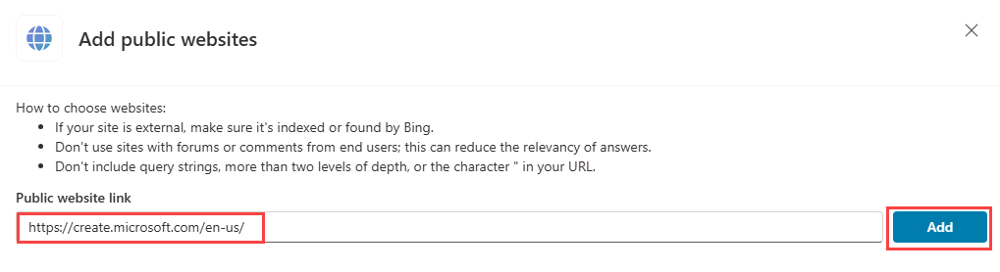

---
lab:
    title: 'Build an initial agent'
    module: 'Manage topics in Microsoft Copilot Studio'
---

# Build an initial agent

## Scenario

In this exercise, you will:

- Create and name an agent
- Add description for what the agent should do
- Configure Generative AI answers

This exercise will take approximately **15** minutes to complete.

## What you will learn

- How to create an agent using natural language
- How to configure Generative AI answers for an agent

## High-level lab steps

- Create a new agent
- Tell your agent what its primary purpose is and how it should act
- Add Generative AI instructions
  
## Prerequisites

- Must have completed **Lab: Import Dataverse solution**

## Exercise 1 - Create agent

In this exercise, you will access the Microsoft Copilot Studio portal, the Developer environment and create a new agent.

### Task 1.1 – Microsoft Copilot Studio portal

1. In a new tab, navigate to the Microsoft Copilot Studio portal `https://copilotstudio.microsoft.com` and sign in with your Microsoft 365 credentials if prompted again.

1. If prompted, select **Start free trial**.

1. Make sure that you are in the appropriate environment.

### Task 1.2 – Create an agent

1. Select **Create** from the left navigation pane and select the **+ New agent** and **Skip to configure** in the top right.

1. In the **Name** text box, enter **`Real Estate Booking Service`**

1. In the **Description** text box, enter **`Create bookings for real estate properties`**

1. In the **Instructions** text box, enter **`Create an agent for topics relating to creating bookings for real estate properties`**

1. At the top, **Language** should be set to **English (en-US)**.

    

1. Select the **three dots** in the upper-right of the page and select **Edit advanced settings**.

    

1. Select **Bookings** under **Solution**.

1. Enter `labagent` for **Schema Name**.

    

1. Select **Save**.

1. In the upper-right of the screen, select **Create**.

1. In the right **Test your agent** pane, enter **`How do I make a booking?`** and view the response.

Leave this window open.

## Exercise 2 - Add Generative AI answers

In this exercise, you will access the Microsoft Copilot Studio portal and add knowledge that the agent will use to answer questions by using Generative AI.

### Task 2.1 - Disable generative orchestration

1. In the **Overview** tab, ensure that **Use generative AI to determine how best to respond to users and events.** is set to **Disabled** within the **Details** section. This turns Orchestration off for the purpose of this lab.

    

### Task 2.2 – Enable Generative AI answers

1. In the **Overview** tab, ensure that **Allow the AI to use its own general knowledge** is set to **Enabled** within the **Knowledge** section.

    

### Task 2.3 – Add a knowledge source

1. Select the **Knowledge** tab.

    

1. Select **+ Add knowledge**.

1. Select **Public websites**

1. In the **Public website link** text box, enter **`https://create.microsoft.com/en-us/`**.

    

1. Select **Add**.

1. Select **Add**.

1. Select the **Overview** tab.

1. Select the **three dots** at the top of the **Test your agent** pane.

1. Enable **Track between topics**.

    

1. At the top of the **Test your agent** pane, select the  **Start a new conversation** icon (refresh icon).

    

1. In the **Ask a question or describe what you need** text box, enter **`How do I boost real estate promotion?`**.

    
