---
lab:
  title: Manage knowledge in Copilot Studio agents
  module: Ground agents with knowledge sources
  description: In this lab, you will use Copilot to create an agent, create a Dataverse table, add knowledge to the agent, and configure generative AI.
  duration: 60 minutes
  level: 200
  islab: true
  primarytopics:
    - Microsoft Copilot Studio
---

# Manage knowledge in Copilot Studio agents

## Scenario

In this exercise, you will:

- Create a Dataverse table
- Create an agent
- Upload a file to use as a knowledge source
- Add a public website as a knowledge source
- Add the Dataverse table as a knowledge source
- Configure generative AI settings
- Configure the generative answers node
- Publish the agent to Microsoft Teams

This exercise will take approximately **60** minutes to complete.

## What you will learn

- How to add knowledge sources to an agent
- How to configure generative AI for the agent and for topics

## High-level lab steps

- Create a Dataverse table using Copilot
- Create an agent using Copilot
- Add knowledge sources
- Configure generative AI
- Publish the agent
  
## Prerequisites

- Have a Microsoft Entra ID account
- Have a Copilot Studio license or have signed up for a [free trial](https://go.microsoft.com/fwlink/p/?linkid=2252605).

## Key concept: Grounding an agent with knowledge

When generative AI is enabled, the agent uses instructions, knowledge, and tools to answer questions dynamically. There are multiple types of knowledge that can be used to ground the agent and several settings that affect how generative AI is used by the agent that affect the responses.

## Exercise 1 - Create a Power Platform environment

### Task 1.1 - Power Platform Admin Center

Before you start the lab exercises, you must create a development environment for you to work in.

1. Open a web browser, navigate to `https://admin.powerplatform.microsoft.com/manage/environments`, and sign in using your credentials for this exercise.

1. If prompted, choose the option to stay signed in.

1. Close any pop-up messages that are displayed.

### Task 1.2 - Add Dataverse to the default environment

1. Select the ellipses (**...**) for the **Contoso (default)** environment and select **Add Dataverse**.

   

1. Leave all of the default settings and select **Add**.

### Task 1.3 - Create a new environment

1. In the **Environments** page, select **+ New** to create a new environment with the following settings:

   - **Type**: Developer
   - **Region**: default region
   - **Name**: *Your name*
   - **Environment group**: None
   - **Make this a Managed Environment**: No
   - **Get new features early**: No
   - **Create on behalf**: No

   

1. Select **Next** and in the **Add Dataverse** section:

   - **Language**: English (United States)
   - **Currency**: USD ($)
   - **Deploy sample apps and data**: No

1. Select **Save** and wait until the state of your environment is **Ready** (you can use the **Refresh** button to update the display).

   

1. In a new browser tab, navigate to `https://copilotstudio.microsoft.com/` and sign in if prompted.

1. Select **Get Started**, if prompted, leaving the default country/region.

1. Skip any welcome messages.

1. In the upper right corner of the page, switch environments by using the Environment Selector and select the environment you created above from the list.

   

### Task 1.4 - Create a solution

1. In the left navigation pane, select the ellipses (**...**), and select **Solutions**.

1. You should see several solutions including the *Default Solution* and the *Common Data Services Default Solution*.

   

1. Select **+ New solution**.

1. In the **Display name** text box, enter **`Lab Exercises`**

1. Verify that **Name** is automatically populated.

1. Select **+ New publisher** below the **Publisher** drop-down.

1. For **Display name**, enter `Fabrikam`

1. For **Name**, enter `fabrikam`

1. For **Prefix**, enter `fab`

   

1. Select **Save**.

1. Verify that **Fabrikam (fabrikam)** is selected in the **Publisher** drop-down.

1. Select the **Set as your preferred solution** checkbox.

   

1. Select **Create**.

1. Close the **Solutions** browser tab.

1. Refresh the **Copilot Studio** page.

## Exercise 2 - Create a table in Dataverse

In this exercise, you will create a Dataverse table that will be used as a knowledge source by an agent.

### Task 2.1 – Create a table for expense claims

1. In a web browser, navigate to **Power Apps Maker portal** at `https://make.powerapps.com/` and sign in if prompted. Skip any welcome messages.

1. In the upper right corner of the page, switch environments by using the Environment Selector and select the environment you created above from the list.

   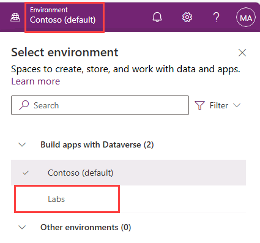

1. In the left-hand navigation in the **Maker portal**, select **Tables**.

   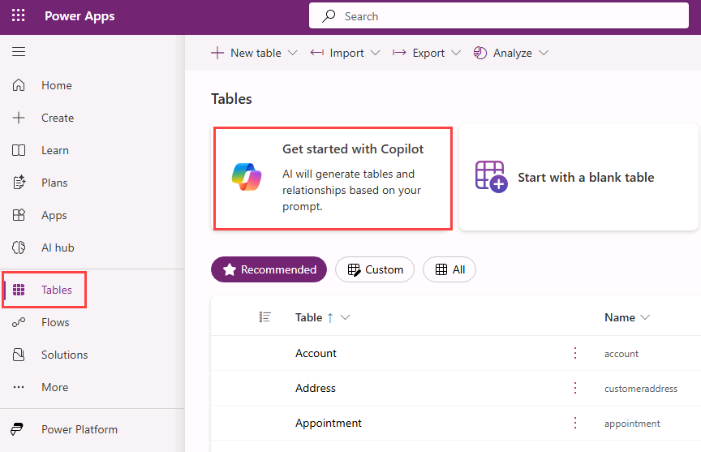

1. Select the **Get started with Copilot** tile.

1. In the **Get started with Copilot** dialog, select the **Table options** icon, and select **One table**.

   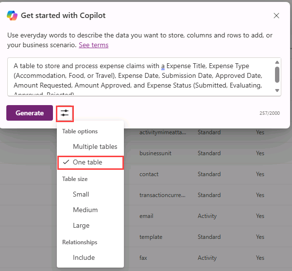

1. In the *Describe the tables you want Copilot to build* text box, enter the following prompt:

   ```prompt
   A table to store and process expense claims with an Expense Title, Expense Type (Accommodation, Meals, Entertainment or Travel), Expense Date, Submission Date, Approved Date, Amount Requested, Amount Approved, and Expense Status (Submitted, Evaluating, Approved, Rejected).
   ```

1. Select **Generate**.

1. A table will be created. Make a note of the name of the table.

   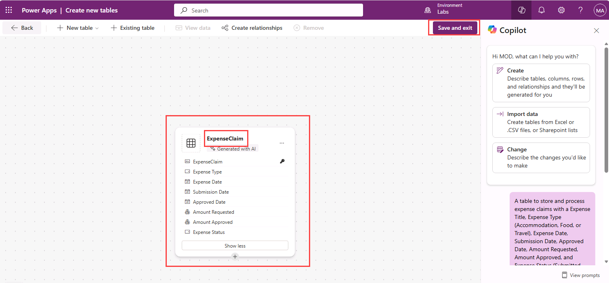

1. Select **Save and exit** and select **Save and exit** again.

## Exercise 3 - Create an agent

In this exercise, you will create a new agent using natural language to answer questions about expense policies in a fictional corporation.

### Task 3.1 – Create an agent for expense claims

1. Navigate to the **Copilot Studio** home page `https://copilotstudio.microsoft.com/`.

1. Make sure that you are in the environment that you created.

1. Select **Agents** in the left-hand navigation.

1. In the bottom-left of the *Start building by describing what your agent needs to do* text box, select the **Agent Settings** icon, which is displayed as a **Cog** image.

   

1. Leave **English (United States)** set as the primary language for the agent.

1. In the **Solution** drop-down, select **Lab Exercises**.

1. Enter `expenseagent` for the *Schema name*.

1. Select **Update**.

1. In the *Start building by describing what your agent needs to do* text box, enter the following prompt:

   ```prompt
   You are an agent that helps employees with expense claims including questions around expense policy and procedures.
   ```

1. Select the **Send** icon.

   Once your agent has been provisioned, you may proceed with configuring your agent.

## Exercise 4 - Ground the agent with knowledge

In this exercise, you will add knowledge sources to the agent to ground the agent.

### Task 4.1 – Add a document as a knowledge source

1. Open a new browser tab and navigate to `https://github.com/MicrosoftLearning/mslearn-copilotstudio/raw/main/expenses/Expenses_Policy.docx` to download the [expenses policy document](https://raw.githubusercontent.com/MicrosoftLearning/mslearn-copilotstudio/main/expenses/Expenses_Policy.docx) locally. This document contains details of the expenses policy for the fictional corporation.

1. Return to the **Copilot Studio** browser tab with the agent you created in Exercise 3.

1. Select the **Knowledge** tab to see the knowledge sources defined in your agent (currently there should be none).

   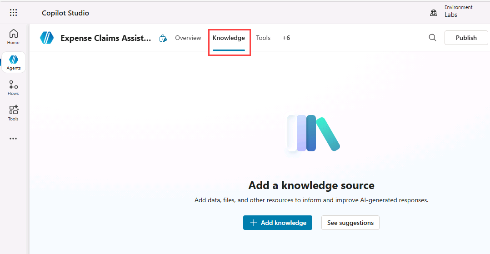

1. Select **+ Add knowledge**, and note the multiple types of knowledge source that you can add to your agent.

   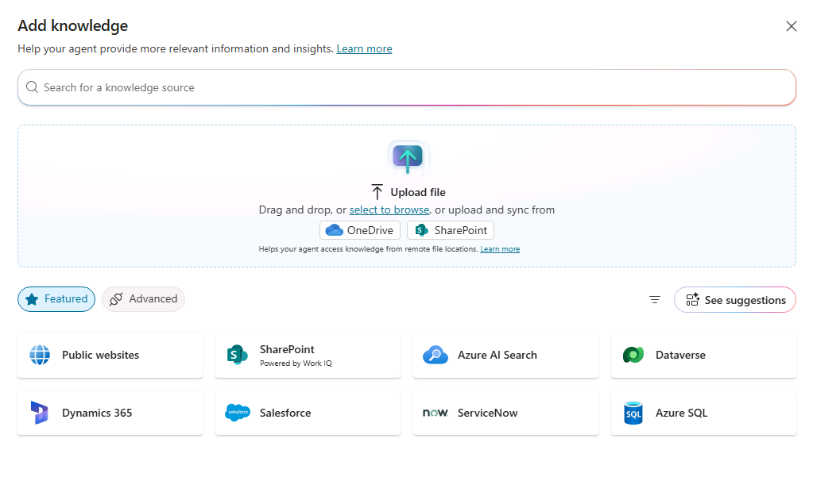

1. In the **Upload file** section, use **select to browse** to upload the expense policy document you downloaded previously and select **Add to agent**.

   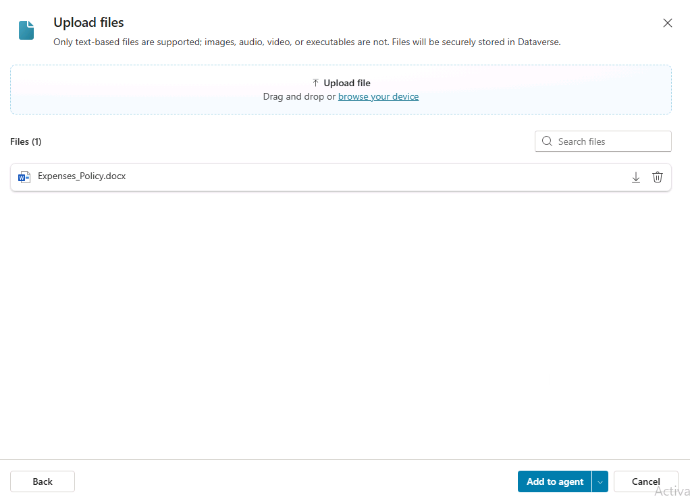

   > [!NOTE]
   > After uploading the file, Copilot Studio begins indexing. This may take 10 minutes or longer, so you will check back after the next exercise.

### Task 4.2 – Add a public website as a knowledge source

1. In the Copilot Studio agent, select the **Knowledge** tab.

1. Select **+ Add knowledge**.

1. Select **Public websites**.

1. In the **Public website link** text box, enter **`https://www.irs.gov/publications/p463`**. This official government public website has details on reimbursement of travel expenses that could be useful for your agent.

1. Select **Add**.

1. For *Name*, enter `Travel, Gift, and Car Expenses | Internal Revenue Service`.

1. For *Description*, enter `This knowledge source contains information on reimbursement of travel expenses.`.

1. Select **Add to agent**.

### Task 4.3 – Add a Dataverse table as a knowledge source

1. In the Copilot Studio agent, select the **Knowledge** tab.

1. Select **+ Add knowledge**.

1. Select **Dataverse**.

1. Search for and select the *Expenses* table you created in Exercise 2

   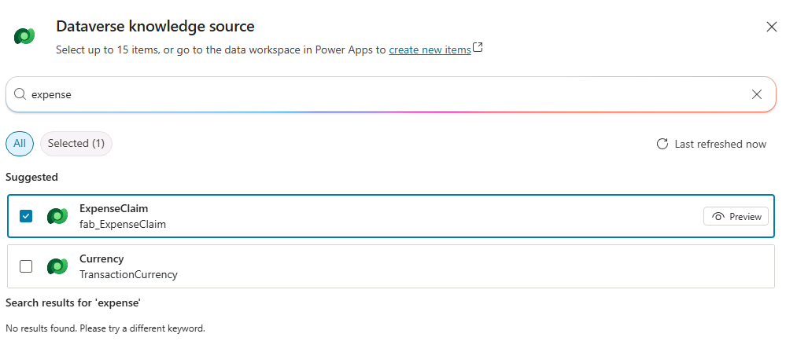

1. Select **Add to agent**.

   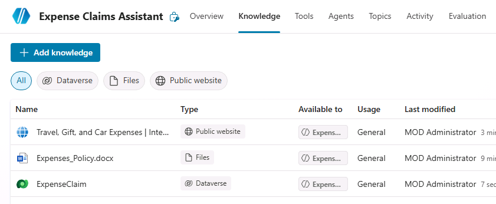

### Task 4.4 – Configure the Dataverse knowledge source

1. In the Copilot Studio agent, select the **Knowledge** tab.

1. Select the ellipses (**⋮**) for the Dataverse table and select **Edit**.

   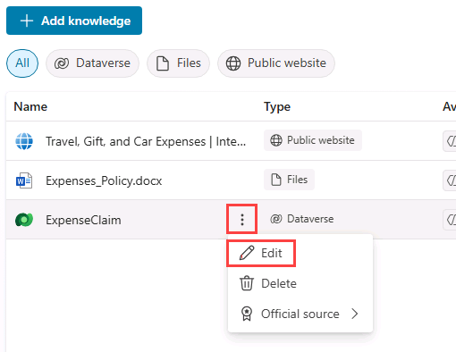

1. In the **Details** tab, for *Name*, enter `Expense Claims data`.

1. Select the **Synonyms** tab.

1. In the **Expense Type** row, select **+ Add synonyms**.

1. Enter `Expense label` and select **Add**.

1. Enter `Expense category` and select **Add**.

   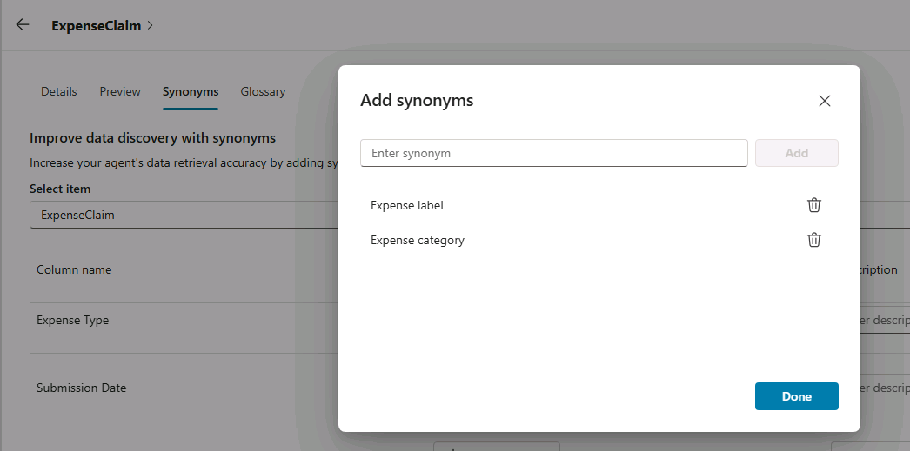

1. Select **Done**.

1. Select the **Glossary** tab.

1. For *Enter term*, enter `Incidental expenses`.

1. For *Enter description*, enter `Minor, necessary business costs that arise in addition to a primary expense such as tips or fees.`.

1. Select **Save**.

### Task 4.5 – Check in on your file indexing

Let's see if the file you uploaded is finished indexing. If it is not, take a coffee break and check back in every few minutes.

1. Select the **Knowledge** tab.

1. Check on the **Status** of your file upload. If it is still **In progress**, refresh every few minutes until it is **Ready**.

### Task 4.6 - Test grounding

1. Select the **Test** icon in the upper-right of the page to open the testing pane.

1. In the **Test** pane, select the ellipses (**...**) next to the variables **{x}** icon, and toggle **Show activity map when testing** to **On** and **Track between topics** to **Off**.

   

1. At the top of the **Test** pane, select the **Start new test session** icon **+**.

1. Enter the following prompt:

   `What can I claim for expenses?`

1. The agent should search all the knowledge sources and generate a response using the uploaded expense policy document.

   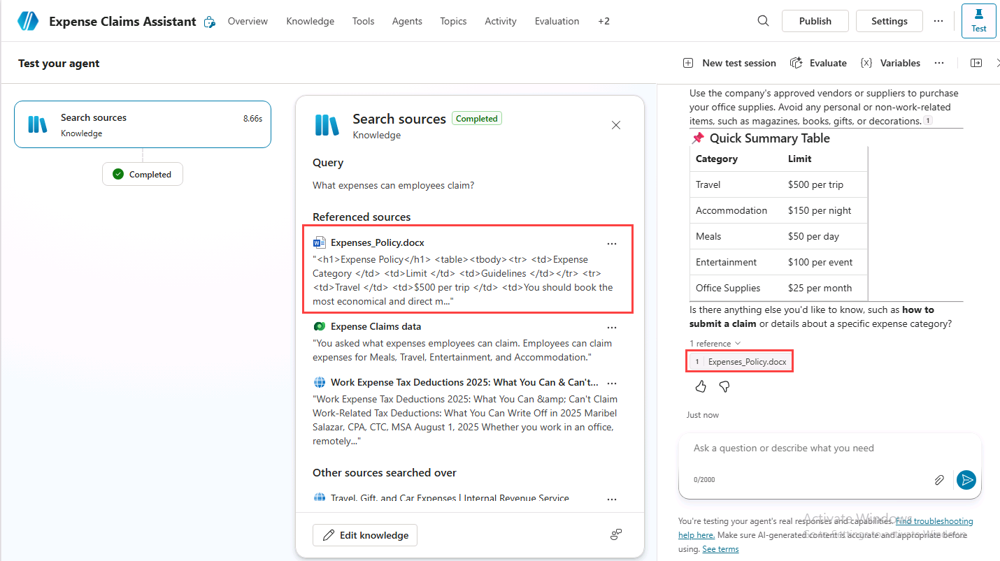

1. At the top of the **Test** pane, select the **Start new test session** icon **+**.

1. Enter the following prompt:

   `What is the total amount of all expense claims for each category?`

1. The agent should search all the knowledge sources and generate a response using the Dataverse table.

   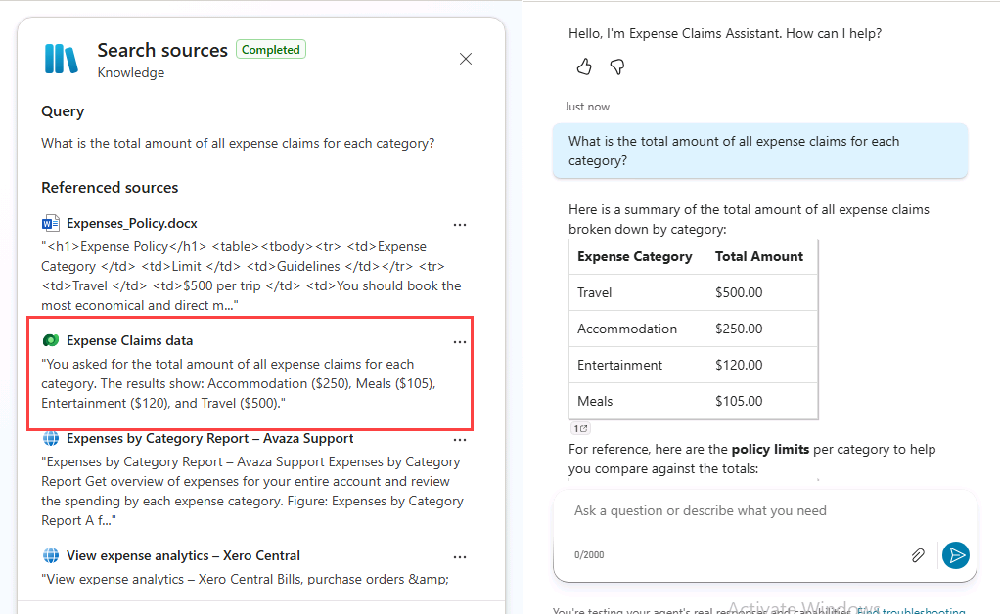

1. At the top of the **Test** pane, select the **Start new test session** icon **+**.

1. Enter the following prompt:

   `What is the standard deduction for incidental expenses?`

1. The agent should search all the knowledge sources and generate a response using the public website.

   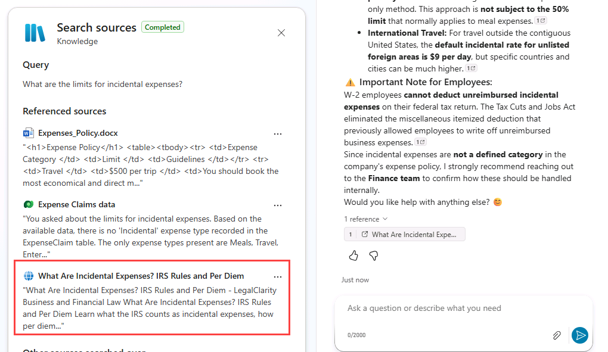

## Exercise 5 - Generative AI settings

In this exercise you will configure generative AI for the agent and for the generative answers node.

### Task 5.1 – Configure agent knowledge settings

1. In the upper-right of the agent page, select the **Settings** button.

1. Note that **Orchestration** is set to **Yes - Responses will be dynamic, using available tools and knowledge as appropriate**.

1. In the **Knowledge** section, set **Allow ungrounded responses** to **Off**.

1. In the **Knowledge** section, set **Use information from the Web** to **Off**.

   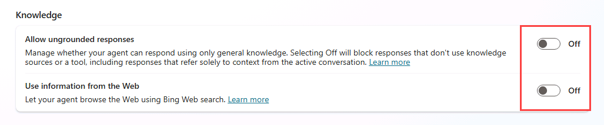

1. Select **Save**

1. In the upper-right of the Settings page, select **X** to close settings.

1. Test the agent using the prompts from the previous exercise. The file and Dataverse knowledge sources will be used but the public website will not be used when generating a response.

### Task 5.2 – Configure generative answers node

1. Select the **Topics** tab.

1. Filter by **System** topics.

1. Open the **Conversational boosting** topic.

1. If a **Boost your conversations with copilots** dialog appears, select **Done**.

1. Select the **Create generative answers** node.

   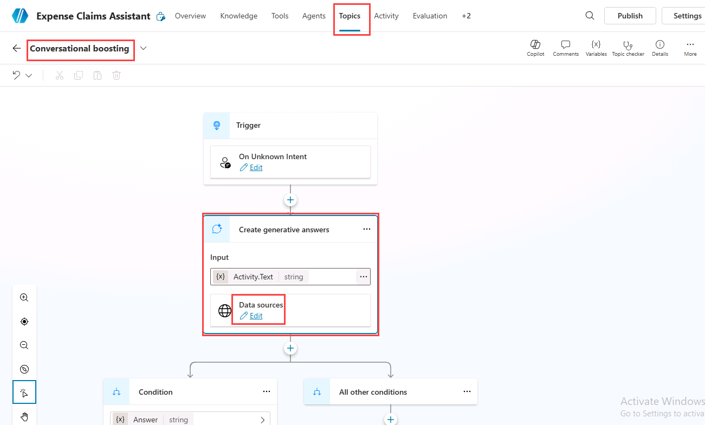

1. Select **Edit** for **Data sources**.

1. Select and enable **Search only selected sources.**

1. Select the **Public website** knowledge source.

1. Select and enable **Web search**.

   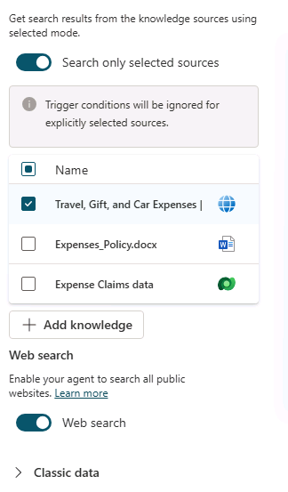

1. Select **Save**.

1. Select the **Overview** tab.

1. Select the **Test** icon in the upper-right of the page to open the testing pane.

1. In the **Test** pane, select the ellipses (**...**) next to the variables **{x}** icon, and toggle **Show activity map when testing** to **Off** and **Track between topics** to **On**.

1. At the top of the **Test** pane, select the **Start new test session** icon **+**.

1. Enter the following prompt:

   `What is the federal per diem rate?`

1. The knowledge sources will not provide an answer but the agent will use generative answers to search the web to generate a response.

   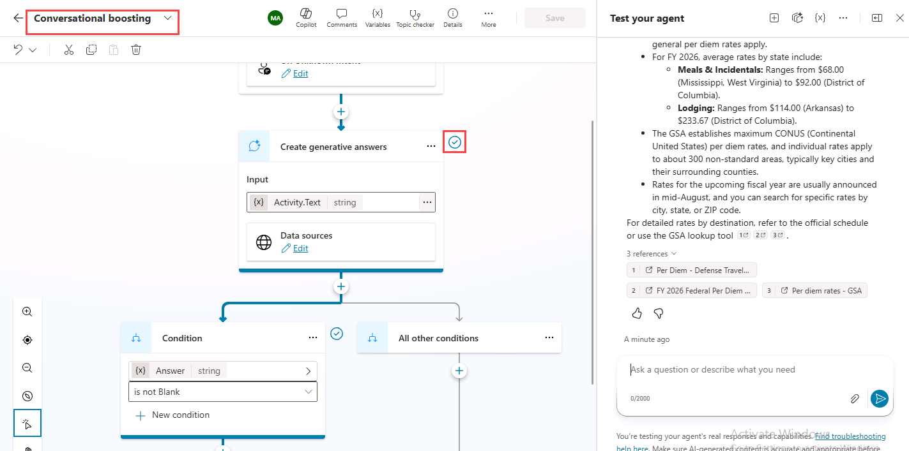

### Task 5.3 – Fallback topic

1. Select the **Topics** tab.

1. Filter by **System** topics.

1. Open the **Conversational boosting** topic.

1. Select the **Create generative answers** node.

1. Select **Edit** for **Data sources**.

1. Disable **Web search**.

1. Select **Save**.

1. Select the **Overview** tab.

1. Select the **Test** icon in the upper-right of the page to open the testing pane.

1. In the **Test** pane, select the ellipses (**...**) next to the variables **{x}** icon and verify that **Show activity map when testing** is set to **Off** and **Track between topics** is set to **On**.

1. At the top of the **Test** pane, select the **Start new test session** icon **+**.

1. Enter the following prompt:

   `What is the federal per diem rate?`

1. The knowledge sources and generative answers will not provide an answer. The **Fallback** topic will be triggered.

   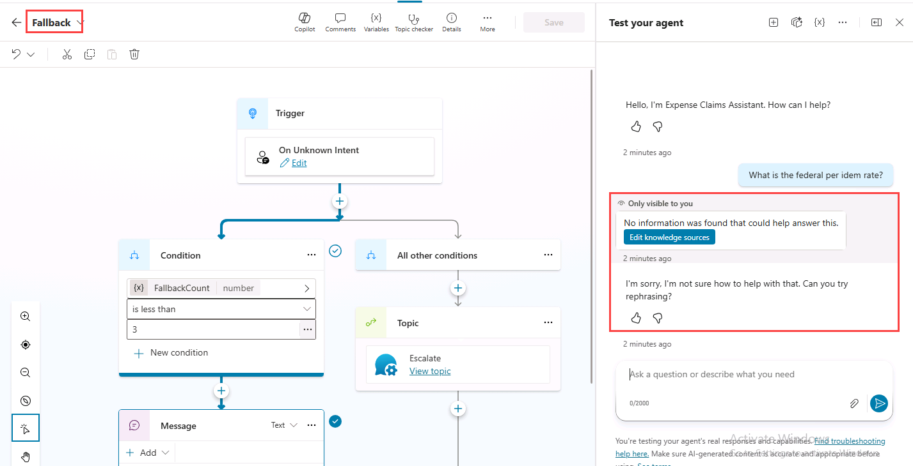

## Exercise 6 - Publish the agent to Microsoft Teams

In this exercise, you will publish the agent to Microsoft Teams, first ensuring that Microsoft Entra ID authentication is enabled.

### Task 6.1 - Microsoft Entra ID authentication

1. In the upper-right of the agent page, select the **Settings** button.

1. In the left-hand side of the **Settings** page, select **Security**.

1. Select **Authentication**.

1. If not already selected, select **Authenticate with Microsoft**.

1. Select **Save** and select **Save** again.

1. In the upper-right of the **Settings** page, select **X** to close settings.

### Task 6.2 - Publish the agent

1. On the agent page, select **Publish** and select **Publish** again to confirm.

### Task 6.3 - Microsoft Teams channel

1. Select the **Channels** tab.

   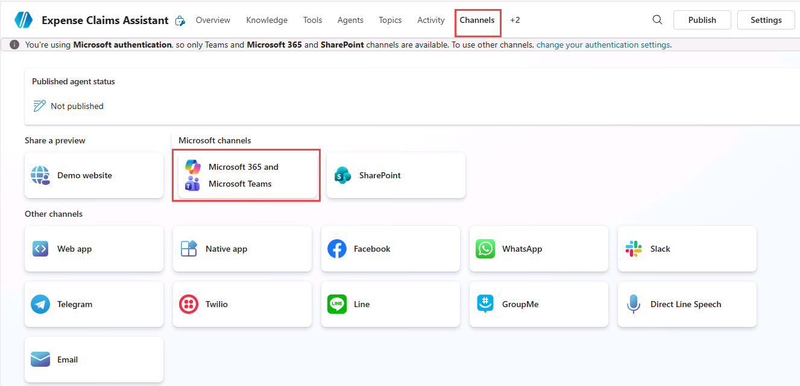

1. Select the **Microsoft 365 and Microsoft Teams** tile.

1. Deselect **Make agent available in Microsoft 365 Copilot**.

1. Select **Add channel**.

   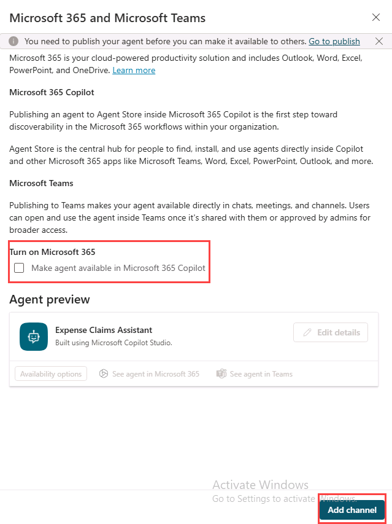

1. Select **See agent in Teams**.

1. Select **Cancel** in the dialog box for **This site is trying to open Microsoft Teams (work or school)**.

1. In the pop-up, select **Cancel** and select **Use the web app instead**.

1. Select **Add** to add the agent to Teams.

   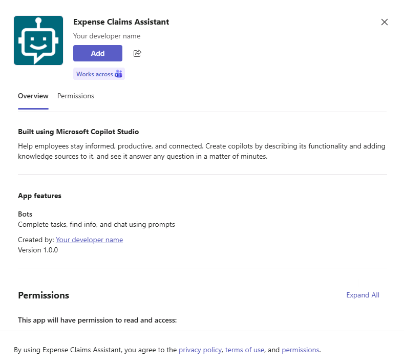

1. Select **Open** and wait for the agent to load in Teams.

1. Test the agent.

    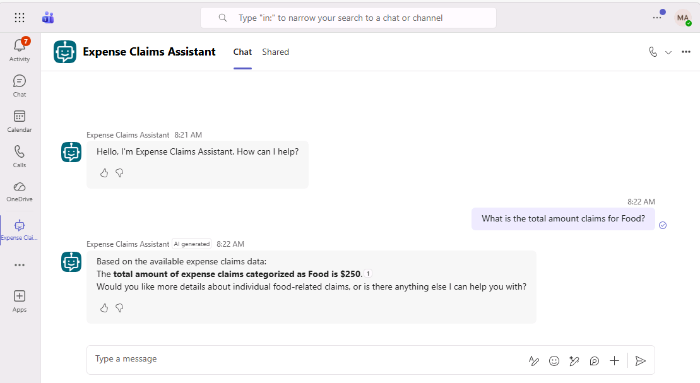

## Summary

In this lab, you added knowledge sources to an agent and explored how generative AI settings affect when and how the knowledge sources are used to generate responses to prompts.
