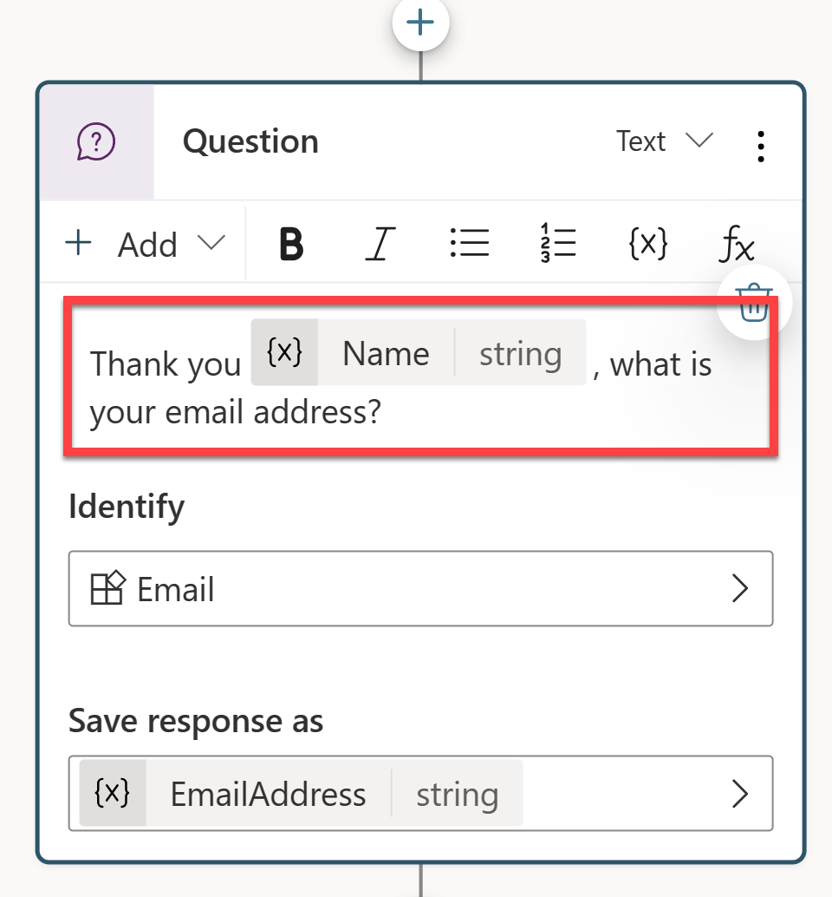

---
lab:
    title: 'Manage topics'
    module: 'Manage topics in Microsoft Copilot Studio'
---

# Manage topics

## Scenario

In this exercise, you will:

- Manage existing topics
- Create and edit topics using Copilot
- Create a topic manually by using trigger phrases

This exercise will take approximately **30** minutes to complete.

## What you will learn

- How topics complement generative AI responses
- When topics are used to enforce structured conversations
- How to create and refine topics using natural language

## High-level lab steps

- Review and disable unnecessary topics
- Create a topic using Copilot
- Edit topic content using natural language
- Test topic behavior with generative AI enabled
  
## Prerequisites

- Must have completed **Lab: Build an initial agent**


## Key concept: Topics and generative AI
When generative AI is enabled, the agent may answer questions dynamically without triggering a topic. This is expected behavior.

Topics are used when you need to:
- Collect required information step by step
- Control the order of questions
- Store responses in variables
- Ensure predictable outcomes

In later labs, you will use topics together with nodes, entities, and tools to enforce your agent's behavior.

## Detailed steps

## Exercise 1 - Review and disable topics

In this exercise, you will review existing topics and disable one that is not required.

### Task 1.1 – Disable topics

1. Navigate to the Microsoft Copilot Studio portal `https://copilotstudio.microsoft.com` and ensure you are in the appropriate environment.

1. Select **Agents** from the left navigation pane.

1. Select the **Real Estate Booking Service** agent you created in the previous lab.

    

1. Select the **Topics** tab.

1. Locate the **Start Over** topic.

1. Toggle **Enabled** to **Off** for the **Start Over** topic.

    

Disabling unused topics helps reduce ambiguity when multiple topics or generative responses could handle the same request.

## Exercise 2 - Create topics with natural language

In this exercise, you will use Copilot to create a topic from a description. This allows generative AI to draft the initial structure, which you can then refine.

### Task 2.1 – Add a topic from description

1. Select **+ Add a topic** and select **Create from description with Copilot**. A new window appears.

    

    

1. In the **Name your topic** text box, enter **`Customer Details`**.

1. In the **Create a topic to...** text box, enter **`Ask the customer for their name and email address`**.

1. Select **Create**.

1. Select **Save**.

### Task 2.2 – Edit topic content using natural language

1. If the **Test your agent** pane is open, close the pane.

1. If the **Edit with Copilot** pane is not shown on the right side of the **Customer Details** pane, select the **Copilot** icon in the upper part of the authoring canvas.

    

1. Select the second **Question** node **What is your email address?**

    

1. In the **Edit with Copilot** panel, in the **What do you want to do?** field, enter the following text:

    `Change "What is your email address?" to say thank you to the Name variable from the previous node and then proceed to ask the email address question.`

1. Select **Update**.

    

    

    > **Note**: The message should be updated to include the *Name* variable from the prior node, and should look similar to the screenshot above. If Edit with copilot did not update the question node correctly, select Undo, and retry with a different prompt.

1. Select **Save**.

### Task 2.3 – Add a summary using natural language

In addition to adding updating existing nodes, you can use Copilot to add new ones.

1. Click an empty area on the authoring canvas so no node is selected.

1. In the **Edit with Copilot** panel, in the **What do you want to do?** field, enter the following text:

    `Summarize the information collected in an adaptive card`

1. Select **Update**.

A message node with an Adaptive Card is added to the end of the topic.

    

1. Select the **Media** box in the Adaptive Card. The Adaptive Card properties should appear on the right of the page.

    

   Your Adaptive Card formula should look similar to the one above. If it doesn't, then you can paste in the formula below:

    ```json
    {
    type: "AdaptiveCard", 
        body: 
        [
            {
                type: "TextBlock",
                size: "Medium",
                weight: "Bolder",
                text: "Summary"    
            },
            {
                type: "FactSet",
                facts: 
                [
                    {
                        title: "Full Name",
                        value: Text(Topic.Name)
                    },
                    {
                        title: "Email Address",
                        value: Text(Topic.EmailAddress)
                    }
                ]
            },
            {
                type: "TextBlock",
                text: "Thank you for providing the information."
            }
        ]
    }
    ```

1. Select the **Copilot** icon (You may need to select **More** \> **Copilot** ) to reopen the **Edit with Copilot** pane.

1. Make sure that no node is selected by selecting the empty space in the authoring canvas.

1. In the **What do you want to do?** field, enter the following text:

    `Add a new multiple choice question to prompt the user if the details are correct with two options Yes or No`

1. Select **Update**.

1. A new question node is added to the end of the topic with options for the user to select.

    

1. Select **Save**.

In later labs, you will use this response to control branching logic and enforce predictable behavior.

## Exercise 3 - Test the topic

1. If the **Test your agent** panel is closed, select the **Test** icon in the upper-right of the page.

1. Select the **Start new test session** icon at the top of the testing panel.

    

1. In the **Ask a question or describe what you need** text box, enter **`Customer information`**.

1. Provide a name and email address when prompted.

1. Select **Yes** when asked to confirm the details.

1. Select **Save**

Observe how the agent uses the topic to control the conversation, collects required information step by step, and temporarily overrides free-form generative responses.
