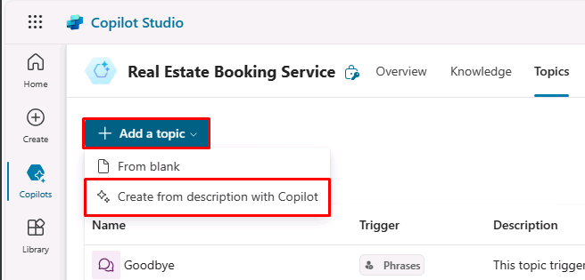

---
lab:
    title: 'Manage topics'
    module: 'Manage topics in Microsoft Copilot Studio'
---

# Manage topics

## Scenario

In this exercise, you will:

- Manage existing topics
- Create and edit topics by using natural language
- Create a topic manually by using trigger phrases

This exercise will take approximately **30** minutes to complete.

## What you will learn

- How to configure agent topics

## High-level lab steps

- Disable topics
- Create new and edit topics with natural language
- Create a new topic and add trigger phrases
  
## Prerequisites

- Must have completed **Lab: Build an initial agent**

## Detailed steps

## Exercise 1 - Remove topics

In this exercise, you will remove topics in an agent.

### Task 1.1 – Disable topics

1. Navigate to the Microsoft Copilot Studio portal `https://copilotstudio.microsoft.com` and ensure you are in the appropriate environment.

1. Select **Agents** from the left navigation pane.

    

1. Select the agent you created in the previous lab.

1. Select the **Topics** tab.

1. Toggle **Enabled** to **Off** for the **Start Over** topic.

    

## Exercise 2 - Create topics with natural language

In this exercise, you will create topics in an agent and add trigger phrases.

### Task 2.1 – Add a topic using copilot

1. Select **+ Add a topic** and select **Create from description with Copilot**. A new window appears.

    

    

1. In the **Name your topic** text box, enter **`Customer Details`**.

1. In the **Create a topic to...** text box, enter **`Ask the customer for their name and email address.`**

1. Select **Create**.

1. Select **Save**.

### Task 2.2 – Update nodes with natural language

1. If the **Edit with Copilot** pane is not shown on the right side of the **Customer Details** pane, select the **Copilot** icon in the upper part of the authoring canvas.

    

1. Select the second **Question** node **What is your email address?**

    

1. In the **Edit with Copilot** panel, in the **What do you want to do?** field, enter the following text:

    `Change "What is your email address?" to say thank you to the Name variable from the previous node and then proceed to ask the email address question.`

1. Select **Update**.

    

    

    > **Note**: The message should be updated to include the *Name* variable from the prior node, and should look similar to the screenshot above. If Edit with copilot did not update the question node correctly, select Undo, and retry with a different prompt.

1. Select **Save**.

### Task 2.3 – Add nodes with natural language

In addition to adding updating existing nodes, you can use Copilot to add new ones.

1. Make sure that no node is selected by selecting the empty space in the authoring canvas.

1. In the **Edit with Copilot** panel, in the **What do you want to do?** field, enter the following text:

    `Summarize the information collected in an adaptive card`

1. Select **Update**.

1. A message node with an Adaptive Card is added to the end of the topic.

    

1. Select the **Media** box in the Adaptive Card. The Adaptive Card properties should appear on the right of the screen.

    

   Your Adaptive Card formula should look similar to the one above. If it doesn't, then you can paste in the formula below:

    ```json
    {
    type: "AdaptiveCard", 
        body: 
        [
            {
                type: "TextBlock",
                size: "Medium",
                weight: "Bolder",
                text: "Summary"    
            },
            {
                type: "FactSet",
                facts: 
                [
                    {
                        title: "Full Name",
                        value: Text(Topic.Name)
                    },
                    {
                        title: "Email Address",
                        value: Text(Topic.EmailAddress)
                    }
                ]
            },
            {
                type: "TextBlock",
                text: "Thank you for providing the information."
            }
        ]
    }
    ```

1. Select the **Copilot** icon to reopen the **Edit with Copilot** pane.

1. Make sure that no node is selected by selecting the empty space in the authoring canvas.

1. In the **What do you want to do?** field, enter the following text:

    `Add a new multiple choice question to prompt the user if the details are correct with two options Yes or No`

1. Select **Update**.

A new question node is added to the end of the topic with options for the user to select.

    

1. Select **Save**.

### Task 2.4 - Test the topic

1. If the **Test your agent** panel is closed, select the **Test** button in the upper-right of the screen.

1. Select the **Start a new conversation** (Refresh) icon at the top of the testing panel.

1. In the **Ask a question or describe what you need** text box, enter **`Customer information`**.

1. Enter your name and email address.

1. Select **Yes**.

## Exercise 3 - Author topics manually

Topics can be created manually by adding trigger phrases.

### Task 3.1 - Create a topic from blank

1. Select the **Topics** tab in the top bar of **Real Estate Booking Service**.

1. Select **+ Add a topic** and select **From blank**.

1. Select the **Details** icon to open the Topic details dialog.

    

1. In the **Name** field, enter the following text:

    `Book a Real Estate Showing`

1. In the **Display Name** field, enter the following text:

    `Book`

1. In the **Description** field, enter the following text:

    `Select the property and requested date and create a booking request`

1. Select **Save**.

### Task 3.2 - Add trigger phrases

1. Select **Edit** under **User says a phrase** in the **Trigger**.

    

1. Enter `I want to book a real estate showing` under **Add phrases** and select the **+** icon.

1. Enter `Schedule a real estate showing` under **Add phrases** and select the **+** icon.

1. Enter `Arrange the viewing for a real estate property` under **Add phrases** and select the **+** icon.

1. Enter `Set up an appointment to view a house` under **Add phrases** and select the **+** icon.

1. Enter `Plan a property viewing` under **Add phrases** and select the **+** icon.

1. Select **Save**.
