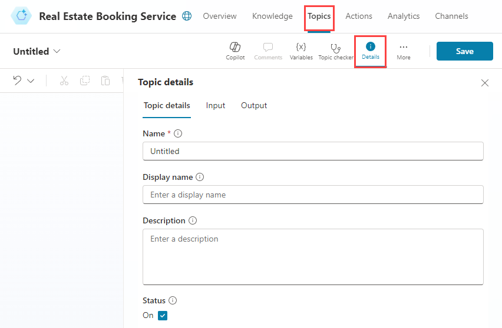
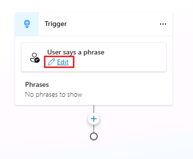

---
lab:
    title: 'Manage topics'
    module: 'Manage topics in Microsoft Copilot Studio'
---

# Manage topics

## Scenario

In this lab, you will:

- Manage existing topics
- Create and edit topics by using natural language
- Create a topic manually by using trigger phrases

## What you will learn

- How to configure copilot topics

## High-level lab steps

- Delete the sample topics
- Disable topics
- Create new and edit topics with natural language
- Create a new topic and add trigger phrases
  
## Prerequisites

- Must have completed **Lab: Build an initial copilot**

## Detailed steps

## Exercise 1 - Remove topics

In this exercise, you will remove topics in a copilot.

### Task 1.1 – Disable topics

1. Navigate to the Microsoft Copilot Studio portal `https://copilotstudio.microsoft.com` and ensure you are in the appropriate environment.

1. Select the **Test** button in the upper-right of the screen to close the testing panel if the panel is open.

1. Select **Copilots** from the left navigation pane.

    

1. Select the copilot you created in the previous lab.

1. Select the **Topics** tab.

    

1. Toggle **Enabled** to **Off** for the **Start Over** topic.

    

## Exercise 2 - Create topics with natural language

In this exercise, you will create topics in a copilot and add trigger phrases.

### Task 2.1 – Add a topic using copilot

1. Select **+ Add a topic** and select **Create from decription with Copilot**. A new window appears.

    

    

1. In the **Name your topic** text box, enter **`Customer Details`**.

1. In the **Create a topic to...** text box, enter **`Ask the customer for their name and email address.`**

1. Select **Create**.

1. Select **Save**.

### Task 2.2 – Update nodes with natural language

1. If the **Edit with CoPilot** pane is not shown on the right side of the **Customer Details** pane, select the **Copilot** icon in the upper part of the authoring canvas.

    

1. Select the second **Question** node, **What is your email address?**

    

1. In the **Edit with Copilot** panel, in the **What do you want to do?** field, enter the following text:

    `Update the message in this Question node to say thank you to the Name variable from the previous node and then proceed to ask the email address question.`

1. Select **Update**.

    

    

    > **Note**: The message should be updated to include the *Name* variable from the prior node, and should look similar to the screenshot above.

1. Select **Save**.

### Task 2.3 – Add nodes with natural language

In addition to adding updating existing nodes, you can use Copilot to add new ones.

1. Make sure that no node is selected by selecting the empty space around the nodes.

1. In the **Edit with Copilot** panel, in the **What do you want to do?** field, enter the following text:

    `Summarize the information collected in an adaptive card`

1. Select **Update**.

1. A message node with an Adaptive Card is added to the end of the topic.

    

1. Select the **Media** box in the Adaptive Card. The Adaptive Card properties should appear on the right of the screen.

    

   Your Adaptive Card formula should look similar to the one above. If it doesn't, then you can paste in the formula below:

    ```json
    {
    type: "AdaptiveCard", 
        body: 
        [
            {
                type: "TextBlock",
                size: "Medium",
                weight: "Bolder",
                text: "Summary"    
            },
            {
                type: "FactSet",
                facts: 
                [
                    {
                        title: "Full Name",
                        value: Text(Topic.Name)
                    },
                    {
                        title: "Email Address",
                        value: Text(Topic.EmailAddress)
                    }
                ]
            },
            {
                type: "TextBlock",
                text: "Thank you for providing the information."
            }
        ]
    }
    ```

1. Opening the Adaptive Card properties closes the **Edit with Copilot** panel; therefore, you need to select the **Copilot** icon to reopen it.

1. Make sure that no node is selected by selecting the empty space around the nodes.

1. In the **What do you want to do?** field, enter the following text:

    `Add a new multiple choice question to prompt the user if the details are correct with two options Yes or No`

1. Select **Update**.

1. A new question node is added to the end of the topic with options for the user to select.

    

1. Select **Save**.

### Task 2.4 - Test the topic

1. Select the **Test** button in the upper-right of the screen to open the testing panel, if it's closed.

1. Select the **Start a new conversation** icon at the top of the testing panel.

1. In the **Ask a question or describe what you need** text box, enter **`Customer information`**.

1. Enter your name and email address.

1. Select **Yes**.

## Exercise 3 - Author topics manually

Topics can be created manually by adding trigger phrases.

### Task 3.1 - Create a topic from blank

1. Select the **Topics** tab in the top bar of **Real Estate Booking Service**.

1. Select **+ Add a topic** and select **From blank**.

1. Select the **Details** icon to open the Topic details dialog.

    

1. In the **Name** field, enter the following text:

    `Book a Real Estate Showing`

1. In the **Display Name** field, enter the following text:

    `Book`

1. In the **Description** field, enter the following text:

    `Select the property and requested date and create a booking request`

1. Select **Save**.

### Task 3.2 - Add trigger phrases

1. Select **Edit** under **Phrases** in the **Trigger**.

    

1. Enter `I want to book a real estate showing` under **Add Phrases** and select the **+** icon.

1. Enter `Schedule a real estate showing` under **Add Phrases** and select the **+** icon.

1. Enter `Arrange the viewing for a real estate property` under **Add Phrases** and select the **+** icon.

1. Enter `Set up an appointment to view a house` under **Add Phrases** and select the **+** icon.

1. Enter `Plan a property viewing` under **Add Phrases** and select the **+** icon.

1. Select **Save**.
