---
lab:
  title: Workflow tools in Copilot Studio agents
  module: Incorporate workflows to enhance agent behavior
  description: In this lab, you will use Copilot to create an agent, create workflow, add workflows as tools to the agent and to a topic.
  duration: 45 minutes
  level: 200
  islab: true
  primarytopics:
    - Microsoft Copilot Studio
---

# Workflow tools in Copilot Studio agents

## Scenario

In this exercise, you will:

- Create an agent
- Create workflows
- Add workflows as tools
- Use tools in the agent and in topics
- Test the agent

This exercise will take approximately **45** minutes to complete.

## What you will learn

- How workflows can be used to perform deterministic actions in an agent
- How to configure workflows as tools
- How to use workflows in a topic

## High-level lab steps

- Create an agent using Copilot
- Create a workflow to send a message to Microsoft Teams
- Add the workflow as a tool to the agent
- Create a workflow and add to a topic
  
## Prerequisites

- Have a Microsoft Entra ID account
- Have a Copilot Studio license or have signed up for a [free trial](https://go.microsoft.com/fwlink/p/?linkid=2252605).

## Key concept: Tools in agents

When generative AI is enabled, the agent can use tools to perform actions in external systems, retrieve data, and send messages.

## Exercise 1 - Create a Power Platform environment

### Task 1.1 - Power Platform Admin Center

Before you start the lab exercises, you must create a development environment for you to work in.

1. Open a web browser, navigate to `https://admin.powerplatform.microsoft.com/manage/environments`, and sign in using your credentials for this exercise.

1. If prompted, choose the option to stay signed in.

1. Close any pop-up messages that are displayed.

### Task 1.2 - Add Dataverse to the default environment

1. Select the ellipses (**...**) for the **Contoso (default)** environment and select **Add Dataverse**.

   

1. Leave all of the default settings and select **Add**.

### Task 1.3 - Create a new environment

1. In the **Environments** page, select **+ New** to create a new environment with the following settings:

   - **Type**: Developer
   - **Region**: default region
   - **Name**: *Your name*
   - **Environment group**: None
   - **Make this a Managed Environment**: No
   - **Get new features early**: No
   - **Create on behalf**: No

   

1. Select **Next** and in the **Add Dataverse** section:

   - **Language**: English (United States)
   - **Currency**: USD ($)
   - **Deploy sample apps and data**: No

1. Select **Save** and wait until the state of your environment is **Ready** (you can use the **Refresh** button to update the display).

   

1. In a new browser tab, navigate to `https://copilotstudio.microsoft.com/` and sign in if prompted.

1. Select **Get Started**, if prompted, leaving the default country/region.

1. Skip any welcome messages.

1. In the upper right corner of the page, switch environments by using the Environment Selector and select the environment you created above from the list.

   

### Task 1.4 - Create a solution

1. In the left navigation pane, select the ellipses (**...**), and select **Solutions**.

1. You should see several solutions including the *Default Solution* and the *Common Data Services Default Solution*.

   

1. Select **+ New solution**.

1. In the **Display name** text box, enter **`Lab Exercises`**

1. Verify that **Name** is automatically populated.

1. Select **+ New publisher** below the **Publisher** drop-down.

1. For **Display name**, enter `Fabrikam`

1. For **Name**, enter `fabrikam`

1. For **Prefix**, enter `fab`

   

1. Select **Save**.

1. Verify that **Fabrikam (fabrikam)** is selected in the **Publisher** drop-down.

1. Select the **Set as your preferred solution** checkbox.

   

1. Select **Create**.

1. Close the **Solutions** browser tab.

1. Refresh the **Copilot Studio** page.

## Exercise 2 - Create an agent

In this exercise, you will create a new agent using natural language to analyze, categorize, and prioritize tasks.

### Task 2.1 – Create an agent to analyze tasks

1. In the **Copilot Studio** home page `https://copilotstudio.microsoft.com/`.

1. Make sure that you are in the environment that you created.

1. Select **Agents** in the left-hand navigation.

1. In the bottom-left of the *Start building by describing what you agent needs to do* prompt window, select the **Agent Settings** icon, which is displayed as a **Cog** image.

   

1. Leave **English** set as the primary language for the agent.

1. Select the **Lab Exercises** *solution*.

1. Enter `analyzetaskagent` for the *Schema name*.

1. Select **Update**.

1. In the *Start building by describing what you agent needs to do* prompt, Enter the following prompt:

   ```prompt
   You are an agent that analyzes, categorizes, and prioritizes tasks.
   ```

1. Select the **Send** icon.

   Once you agent has been provisioned, you may proceed with configuring your agent.

## Exercise 3 - Create a workflow tool

In this exercise, you create a workflow that sends a message to Microsoft Teams. You will add this workflow to the agent.

### Task 3.1 – Create the Send Message to Teams workflow

1. In Copilot Studio, select **Tools** in the left-hand navigation.

   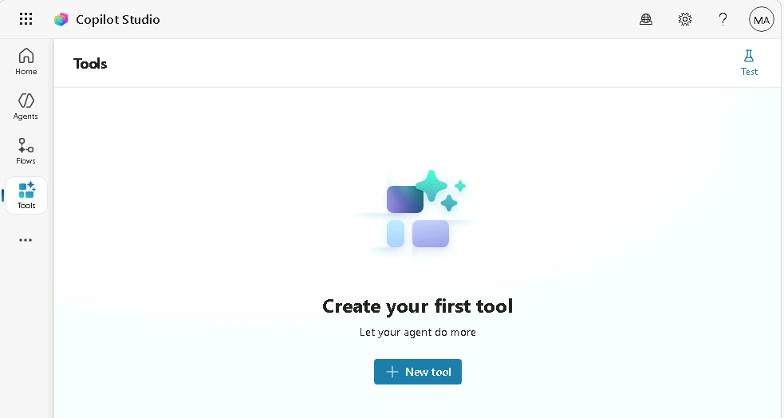

1. Select **+ New tool**.

1. In the **New Tool** dialog, select the **Agent flow** tile.

1. Verify that the **When an agent calls the flow** trigger and the **Respond to the agent** action have been added to the workflow.

   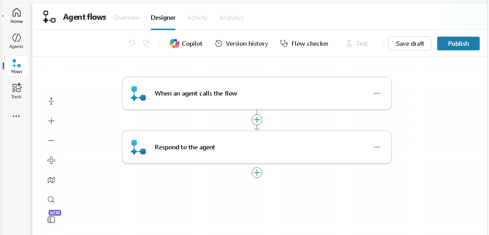

1. Select the trigger step **When an agent calls the flow** and select **+ Add an input**.

1. Select **Text**.

1. Enter `Task Summary` for **Input** and `Analyzed tasks` for **Please enter your input**.

   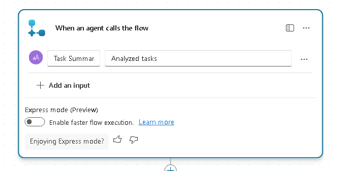

1. Select **Save draft** near the upper-right of the page.

1. Select the **Overview** tab.

1. In the **Details** section, select **Edit**.

   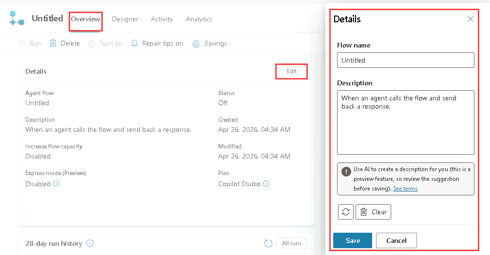

1. In the **Details** pane, update **Flow name** to `Send Summary to Teams`.

1. For **Description**, enter `Post a message to Teams with the summary of the task analysis`.

1. Select **Save**

### Task 3.2 - Post to Teams action

1. Select the **Designer** tab.

1. Select the **+** icon between the two steps in the workflow to insert a new action.

1. Enter `Teams` in the **Search** field and select **See more** for the **Microsoft Teams** connector.

   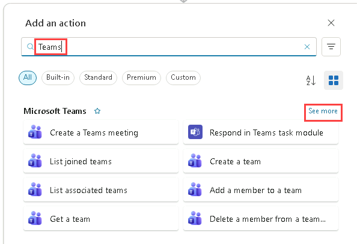

1. Select the **Post message in a chat or channel** action.

1. For *Post as* select **Flow bot**.

1. For *Post in* select **Channel**.

1. For *Team* select one of the Teams listed e.g., **Leadership**.

1. For *Channel* select one of the channels listed e.g., **General**.

1. For *Message**, use *Dynamic Content* to select **Task Summary**.

   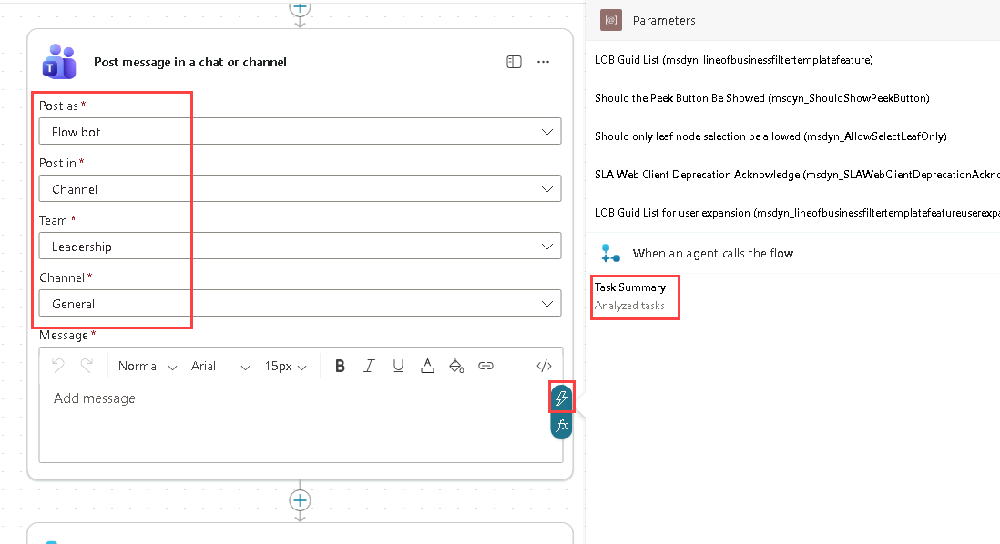

### Task 3.3 - Response action

1. Select the **Respond to the agent** node in the authoring canvas and select **+ Add an output**.

1. Select **Text**.

1. For *Enter a name*, enter **`Message`**.

1. For *Enter a value to respond with*, use *Dynamic Content* and select the **Message link** from the Teams action.

   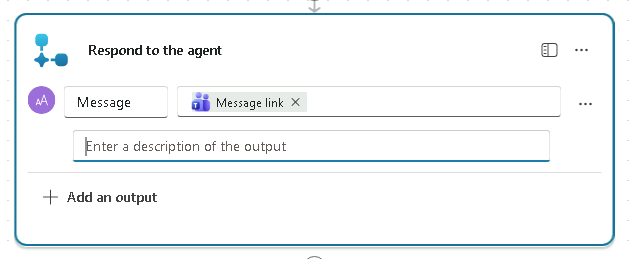

1. Select **Save draft** near the upper-right of the page.

1. Select **Publish** near the upper-right of the page.

1. In Copilot Studio, select **Tools** in the left-hand navigation.

### Task 3.4 - Add workflow as a tool to the agent

1. Select **Agents** from the left navigation pane.

1. Open the **Task Analysis Agent** agent.

1. Select the **Tools** tab.

1. Select **+ Add a tool**.

1. In the **Add tool** dialog, select the **Workflows** filter.

   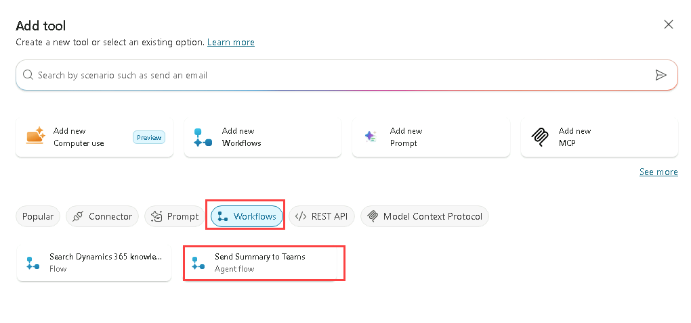

1. Select the **Send Summary to Teams** workflow.

1. Select **Add and configure**.

1. In the *Details* section, for *Description* enter `Sends a summary of the completed task analysis to a Microsoft Teams channel`.

1. Expand **Additional details** and select or enter the following:

   - **When this tool may be used**: *Agent may use this tool at any time*
   - **Ask the end user before running**: *No*
   - **Credentials to use**: *End user credentials*
   - **Description**: *`Please sign in to notify Teams`*

1. In the *Inputs* section, for *Fill using* select **Dynamically fill with AI**.

1. In the *Completion* section, for *After running*, select **Write the response with generative AI**.

   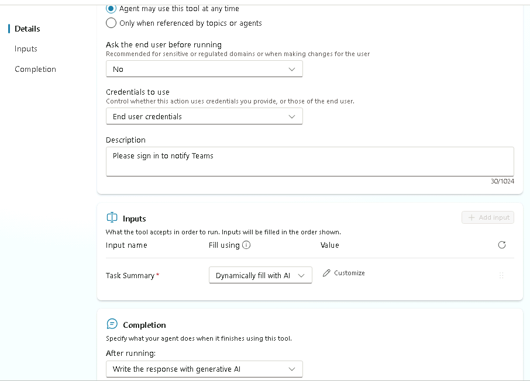

1. Select **Save**.

### Task 3.5 - Update agent instructions

1. Select the **Overview** tab.

1. In the **Instructions** section, select **Edit**.

1. Under the *## Step-by-step instructions* in the agent instructions, add the following to the final step `Use the ` and then enter the `/` character and select the **Send  Summary to Teams** tool and then enter ` when the task analysis is complete.`

   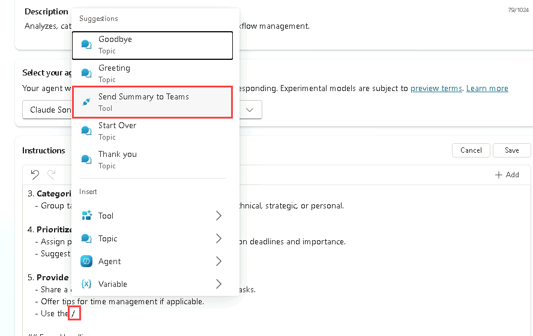

1. Select **Save**.

### Task 3.6 - Test the workflow tool in the agent

1. Select the **Test** icon in the upper-right of the page to open the testing panel.

1. In the **Test** panel, select the ellipses (**...**) next to the variables **{x}** icon, and toggle **Show activity map when testing** to **On** and **Track between topics** to **Off**.

   

1. At the top of the Test panel, select the **Start new test session** icon **+**.

1. When the **Conversation Start** message appears, your agent will start a conversation. In response, let's try to trigger the topic that you've created:

   `Analyze this list of tasks 1. Build an agent, 2. Test an agent, 3. Deploy an agent`

1. If prompted to connect to Microsoft Teams, select **Allow**.

   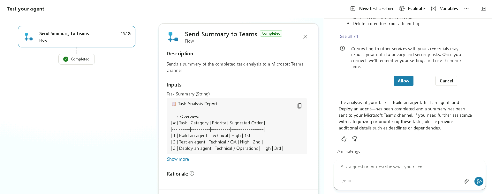

1. In a new browser tab, navigate to `https://teams.cloud.microsoft/` and sign in if prompted.

1. Navigate to the Team and channel you selected earlier in the workflow.

   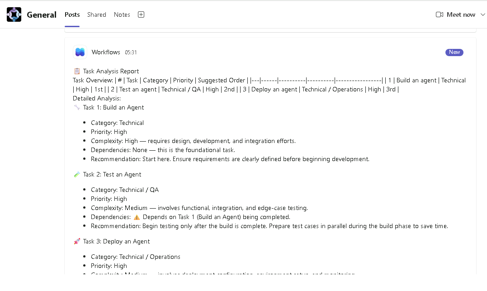

## Exercise 4 - Create a workflow tool that analyzes an Excel tile in a topic

In this exercise, you will use Copilot to create a topic from a description, a workflow tool that analyzes the tasks in an Excel file, and call this tool from a topic.

### Task 4.1 - Create an Excel file

1. In Copilot Studio, select the **App launcher** in the upper-left of the screen.

   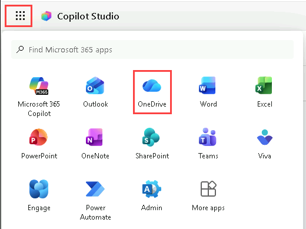

1. Select **OneDrive**.

1. Select **Create or upload**.

1. Select **Excel workbook**.

   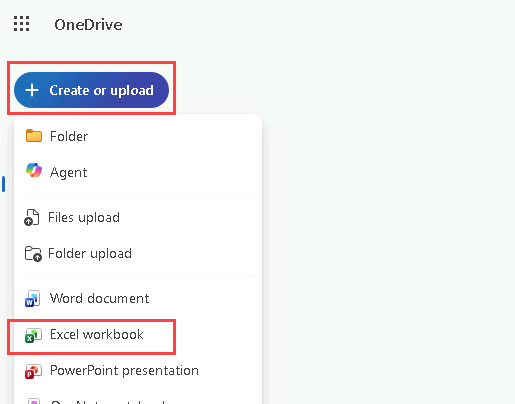

1. In the upper-left of the Excel workbook, rename the file by clicking on **Book** and entering `Operations tasks`.O

   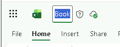

1. Create the following columns in the first row:

   - `Reference`
   - `Title`
   - `Description`
   - `Requested by`
   - `Priority`
   - `Status`

1. In the second row, enter for the first task:

   - `OPS-001`
   - `Server Patch Update`
   - `Apply monthly security patches to production servers`
   - `IT Operations`
   - `High`
   - `Open`

1. In the third row, enter for the second task:

   - `OPS-002`
   - `Backup Validation`
   - `Verify nightly backups completed successfully`
   - `Infrastructure Team`
   - `Medium`
   - `In Progress`

1. In the fourth row, enter for the third task:

   - `OPS-003`
   - `Access Review`
   - `Review and remove inactive user accounts`
   - `Security Team`
   - `High`
   - `Open`

1. In the fifth row, enter for the fourth task:

   - `OPS-004`
   - `Incident Report`
   - `Document root cause for recent service outage`
   - `Service Desk`
   - `Medium`
   - `Completed`

   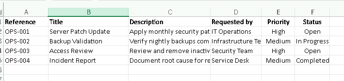

1. Select the rows and columns containing data (A1:F5), and in the toolbar select the **Insert** tab, and select **Table**, select **OK**.

1. Select the **Table Design** tab and in the upper-left change the name of the table from *Table1* to **`Tasks`**.

   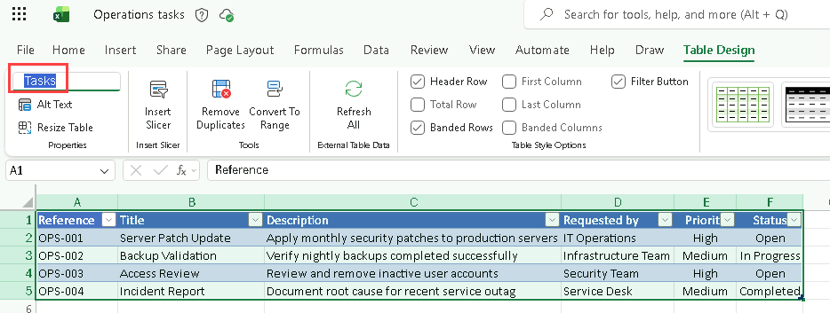

1. Close the browser tab containing the Excel workbook.

1. In OneDrive, select **My files** and verify that the Operations tasks Excel workbook is listed.

1. Close the browser tab containing OneDrive.

### Task 4.2 – Create the Analyze Excel tasks workflow

1. In Copilot Studio, select **Tools** in the left-hand navigation.

1. Select **+ New tool**.

1. In the **New Tool** dialog, select the **Agent flow** tile.

1. Verify that the **When an agent calls the flow** trigger and the **Respond to the agent** action have been added to the workflow.

1. Select the trigger step **When an agent calls the flow** and select **+ Add an input**.

1. Select **Text**.

1. Enter `Priority` for **Input** and `Priority of Tasks` for **Please enter your input**.

1. Select **Save draft** near the upper-right of the page.

1. Select the **Overview** tab.

1. In the **Details** section, select **Edit**.

1. In the **Details** pane, update **Flow name** to `Get Task List`.

1. For **Description**, enter **`Retrieve a list of tasks with a matching priority`**.

1. Select **Save**

1. Select the **Designer** tab.

1. Select the **+** icon between the two steps in the workflow to insert a new action.

1. Enter `Excel` in the **Search** field and select **See more** for the **Excel Online (Business)** connector.

1. Select the **List rows present in a table** action.

1. Select **Sign in** to create a connection.

1. In the Sign into your account dialog select the **MOD Administrator** account, select **I have verified this request and trust the source**, and select **Allow access**.

1. For *Location* select **OneDrive for Business**.

1. For *Document library* select **OneDrive**.

1. For *File* browse and select the **Operations tasks** workbook.

1. For *Table* select **Tasks**.

   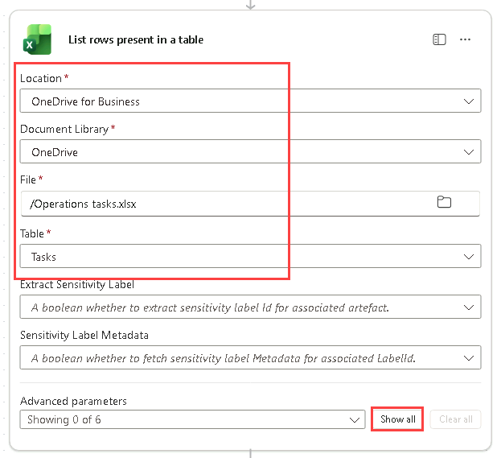

1. Select **Show all**.

1. For *Filter query*, enter **`Priority eq ''`**.

1. Move the cursor between the two single quotes and use *Dynamic content* to insert the **Priority** input parameter.

   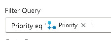

1. Select the **Respond to the agent** node in the authoring canvas and select **+ Add an output**.

1. Select **Text**.

1. For *Enter a name*, enter **`Task list`**.

1. For *Enter a value to respond with*, use *Dynamic Content* and select the **body/value** from the List rows action.

1. Select **Save draft** near the upper-right of the page.

1. Select **Publish** near the upper-right of the page.

1. In Copilot Studio, select **Tools** in the left-hand navigation.

### Task 4.3 – Add a topic to the agent

1. Select **Agents** from the left navigation pane.

1. Open the **Task Analysis Agent** agent.

1. Select the **Topics** tab.

1. Select **+ Add a topic** and select **Add from description with Copilot**. A new window appears.

1. In the **Name your topic** text box, enter **`Priority Tasks`**.

1. In the **Create a topic to...** text box, enter **`Ask the the user to choose a priority from a list containing High, Medium, and Low`**.

1. Select **Create**.

   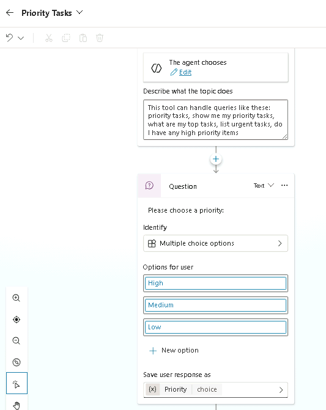

1. Select the **Priority** variable in the bottom of the question node to open  Variables properties.

1. Under *Usage* select **Global**.

   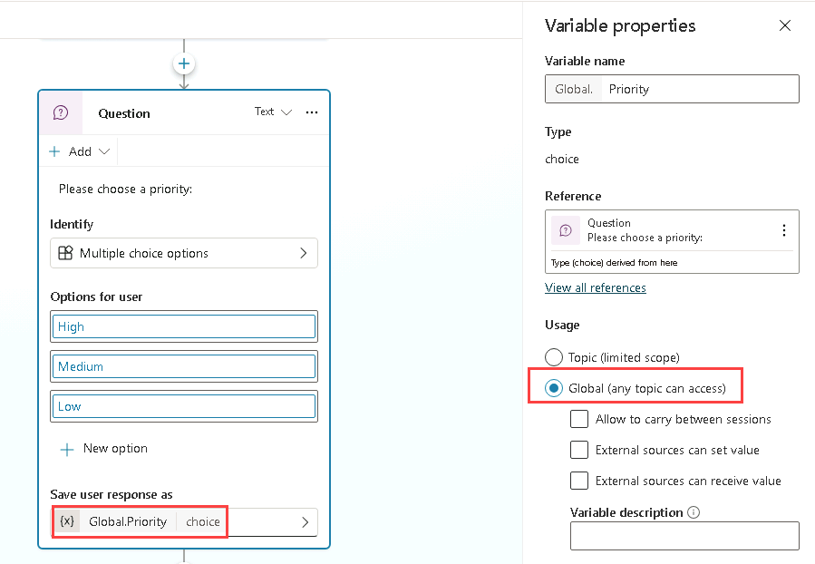

1. Select **Save**.

### Task 4.4 - Add workflow as a tool

1. Select **Agents** from the left navigation pane.

1. Open the **Task Analysis Agent** agent.

1. Select the **Tools** tab.

1. Select **+ Add a tool**.

1. In the **Add tool** dialog, select the **Workflows** filter.

1. Select the **Get Task List** workflow.

1. Select **Add and configure**.

1. In the *Details* section, for *Description* enter **`Retrieves a list of tasks for a specified priority`**.

1. Expand **Additional details** and select or enter the following:

   - **When this tool may be used**: *Only when referenced by topics or agents*
   - **Ask the end user before running**: *No*
   - **Credentials to use**: *End user credentials*
   - **Description**: *`Please sign in to retrieve tasks`*

1. In the *Inputs* section, for *Fill using* select **Custom value** and select the **Priority** global variable.

   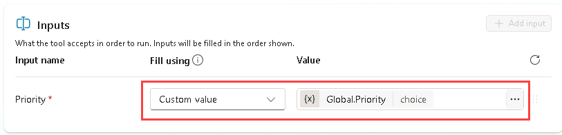

1. In the *Completion* section, for *After running*, select **Write the response with generative AI**.

1. Select **Save**.

### Task 4.5 - Add workflow tool to the topic

1. Select the **Topics** tab.

1. Select the **Priority Tasks** topic.

1. Select the the **+** icon under the **Question** node and select **Add a tool** and select the **Tool** tab, and select the **Get Task List** tool.

   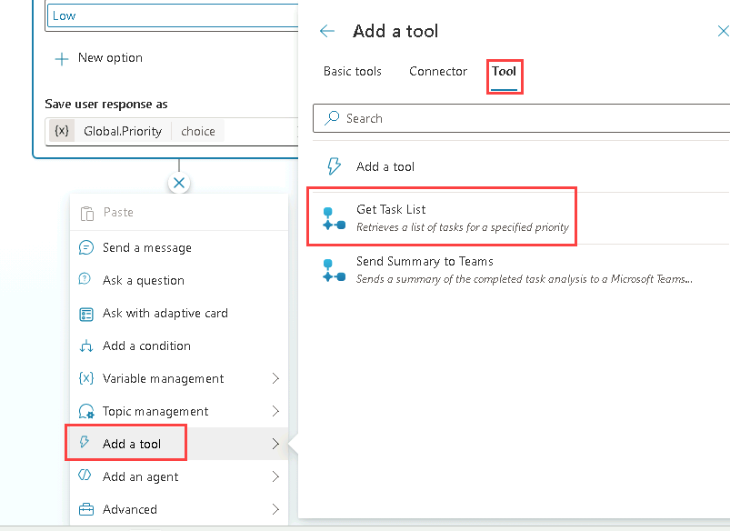

1. Select **Save**.

### Task 4.6 - Update agent instructions with the topic

1. Select the **Overview** tab.

1. In the **Instructions** section, select **Edit**.

1. Under the *## Skills* in the agent instructions, add the following to the final step `Use the ` and then enter the `/` character and select the **Priority Tasks** topic and then enter ` to get the task list.`

1. Select **Save**.

### Task 4.5 - Test the workflow tools

1. Select the **Test** icon in the upper-right of the page to open the testing panel.

1. In the **Test** panel, select the ellipses (**...**) next to the variables **{x}** icon, and toggle **Show activity map when testing** to **Off** and **Track between topics** to **On**.

1. At the top of the Test panel, select the **Start new test session** icon **+**.

1. When the **Conversation Start** message appears, your agent will start a conversation. In response, let's try to trigger the topic that you've created:

   `Analyze the task list`

1. The **Priority Tasks** topic will be shown.

1. Select **Medium**.

1. The test pane should contain two tasks.

   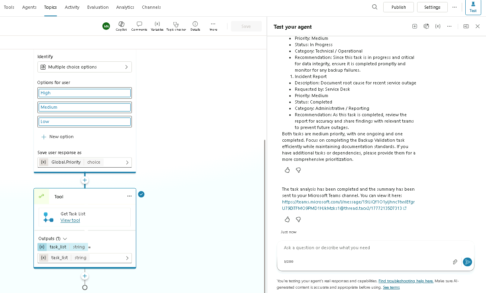

1. In a new browser tab, navigate to `https://teams.cloud.microsoft/` and sign in if prompted.

1. Navigate to the Team and channel you selected earlier and review the two tasks posted to the channel.

   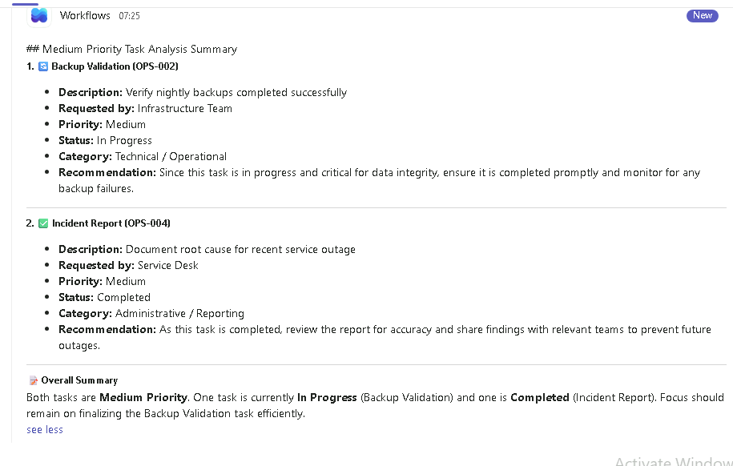

## Summary

In this lab, you created workflow tools that are called by the agent using generative AI and from a topic.
