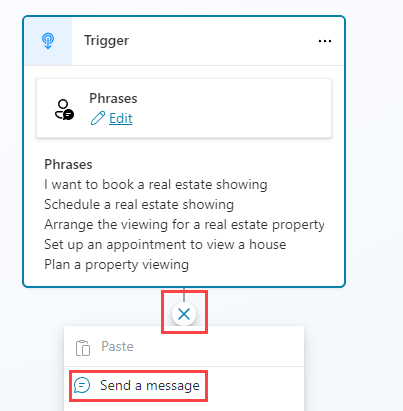
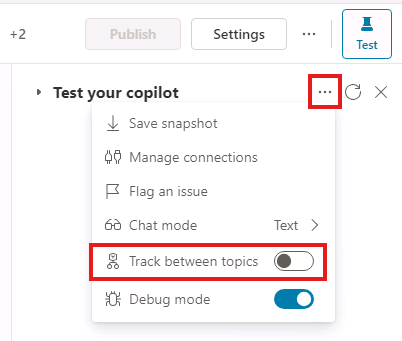
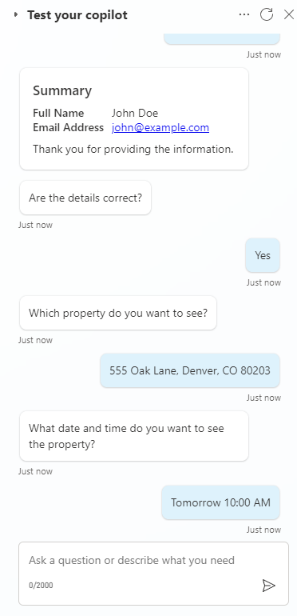

---
lab:
    title: 'Manage nodes'
    module: 'Manage topics in Microsoft Copilot Studio'
---

# Manage nodes

## Scenario

In this exercise, you will build a predictable, step-by-step conversation flow using nodes while generative AI remains enabled. When generative AI is enabled, the agent may respond dynamically to some prompts. Topics and nodes are used when you need structured, repeatable outcomes—for example, collecting required information in a fixed order.

In this exercise, you will:

- Create the **Book Showing** topic
- Add nodes to enforce a structured conversation flow
- Test the agent and verify topic routing

This exercise will take approximately **30** minutes to complete.

## What you will learn

- How to use nodes to enforce a structured conversation when generative AI is enabled
- How to share variables across topics using variable scope
- How to build repeatable, step-by-step topic flows using message, question, condition, and topic management nodes

## High-level lab steps

- Create Book Showing topic
- Configure variable scope to use variables from the Customer Details topic in the Book Showing topic
- Create and edit nodes
- Test the agent
  
## Prerequisites

- Must have completed **Lab: Manage topics**

## Detailed steps

## Exercise 1 - Create a topic from blank

In this exercise, you will create the **Book Showing** topic and add trigger phrases. Trigger phrases help the agent recognize when the user is trying to book a showing.

### Task 1.1 - Create a topic from blank

1. Navigate to the Copilot Studio portal `https://copilotstudio.microsoft.com` and ensure you are in the appropriate environment.

1. Select **Agents** from the left navigation pane.

1. Select the **Real Estate Booking Service** agent you created in the earlier lab.

1. Select the **Topics** tab.

1. Select **+ Add a topic** and select **From blank**.

1. Select the **Details** icon to open the Topic details dialog (you may need to select **More** \> **Details**).

    

1. In the **Name** field, enter the following text:

    `Book Showing`

1. In the **Description** field, enter the following text:

    `Use this topic when a user wants to book, schedule, or arrange a real estate property showing`

1. Select **Save**.

### Task 1.2 - Verify trigger type

1. Select the **Trigger** node at the top of the topic. Confirm the trigger type is set to **The agent chooses**. 

> **Note** With generative orchestration enabled, the agent uses this description to decide when to start the topic.

## Exercise 2 - Variable scope

Enable variables to be be accessed by other topics.

### Task 2.1 - Configure the scope of the variables

1. Select the **Topics** tab.

1. Select the **Customer Details** topic.

1. Select **Variables** in the top bar to open the Variables pane (you may need to select **More** \> **Variables**).

1. Select and expand **Topic** variables.

1. Select the right-hand check boxes for the three topic variables. This enables the variables in this topic to be available for other topics to use.

    

1. Select **Save**.

## Exercise 3 - Author a structured topic flow with nodes

In this exercise, you will add nodes to the Book Showing topic to enforce a repeatable, step-by-step flow.

### Task 3.1 - Add a message node

1. Select the **Topics** tab.

1. Select the **Book Showing** topic.

1. Select the the **+** icon under the Trigger node and select **Send a message**.

    

1. In the **Enter a message** field, enter the following text:

    `Hi, I can help you with booking a real estate property showing.`

1. Select **Save**.

### Task 3.2 - Route to the Customer Details topic

1. Select the the **+** icon under the **Message** node

1. Select **Topic management** \> **Go to another topic** \> **Customer Details**.

    

1. Select **Save**.

### Task 3.3 - Add condition node

1. Select the the **+** icon under the **Topic** node and select **Add a condition**.

1. In the **Condition** node, select the **DetailsCorrect** variable.

1. Select **is equal to**.

1. Select **Yes**.

    

1. Select **Save**.

### Task 3.4 - Add question nodes

1. Select the the **+** icon under the left **Condition** node and select **Ask a question**.

1. In the **Enter a message** field, enter the following text:

    `Which property do you want to see?`

1. Select **User's entire response** for **Identify**.

1. Select the variable in **Save user response as** and enter **`PropertyName`** for **Variable name**.

    

1. Select **Save**.

1. Select the the **+** icon under the new **Question** node and select **Ask a question**.

1. In the **Enter a message** field, enter the following text:

    `What date and time do you want to see the property?`

1. Select **Date and time** for **Identify**.

1. Select the variable in **Save user response as** and enter **`VisitDateTime`** for **Variable name**

1. Select the **+** icon under the left **Question** node and select **Send a messsage**.

1. In the **Enter a message** field, enter the following text:

    `Great! Let me get that scheduled for you.`

1. After that message node, add a node to end the topics by selecting **Topic Management** \> **End all topics**.

1. Select **Save**.

## Exercise 4 - Test the agent

In this exercise, you will test topic routing and confirm the conversation follows the expected step-by-step flow.

### Task 4.1 - Test the Book Showing topic

1. Select the **Test** icon in the upper-right of the page to open the testing panel.

1. Select the **ellipses ...** menu at the top of the testing panel in the upper-right of the page.

1. If it's not enabled, enable **Track between topics**.

    

1. Select the **Start new test session** icon at the top of the testing panel.

1. When the **Conversation Start** message appears, your agent will start a conversation. In response, let's try to trigger the topic that you've created:

    `I want to book a real estate showing`

1. The agent should respond with the "What is your name?" question.

    

1. Provide a name.

1. Provide an email address.

1. After you supply the information, an Adaptive Card displays the information that you entered and asks if the details are correct. Select **Yes**.

Notice that you were routed back to the **Book Showing** topic.

1. Enter `555 Oak Lane, Denver, CO 80203` to the **Which property to you want to see?** prompt

1. Enter `Tomorrow 10:00 AM` to the **What date and time do you want to see the property?** prompt.

    

## Summary
In this lab, you created the Book Showing topic and used nodes to enforce a structured, step-by-step interaction while generative AI remained enabled. You also configured variable scope so information collected in Customer Details can be used across topics.
