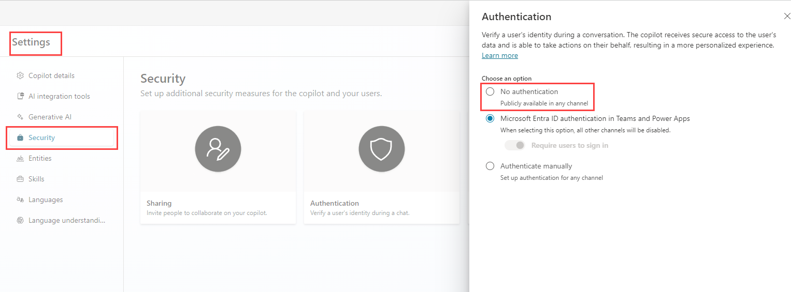

---
lab:
    title: 'Manage nodes'
    module: 'Manage topics in Microsoft Copilot Studio'
---

# Manage nodes

## Scenario

In this exercise, you will:

- Author the conversational flow
- Manage variables

This exercise will take approximately **30** minutes to complete.

## What you will learn

- How to add nodes to a topic to author the conversational flow

## High-level lab steps

- Configure variable scope
- Create and edit nodes
- Deploy and test the agent
  
## Prerequisites

- Must have completed **Lab: Manage topics**

## Detailed steps

## Exercise 1 - Variable scope

Variables can be accessed by other topics.

### Task 1.1 - Configure the scope of the variables

1. Navigate to the Copilot Studio portal `https://copilotstudio.microsoft.com` and ensure you are in the appropriate environment.

1. Select **Agents** from the left navigation pane.

1. Select the agent you created in the earlier lab.

1. Select the **Topics** tab.

1. Select the **Customer Details** topic.

1. Select **Variables** in the top bar to open the Variables pane.

1. Select the right-hand check boxes for the three topic variables.

    

1. Select **Save**.

## Exercise 2 - Author topics manually

The conversational flow in a topic can be created manually by adding nodes.

### Task 2.1 - Add a message node

1. Select the **Topics** tab.

1. Select the **Book a Real Estate Showing** topic.

1. Select the the **+** icon under the Trigger node and select **Send a message**.

    

1. In the **Enter a message** field, enter the following text:

    `Hi, I can help you with booking a real estate property showing.`

1. Select **Save**.

### Task 2.2 - Add a Topic management node

1. Select the the **+** icon under the **Message** node, then select **Topic management** > **Go to another topic** > **Customer Details**.

    

1. Select **Save**.

### Task 2.3 - Add condition node

1. Select the the **+** icon under the **Redirect** node and select **Add a condition**.

1. In the **Condition** node, select the **DetailsCorrect** variable.

1. Select **is equal to**.

1. Select **Yes**.

    

1. Select **Save**.

### Task 2.4 - Add question nodes

1. Select the the **+** icon under the left **Condition** node and select **Ask a question**.

1. In the **Enter a message** field, enter the following text:

    `Which property do you want to see?`

1. Select **User's entire response** for **Identify**.

1. Select the variable in **Save user response as** and enter **`PropertyName`** for **Variable name**.

    

1. Select **Save**.

1. Select the the **+** icon under the new **Question** node and select **Ask a question**.

1. In the **Enter a message** field, enter the following text:

    `What date and time do you want to see the property?`

1. Select **Date and time** for **Identify**.

1. Select the variable in **Save user response as** and enter **`DateTime`** for **Variable name**

1. Select **Save**.

### Task 2.5 - Test the agent

1. If it's not open, select the **Test** button in the upper-right of the screen to open the testing panel.

1. Select the **three dots** at the top of the testing panel in the upper-right of the screen.

1. If it's not enabled, enable **Track between topics**.

    

1. Select the **Start a new conversation** (refresh) icon at the top of the testing panel.

1. When the **Conversation Start** message appears, your agent will start a conversation. In response, enter a trigger phrase for the topic that you've created:

    `I want to book a real estate showing`

1. The agent responds with the "What is your name?" question, as shown in the following image.

    

1. Enter your name and email address.

1. After you supply the information, an Adaptive Card displays the information that you entered and asks if the details are correct. Select **Yes**.

1. Enter `555 Oak Lane, Denver, CO 80203` to the **Which property to you want to see?** prompt

1. Enter `Tomorrow 10:00 AM` to the **What date and time do you want to see the property?** prompt.

    

## Exercise 3 - Deploy agent

### Task 3.1 - Configure Authentication

1. Select **Settings** in the upper-right of **Real Estate Booking Service**.

1. Select the **Security** tab.

1. Select the **Authentication** tile.

    

1. Select **No authentication**.

1. Select **Save**.

1. Select **Save** in the confirmation window.

1. Select the **X** in the upper-right to close out of the **Settings**.

### Task 3.2 - Publish the agent

1. Select **Publish** in the upper-right, then select **Publish** again.

### Task 3.3 - Demo Website

1. Select the **three dots** next to the **Settings** button in the upper-right of the screen and select **Go to demo website**.

1. In the **Type your message** text box, enter **`I want to book a property`**.

1. Answer the prompts to test the agent.
