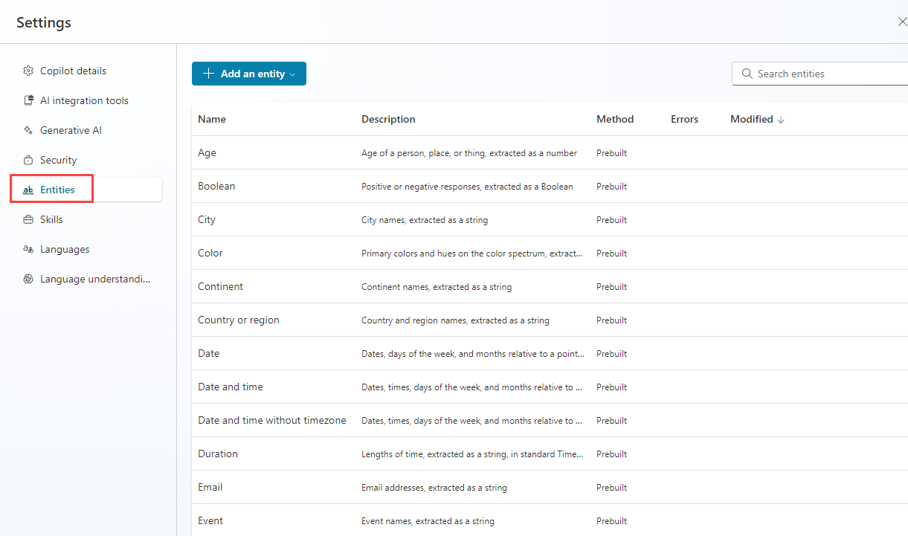
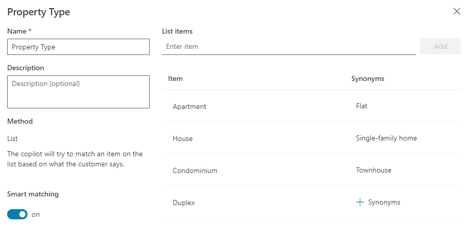
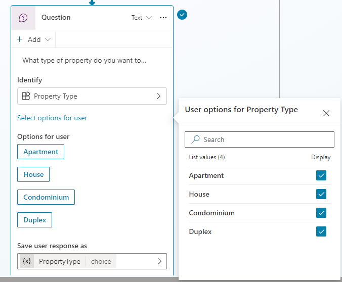

---
lab:
    title: 'Work with entities'
    module: 'Work with entities and variables in Microsoft Copilot Studio'
---

# Work with entities

## Scenario

In this exercise, you will:

- Create and use entities

This exercise will take approximately **15** minutes to complete.

## What you will learn

- How to create and use entities to improve the agent

## High-level lab steps

- Create entities
- Use entities in nodes
  
## Prerequisites

- Must have completed **Lab: Manage nodes**

## Detailed steps

## Exercise 1 - Create entities

Microsoft Copilot Studio uses entities to understand user intent. There are many prebuilt entities included for commonly used information. You can create custom entities for your specific purpose.

### Task 1.1 - View prebuilt entities

1. Navigate to the Microsoft Copilot Studio portal `https://copilotstudio.microsoft.com` and ensure you are in the appropriate environment.

1. Select **Agents** from the left navigation pane.

1. Select the **Real Estate Booking Service** agent you created in the earlier lab.

1. Select **Settings** in the upper-right of the screen.

1. Select the **Entities** tab.

    

### Task 1.2 - Create the property type entity

1. Select **+ Add an entity** and select **+ New entity**.

    

1. Select the **Closed list** tile.

1. Enter **`Property Type`** in the **Name** field.

1. Enter **`Apartment`** in the **Enter item** field and select **Add**.

1. Enter **`Condominium`** in the **Enter item** field and select **Add**.

1. Enter **`Duplex`** in the **Enter item** field and select **Add**.

1. Enter **`House`** in the **Enter item** field and select **Add**.

1. Select **+ Synonyms** for **Apartment**, enter **`Flat`** and select the **+** icon and select **Done**.

1. Select **+ Synonyms** for **Condominium**, enter **`Townhouse`** and select the **+** icon and select **Done**.

1. Select **+ Synonyms** for **House**, enter **`Single-family home`** and select the **+** icon and select **Done**.

1. Enable **Smart matching**.

    

1. Select **Save**.

1. Select **Close**.

### Task 1.3 - Create number of bedrooms entity

1. Select **+ Add an entity** and select **+ New entity**.

1. Select the **Regular expression (Regex)** tile.

1. Enter **`Number of Bedrooms`** in the **Name** field.

1. Enter **`[1-5]`** in the **Pattern** field.

1. Select **Save**.

1. Select **Close**.

1. Select the **X** icon in the top-right to close out of Settings and return to your agent.

## Exercise 2 - Use entities to improve the agent

Use entities in the conversational flow to improve the agent.

### Task 2.1 - Use entities

1. Select the **Topics** tab.

1. Select the **Book a Real Estate Showing** topic.

1. Select the the **+** icon between the **Condition** and property **Question** nodes, then select **Ask a question**.

1. In the **Enter a message** field, enter the following text:

    `What type of property do you want to see?`

1. Select **Property Type** for **Identify**.

1. Select **Select options for user** and check the **Display** option for all four values.

1. Select the variable in **Save user response as** and enter **`PropertyType`** for **Variable name**

    

1. Select the the **+** icon below the new **Question** node and select **Ask a question**.

1. In the **Enter a message** field, enter the following text:

    `How many bedrooms do you need?`

1. Select **Number of Bedrooms** for **Identify**.

1. Select the variable in **Save user response as** and enter **`NumberofBedrooms`** for **Variable name**

1. Select **Save**.
