---
lab:
    title: 'Create agent flows'
    module: 'Enhance Microsoft Copilot Studio agents'
---

# Create agent flows

## Scenario

In this exercise, you will:

- Create an agent flow

This exercise will take approximately **30** minutes to complete.

## What you will learn

- How to create a tool for running an agent flow in Copilot Studio

## High-level lab steps

- Create an agent flow to retrieve Dataverse data
- Create an agent flow to create Dataverse data
  
## Prerequisites

- Must have completed **Lab: Work with entities**

## Detailed steps

## Exercise 1 - Create a tool to retrieve data from Dataverse

Microsoft Copilot Studio can access data in Microsoft Dataverse using agent flows.

### Task 1.1 - Create agent flow to retrieve a property

1. Navigate to the Microsoft Copilot Studio portal `https://copilotstudio.microsoft.com` and ensure you are in the appropriate environment.

1. Select **Agents** from the left navigation pane.

1. Select the **Real Estate Booking Service** you created in the earlier lab.

1. Select the **Tools** tab.

1. Select **+ Add a tool**.

1. Select **+ New tool**.

1. Select **Agent flow**.

1. Select the trigger step **When an agent calls the flow** and select **+ Add an input**.

1. Select **Text**.

1. Enter `Bedrooms` for **Input** and `Number of Bedrooms` for **Please enter your input**.

    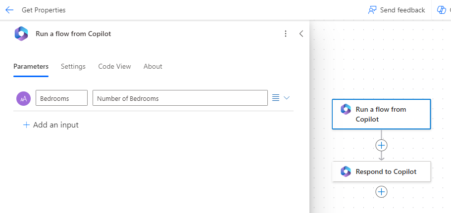

1. Select the **+** icon between the two steps in the flow to add a new action.

1. Enter `Dataverse` in the **Search** field and select **See more** for the **Microsoft Dataverse** connector.

    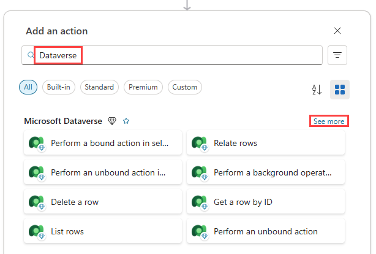

1. Select the **List rows** action.

1. If prompted for authentication, enter `Lab connection` for **Connection name**, select **OAuth** for **Authentication Type, and select **Sign in**.

    > **Note:** If you see a '**Failed to create OAuth connection**' error, you may need to allow popups in your browser.

    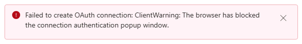

    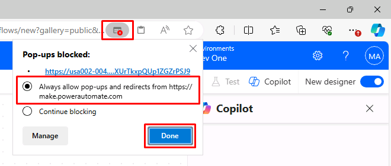

1. Select **Real Estate Properties** for table name.

1. Enter `contoso_bedrooms eq ` (with a space after **eq**) in the **Filter Rows** field.

1. With the **Filter Rows** field still selected, select the **lightning** icon to its right, then select the **Bedrooms** parameter.

    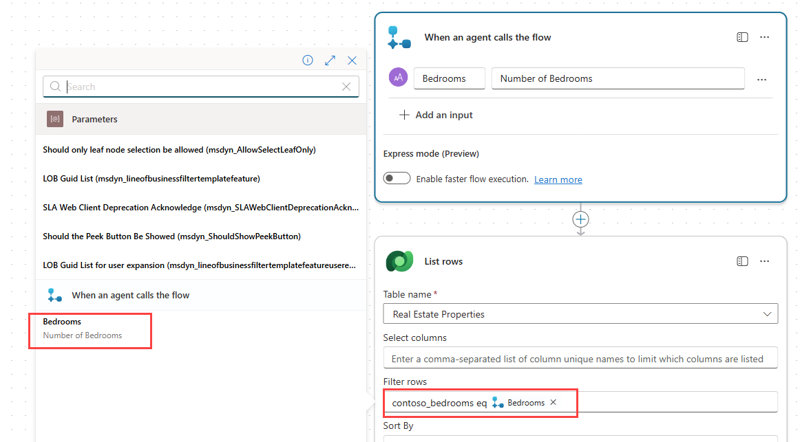

    > **Important:** Ensure there is a space between eq and Bedrooms.

1. Select the **Respond to Copilot** action in the authoring canvas and select **+ Add an output**.

1. Select **Text**.

1. Enter `PropertyId` for **Enter a name**

1. Select the **Enter a value to respond with** field, and select **fx (Insert Expression)**.

1. Enter the following expression into the top field:

    ```
    first(outputs('List_rows')?['body/value'])['contoso_realestatepropertyid']
    ```

1. Select **Add**.

1. Select **+ Add an output**.

1. Select **Text**.

1. Enter `PropertyName` for **Enter a name**.

1. Select the **Enter a value to respond with** field, and select **fx (Insert Expression)**.

1. Enter the following expression:

    ```
    first(outputs('List_rows')?['body/value'])['contoso_propertyname']
    ```
    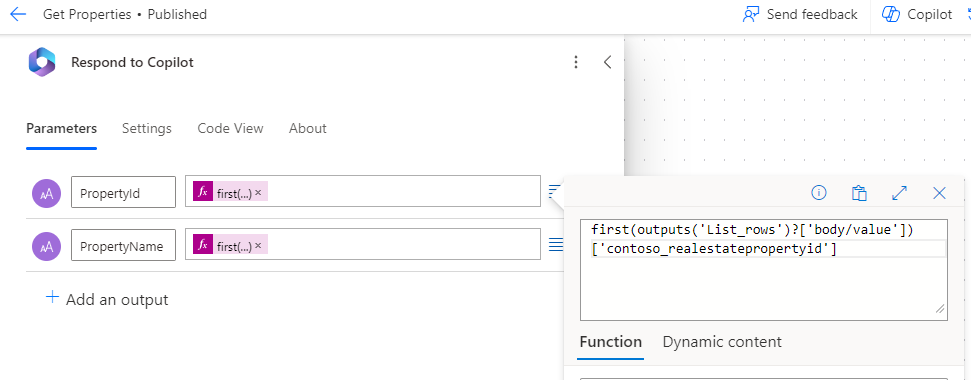

1. Select **Add**.

1. Select the **Settings** tab in the **Respond to Copilot** pane.

1. Ensure that **Asynchronous Response** is set to **Off**.

    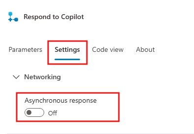

1. Select **Save draft** near the upper-right of the page.

1. Wait for the save to complete, then select **Publish**. In the **Your agent flow published successfully!** pop-up, select **Go back to agent**.

1. Select the **Overview** tab.

1. Select **Edit** in the **Details** section. 

1. Update the **Flow name** to `Get Property`

1. Select **Save**

1. Select **Agents** and select your **Real Estate Booking Service** agent. 

1. Select **Tools** and see the Get Property flow you created.


### Task 1.2 - Add the Get Property tool to the topic

1. Select the **Topics** tab.

1. Select the **Book a Real Estate Showing** topic.

1. Select the the **+** icon below the **How many bedrooms do you need question?** node, select **Add a tool**, then select the **Get Property** flow.

1. Select the **NumberofBedrooms** variable for the **Bedrooms** input parameter.

    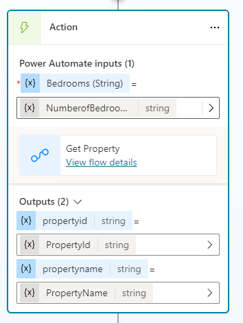

1. Select the **three dots** in the **Which property do you want to see?** question node and select **Delete**.

1. Select the the **+** icon under the **Action** node and select **Send a message**.

1. In the **Enter a message** field, enter `Property ` (with a space following it).

1. In the same node, select the **{X} (Insert variable)** icon and select the **PropertyName** variable.

    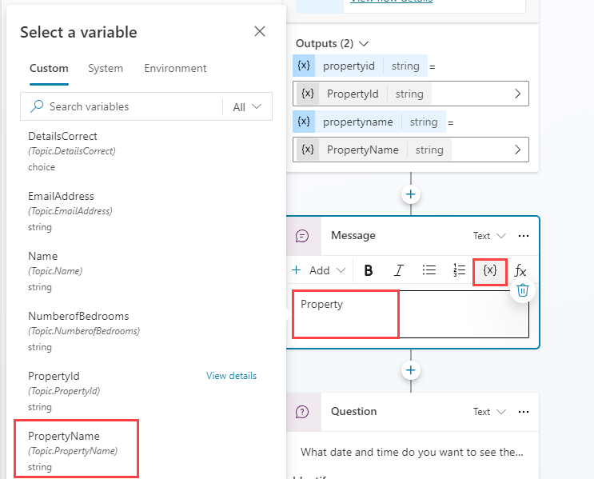

1. Select **Save**.

## Exercise 2 - Create a tool to create data in Dataverse

Microsoft Copilot Studio can ceate data in Microsoft Dataverse using agent flows.

### Task 2.1 - Create agent flow to make a booking

1. Select the **tools** tab in **Real Estate Booking Service**.

1. Select **+ Add a tool**.

1. SSelect **+ New tool** and then **Agent flow** .

1. Select **Save draft** and wait for the agent flow to save.

1. Select the **Overview** tab

1. Select **Edit** in the **Details** section. 

1. Rename the flow `Create Booking Request`

1. Select **Save**.

1. Select te **Designer** tab.

1. Select the trigger step **When an agent calls the flow** and select **+ Add an input**.

1. Select **Text**.

1. Enter `PropertyId` for **Input** and `Property` for **Please enter your input**.

1. Select **+ Add an input**.

1. Select **Text**.

1. Enter `ViewerName` for **Input** and `Viewer Name` for **Please enter your input**.

1. Select **+ Add an input**.

1. Select **Text**.

1. Enter `ViewerEmail` for **Input** and `Viewer Email` for **Please enter your input**.

    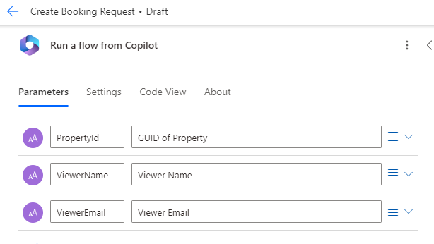

1. Select the **+** icon between the two steps in the flow to add a new action.

1. Enter `Dataverse` in the **Search** field and select **See more** for the **Microsoft Dataverse** connector.

1. Select the **Add a new row** action.

1. Select **Booking Requests** for table name.

1. Enter `Agent booking` in the **Booking Name** field.

1. Select **Show all** under **Advanced parameters**.

1. Enter `contoso_bookingrequests()` in the **Property (Real Estate Properties)** field, move the cursor within the parentheses, select the **lightning** icon, then select the **PropertyId** parameter.

1. Select the **Viewer Email** field, select the **lightning** icon, then select the **ViewerEmail** parameter.

1. Select the **Viewer Name** field, select the **lightning** icon, then select the **ViewerName** parameter.

    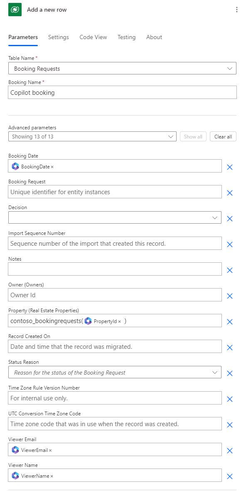

1. Select the **Respond to Copilot** action.

1. Select the **Settings** tab.

1. Ensure that **Asynchronous Response** is set to **Off**.

1. Select **Save draft** in the upper-right of the window.

1. Wait for the save to complete, then select **Publish**.

1. Select **Overview** tab.

1. Select **Edit** in the Details section.

1. Rename the agent flow `Create Booking Request`

1. Select **Save**.

### Task 2.2 - Validate your tools

1. Select **Agents** and open your **Real Estate Booking Service** agent.

1. Select the **Tools** tab and validate that both of your agent flows are in the list. If not, select **+Add a tool** > **Flow** > and select the missing agent flow. Select **Add to agent**.

### Task 2.3 - Add the Create Booking Request tool to the topic

1. Select the **Topics** tab.

1. Select the **Book a Real Estate Showing** topic.

1. Select the the **+** icon below the **What date and time do you want to see the property?** node, select **Add a tool**, then select the **Create Booking Request** flow.

1. Select the **PropertyId** variable for the **PropertyId** input parameter.

1. Select the **Name** variable for the **ViewerName** input parameter.

1. Select the **EmailAddress** variable for the **ViewerEmail** input parameter.

1. Select the the **+** icon below the new **Action** node, select **Topic management**, select **Go to another topic** and select **End of Conversation**.

1. Select **Save**.

1. Select **Publish** and select **Publish** again.

## Exercise 3 - Test your agent

### Task 3.1 - Make a booking request

1. If closed, select the **Test** button in the upper-right of the screen to open the testing panel.

1. Select the **three dots** at the top of the testing panel in the upper-right of the screen.

    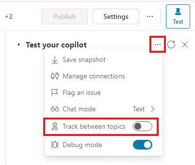

1. If it's not enabled, enable **Track between topics**.

1. Select the **Start a new conversation** (refresh) icon at the top of the testing panel.

1. When the **Conversation Start** message appears, your agent will start a conversation. In response, enter a trigger phrase for the topic that you've created:

    `I want to book a real estate showing`

1. Enter the following information:

    ```
    Name: <Your name>
    ```
    ```
    Email address: <Your email address>
    ```

1. After you supply the information, an Adaptive Card displays the information that you entered and asks if the details are correct. Select **Yes**.

1. Select **House** for the type of property prompt.

1. Enter `3` for the number of bedrooms prompts.

    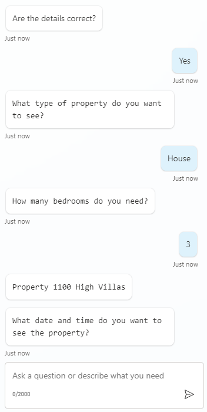

1. Enter `Tomorrow 2:00 PM` to the **What date and time do you want to see the property?** prompt.

1. Select **Yes** to the **Did that answer your question?** prompt.

1. Select any rating.

1. Enter **No** to the **Can I help with anything else?** prompt.

### Task 3.2 - Verify the booking request

1. If it's not still open, navigate to `https://make.powerapps.com` in a new tab.

1. Make sure you are in the appropriate environment.

1. Select **Apps** in the left navigation.

1. Select **Play** on the **Real Estate Property Management** model-driven app.

1. In the left navigation, select **Booking Requests**. View the booking request your agent just created for you.

    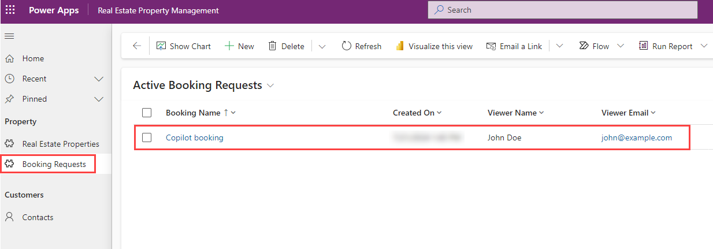
