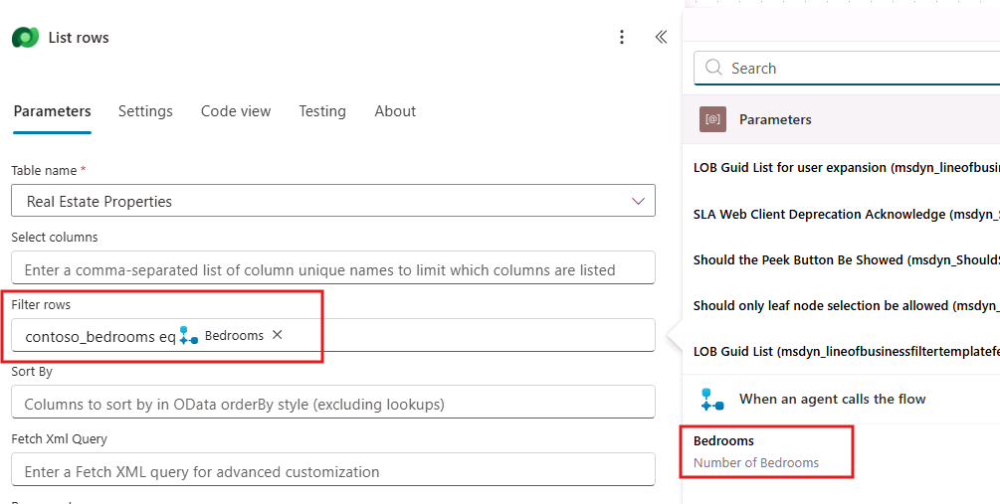
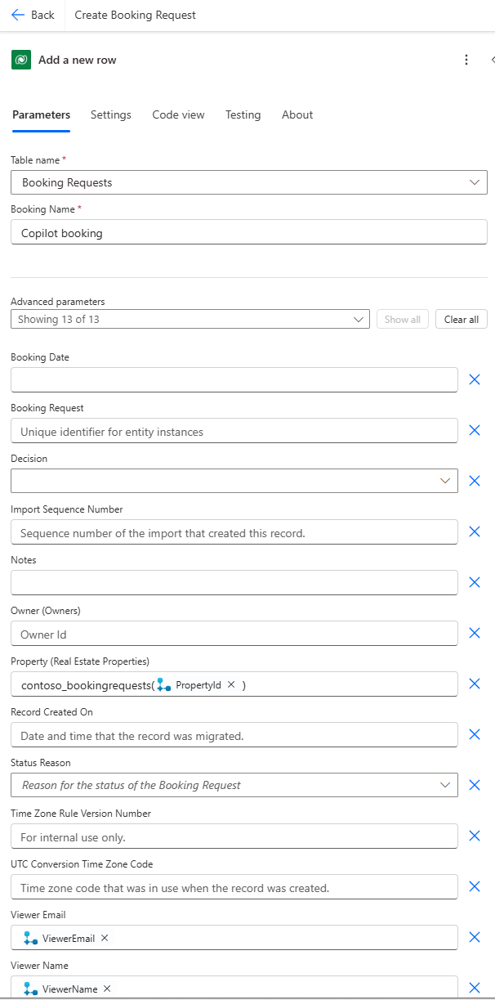

---
lab:
    title: 'Copilot actions'
    module: 'Enhance Microsoft Copilot Studio copilots'
---

# Copilot actions

## Scenario

In this lab, you will:

- Create copilot actions

## What you will learn

- How to add use Power Automate to access data in Microsoft Dataverse

## High-level lab steps

- Create a Power Automate cloud flow to retrieve Dataverse data with a copilot action
- Create a Power Automate cloud flow to create Dataverse data with a copilot action
  
## Prerequisites

- Must have completed **Lab: Work with entities**

## Detailed steps

## Exercise 1 - Create Copilot action to retrieve data from Dataverse

Microsoft Copilot Studio can access data in Microsoft Dataverse using Power Automate cloud flows.

### Task 1.1 - Create Power Automate flow to retrieve a property

1. Navigate to the Microsoft Copilot Studio portal `https://copilotstudio.microsoft.com` and ensure you are in the **Dev One** environment.

1. Select the **Test** button in the upper-right of the screen to close the testing panel if the panel is open.

1. Select **Copilots** from the left navigation pane.

1. Select the copilot you created in the earlier lab.

1. Select the **Actions** tab.

1. Select **+ Add an action**.

    

1. Scroll down and select **Create a new flow**.

1. Sign in to Power Automate if prompted.

    

1. Select **Run a flow from Copilot** in the top-left of the screen and enter `Get Property` as the flow name.

1. Select the trigger step **Run a flow from Copilot** and select **+ Add an input**.

1. Select **Text**.

1. Enter `Bedrooms` for **Input** and `Number of Bedrooms` for **Please enter your input**.

    

1. Select the **+** icon between the two steps in the flow and select **Add an action**.

1. Enter `Dataverse` in the **Search** field and select **See more** for the Dataverse connector.

    

1. Select the **List rows** action.

1. If prompted for authentication, select **OAuth** and select **Sign in**.

1. Select **Real Estate Properties** for table name.

1. Select **Show all**.

1. Enter `contoso_bedrooms eq ` in the **Filter Rows** field.

1. Use **Dynamic content** to select the **Bedrooms** parameter and select **Add**.

    

1. Select the **Respond to Copilot** action and select **+ Add an output**.

1. Select **Text**.

1. Enter `PropertyId` for **Enter a name**, click into the **Enter a value to respond with** field, and select **Insert Expression**.

1. Enter the following expression:

    ```
    first(outputs('List_rows')?['body/value'])['contoso_realestatepropertyid']
    ```

    

1. Select **Add**.

1. Select **+ Add an output**.

1. Select **Text**.

1. Enter `PropertyName` for **Enter a name**, click into the **Enter a value to respond with** field, and select **Insert Expression**.

1. Enter the following expression:

    ```
    first(outputs('List_rows')?['body/value'])['contoso_propertyname']
    ```

1. Select **Add**.

1. Select **Settings**.

1. Ensure that **Asynchronous Response** is set to **Off**.

    

1. Select **Save draft**.

1. Select **Publish**.

1. Close the Power Automate tab.

### Task 1.2 - Add a Copilot action to retrieve a property

1. Select **Refresh**.

1. Select the **Get Property** flow.

    

1. Select **Next**.

1. Select **Next**.

1. Select **Finish**.

### Task 1.3 - Add the Get Property Copilot action to the topic

1. Select the **Topics** tab.

1. Select the **Book a Real Estate Showing** topic.

1. Select the the **+** icon below the **How many bedrooms do you need question?** node and select **Call an action**.

    

1. Select the **Get Property** flow.

1. Select the **NumberofBedrooms** variable for the **Bedrooms** input parameter.

    

1. Select the **three dots** in the **Which property do you want to see?** question node and select **Delete**.

1. Select the the **+** icon under the action node and select **Send a message**.

1. In the **Enter a message** field, enter the following text:

    `Property `

    

1. Select the **Insert variable** icon and select the **PropertyName** variable.

1. Select **Save**.

## Exercise 2 - Create Copilot action to create data in Dataverse

Microsoft Copilot Studio can ceate data in Microsoft Dataverse using Power Automate cloud flows.

### Task 2.1 - Create Power Automate flow to make a booking

1. Select your copilot in the Copilot pane on the left-hand side of the screen to return to the **Overview** tab.

1. Select the **Actions** tab.

1. Select **+ Add an action**.

1. Scroll down and select **Create a new flow**.

1. Select **Run a flow from Copilot** in the top-left of the screen and enter `Create Booking Request` as the flow name.

1. Select the trigger step **Run a flow from Copilot** and select **+ Add an input**.

1. Select **Text**.

1. Enter `PropertyId` for **Input** and `Property` for **Please enter your input**.

1. Select **+ Add an input**.

1. Select **Text**.

1. Enter `ViewerName` for **Input** and `Viewer Name` for **Please enter your input**.

1. Select **+ Add an input**.

1. Select **Text**.

1. Enter `ViewerEmail` for **Input** and `Viewer Email` for **Please enter your input**.

    

1. Select the **+** icon between the two steps in the flow and select **Add an action**.

1. Enter `Dataverse` in the **Search** field and select **See more** for the Dataverse connector.

1. Select the **Add a new row** action.

1. Select **Booking Requests** for table name.

1. Select **Show all**.

1. Enter `Copilot booking` in the **Booking Name** field.

1. Enter `contoso_bookingrequests()` in the **Property (Real Estate Properties)** field, move the cursor within the brackets, and use **Dynamic content** to select the **PropertyId** parameter.

1. Use **Dynamic content** to select the **ViewerName** parameter for the **Viewer Name** field.

1. Use **Dynamic content** to select the **ViewerEmail** parameter for the **Viewer Email** field.

    

1. Select the **Respond to Copilot** action.

1. Select **Settings**.

1. Ensure that **Asynchronous Response** is set to **Off**.

1. Select **Save draft**.

1. Select **Publish**.

1. Close the Power Automate tab.

### Task 2.2 - Add a Copilot action to create a booking request

1. Select **Refresh**.

1. Select the **Create Booking Request** flow.

1. Select **Next**.

1. Select **Next**.

1. Select **Finish**.

### Task 2.3 - Add the Create Booking Request Copilot action to the topic

1. Select the **Topics** tab.

1. Select the **Book a Real Estate Showing** topic.

1. Select the the **+** icon below the **What date and time do you want to see the property?** node and select **Call an action**.

1. Select the **Create Booking Request** flow.

1. Select the **PropertyId** variable for the **PropertyId** input parameter.

1. Select the **Name** variable for the **ViewerName** input parameter.

1. Select the **EmailAddress** variable for the **ViewerEmail** input parameter.

1. Select the the **+** icon below the action node, select **Topic management**, select **Go to another topic** and select **End of conversation**.

1. Select **Save**.

1. Select **Publish** and select **Publish** again.

## Exercise 3 - Test the copilot actions

### Task 3.1 - Make a booking request

1. Select the **Test** button in the upper-right of the screen to open the testing panel.

1. Select the **three dots** at the top of the testing panel in the upper-right of the screen.

    

1. Select **Track between topics**.

1. Select the **Start a new conversation** icon at the top of the testing panel.

1. When the **Conversation Start** message appears, your copilot will start a conversation. In response, enter a trigger phrase for the topic that you've created:

    `I want to book a real estate showing`

1. Enter the following information:

    ```
    Name: <Your name>
    Email address: <Your email address>
    ```

1. After you supply the information, an Adaptive Card displays the information that you entered, a question asking if the information is correct, and options to select **Yes** or **No**.

1. Select **Yes**.

1. Select **House** for the type of property prompt.

1. Enter `3` for the number of bedrooms prompts.

    

1. Enter `Tomorrow 2:00 PM` to the **What date and time do you want to see the property?** prompt.

1. Select **Yes** to the **Did that answer your question?** prompt.

1. Select any rating.

1. Select **No** to the **Can I help with anything else?** prompt.

### Task 3.2 - Verify the booking request

1. Navigate to `https://make.powerapps.com`.

1. Make sure you are in the **Dev One** environment.

1. Select **Play** on the **Real Estate Property Management** model-driven app.

1. In the left navigation pane, select **Booking Requests** table.

    
