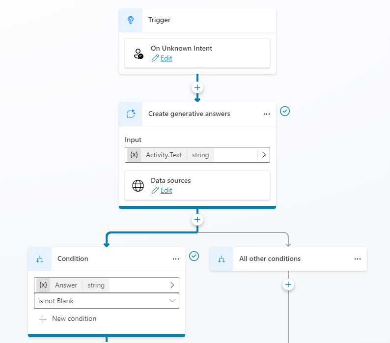
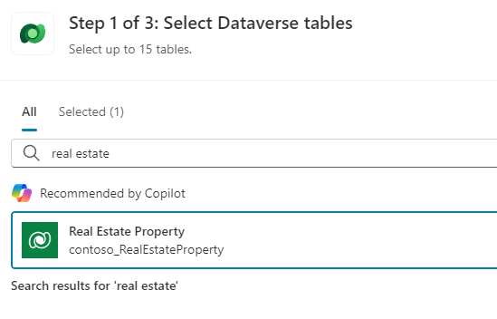
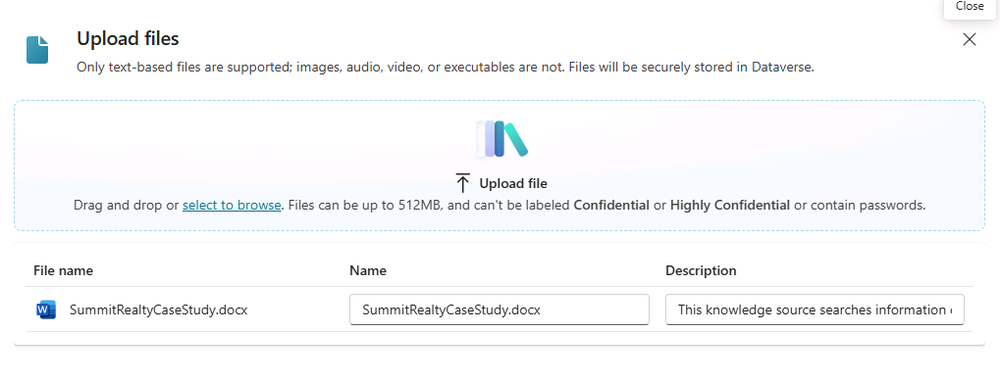
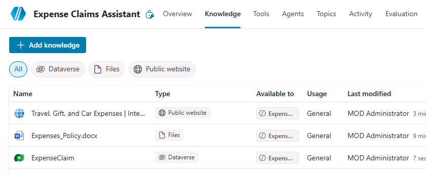
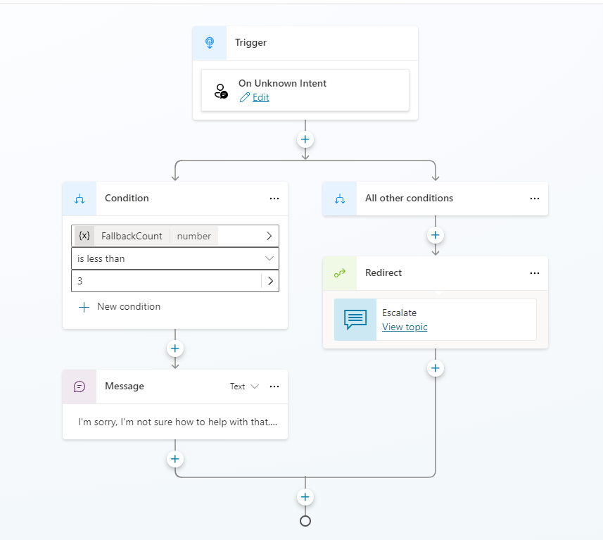
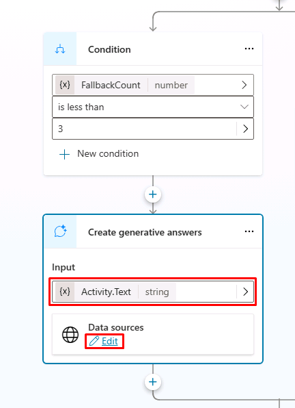
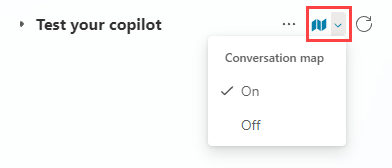

---
lab:
    title: 'Use Generative AI in Microsoft Copilot Studio'
    module: 'Enhance Microsoft Copilot Studio agents'
---

# Use Generative AI in Microsoft Copilot Studio

## Scenario

In this exercise, you will:

- Use knowledge and Generative AI in your agent

This exercise will take approximately **30** minutes to complete.

## What you will learn

- How to use the Generative answers feature to improve your agent's responses.

## High-level lab steps

- Enable Generative AI
- Add knowledge
  
## Prerequisites

- Must have completed **Lab: Create agent actions**

## Detailed steps

## Exercise 1 - Configure Generative AI

### Task 1.1 - Enable Orchestration

1. If it's not still open, go to the Microsoft Copilot Studio portal `https://copilotstudio.microsoft.com` and ensure you are in the appropriate environment.

1. Select **Agents** from the left navigation.

1. Select the **Real Estate Booking Service** you created in the earlier lab.

1. Select the **Settings** button in the upper-right of the screen.

1. In the **Details** section, turn Orchestration to **Enabled**.

### Task 1.2 - Use generative answers in the Conversational boosting topic

1. Select the **Topics** tab and select the **System** filter.

1. Select the **Conversational boosting** topic.

    

1. Review the **Create generative answers** node.

### Task 1.3 - Configure Authentication

1. Select the ellipses (**...**) > **Settings** in the upper-right of the screen.

1. Select the **Security** tab.

1. Select the **Authentication** tile.

1. Select **Authenticate with Microsoft**.

1. Select **Save**.

1. Select **Save**.

1. Close the **Settings** menu by selecting the **X** in the upper-right of Copilot Studio.

1. Select **Publish** and select **Publish** again.

## Exercise 2 - Add knowledge

### Task 2.1 - Add knowledge from Dataverse

1. Select the **Knowledge** tab.

1. Select **+ Add knowledge**.

1. Select **Dataverse**.

1. Select the **Real Estate Property** table.

    

1. Select **Add**.

### Task 2.2 - Add knowledge from files

1. Download this [**Microsoft case study**](https://download.microsoft.com/documents/customerevidence/Files/4000007499/SummitRealtyCaseStudy.docx) or [**SummitRealtyCaseStudy.docx**](../../Allfiles/SummitRealtyCaseStudy.docx) from GitHub.

> ℹ️ **NOTE:** The link to the Microsoft case study is here: `https://download.microsoft.com/documents/customerevidence/Files/4000007499/SummitRealtyCaseStudy.docx`

1. Select **+ Add knowledge**.

1. Under **Upload file**, browse and select the case study that you downloaded.

    

1. Select **Add**.

    

## Exercise 3 - Configure Fallback topic

### Task 3.1 - Use generative answers in System fallback topic

1. Select the **Topics** tab and select the **System** filter.

1. Select the **Fallback** topic.

    

1. Select the **three dots** in the **Message** node and select **Delete**.

1. Select the the **+** icon under the **Condition** node, select **Advanced**, and select **Generative answers**.

1. Select **System** tab and select **Activity.Text** for the **Input** field.

1. Select **Edit** under **Data sources**.

    

1. Select **Search only selected sources**.

1. Select the **Real Estate Property** Dataverse table.

1. Deselect **Allow the AI to use its own general knowledge**.

1. Select the **Customize** checkbox under **Content moderation level** and select **Medium**.

1. Select **Save**.

## Exercise 4 - Test Generative AI

### Task 4.1 Test the agent's knowledge

1. If it's not open, select the **Test** button in the upper-right of the screen to open the testing panel.

1. Select the **Conversation map** icon at the top of the testing panel in the upper-right of the screen.

    

1. Select **On**.

1. Select the **Start a new conversation** icon at the top of the testing panel.

1. Explore the agent and see how it uses the knowledge sources.
