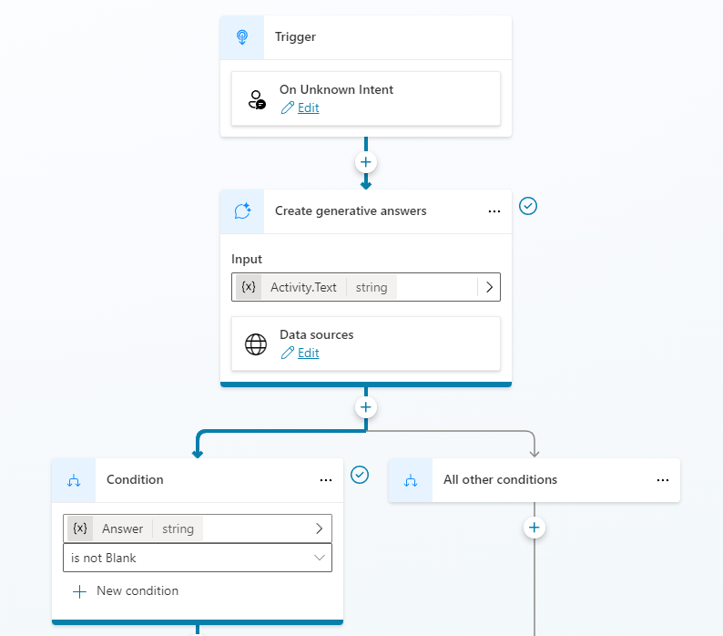
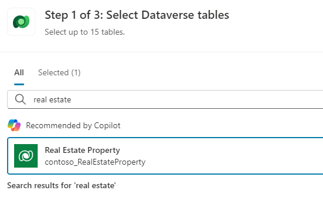
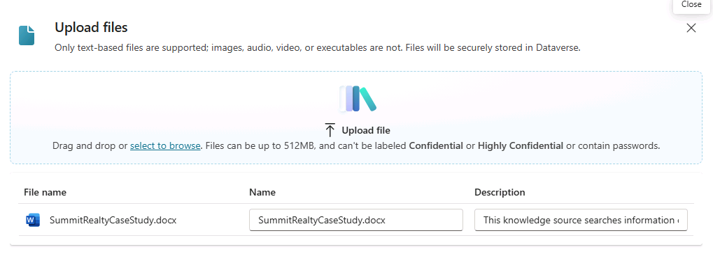

---
lab:
    title: 'Use Generative AI in Microsoft Copilot Studio'
    module: 'Enhance Microsoft Copilot Studio agents'
---

# Use Generative AI in Microsoft Copilot Studio

## Scenario

In this lab, you will prepare your agent for production use by configuring grounding, fallback behavior, and safety controls while keeping generative AI enabled.

In this exercise, you will:

- Configure your agent to use generative AI only within approved knowledge sources
- Guide your agent to respond predictably and safely when it cannot answer a question

This exercise will take approximately **20** minutes to complete.

## What you will learn

- How to constrain generative AI using grounding
- How to configure system topics for safe fallback behavior
  
## Prerequisites

- Must have completed **Lab: Create agent flows**

## Detailed steps

## Exercise 1 - Ground generative answers to approved data

### Task 1.1 - Restrict generative answers in Conversational boosting

1. If it's not still open, go to the Microsoft Copilot Studio portal `https://copilotstudio.microsoft.com` and ensure you are in the appropriate environment.

1. Open the **Real Estate Booking Service** agent.

1. Select **Topics**

1. Open the **Conversational boosting** topic.

1. Select the **create generative answers** node.

1. Select **Edit** for **Data sources**.

1. Select **Search only selected sources.**

1. Select the approved knowledge sources for your agent (for example, Dataverse tables, websites, or uploaded files).

1. Clear **Allow the AI to use its own general knowledge**.

1. Select **Save**.

### Task 1.2 - Use generative answers in the Conversational boosting topic

1. Select the **Topics** tab and select the **System** filter.

1. Select the **Conversational boosting** topic.

    

1. Review the **Create generative answers** node.

### Task 1.3 - Configure Authentication

1. Select **Settings** in the upper-right of the screen.

1. Select the **Security** tab.

1. Select **Authentication**.

1. Select **Authenticate with Microsoft**.

1. Select **Save**.

1. Select **Save** in the confirmation window.

1. Select the **X** in the upper-right to close out of the **Settings**.

## Exercise 2 - Add knowledge

### Task 2.1 - Add knowledge from Dataverse

1. Select the **Knowledge** tab.

1. Select **+ Add knowledge**.

1. Select **Dataverse**.

1. Select the **Real Estate Property** table.

    

1. Select **Add to agent**.

### Task 2.2 - Add knowledge from files

1. Open and new window and navigate to `https://download.microsoft.com/documents/customerevidence/Files/4000007499/SummitRealtyCaseStudy.docx` to download the [**Microsoft case study**](https://download.microsoft.com/documents/customerevidence/Files/4000007499/SummitRealtyCaseStudy.docx) file.

1. Select **+ Add knowledge**.

1. Under **Upload file**, browse and select the case study that you downloaded.

    

1. Select **Add to agent**.

    

## Exercise 3 - Configure Fallback topic

### Task 3.1 - Use generative answers in System fallback topic

1. Select the **Topics** tab and select the **System** filter.

1. Select the **Fallback** topic.

    

1. Select the **ellipses (...)** menu in the **Message** node and select **Delete**.

1. Select the the **+** icon under the **Condition** node, select **Advanced**, and select **Generative answers**.

1. In the **Input** field, select the **System** tab and select **Activity.Text**.

1. Select **Edit** under **Data sources**.

    

1. Select **Search only selected sources**.

1. Select the **Real Estate Property** Dataverse table.

1. Deselect **Allow the AI to use its own general knowledge**.

1. Select the **Customize** checkbox under **Content moderation level** and select **Medium**.

1. Select **Save**.

## Exercise 4 - Test Generative AI

### Task 4.1 Test the agent's knowledge

1. If it's not open, select the **Test** icon in the upper-right of the page to open the testing panel.

1. Select the **Start new test session** icon at the top of the testing panel.

1. Explore the agent and see how it uses the knowledge sources e.g.
  - `Which cities have property listings?`
  - `Which CRM does Summit Realty use?`
