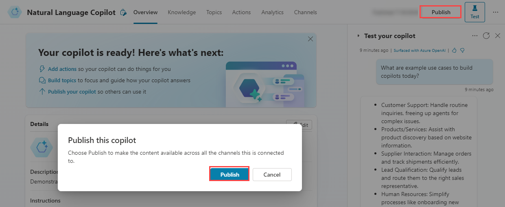
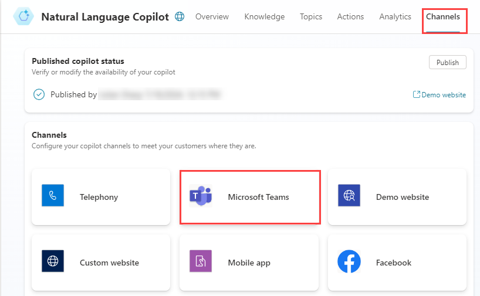
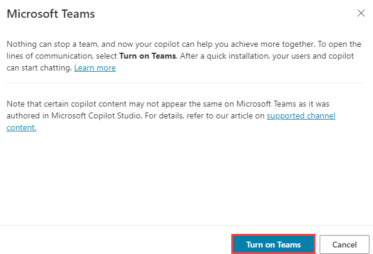
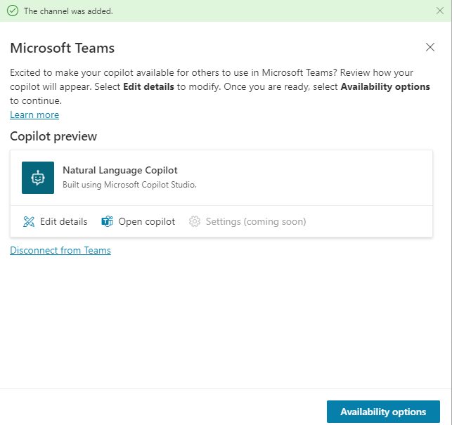

---
lab:
    title: 'Deploy copilot to Microsoft Teams'
    module: 'Create a copilot with Microsoft Copilot Studio and Dataverse for Teams'
---

# Deploy copilot to Microsoft Teams

## Scenario

In this lab, you will:

- Create copilot actions

## What you will learn

- How to deploy a copilot to Microsoft Teams

## High-level lab steps

- Publish
- Deploy copilot to Microsoft Teams
  
## Prerequisites

- Must have completed **Lab: Use Generative AI in Microsoft Copilot Studio**

## Detailed steps

## Exercise 1 - Publish the copilot

### Task 1.1 - Publish the latest content

1. Navigate to the Microsoft Copilot Studio portal `https://copilotstudio.microsoft.com` and ensure you are in the appropriate environment.

1. Select **Copilots** from the left navigation pane.

1. Select the copilot you created in the earlier lab.

1. Select **Publish** and select **Publish** again.

   

   > [!NOTE]
   > Publishing can take a few minutes.

## Exercise 2 - Channels

With your copilot published, you can make your copilot available to users in Teams. This way you, your teammates, and your broader organization can interact with it.

### Task 2.1 - Microsoft Teams channel

1. With your Copilot open in Microsoft Copilot Studio, select the **Channels** tab.

    

1. Select the **Microsoft Teams** tile.

    

1. Select **Turn on Teams**.

    

1. Select **Availability options**.

    

1. Selecy **Copy link**.

1. Select **Show to my teammates and shared users**.

1. Select your user.

1. Select **Share**.

1. Select **Share**.

### Task 2.2 - Microsoft Teams

1. Navigate to the Microsoft Teams `https://teams.microsoft.com` in a browser.

1. Sign in to Teams if prompted.

1. Select **Teams** in the left-hand rail.

1. There should be a team named **Contoso** with a **General** channel.

1. Navigate to the URL link copied in the previous task.

1. Select **Cancel** for *This site is try to open in Microsoft Teams**.

1. Select **Use te web app instead**.

    

1. Select **Add**.

    
