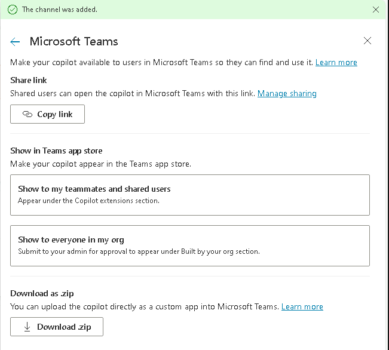
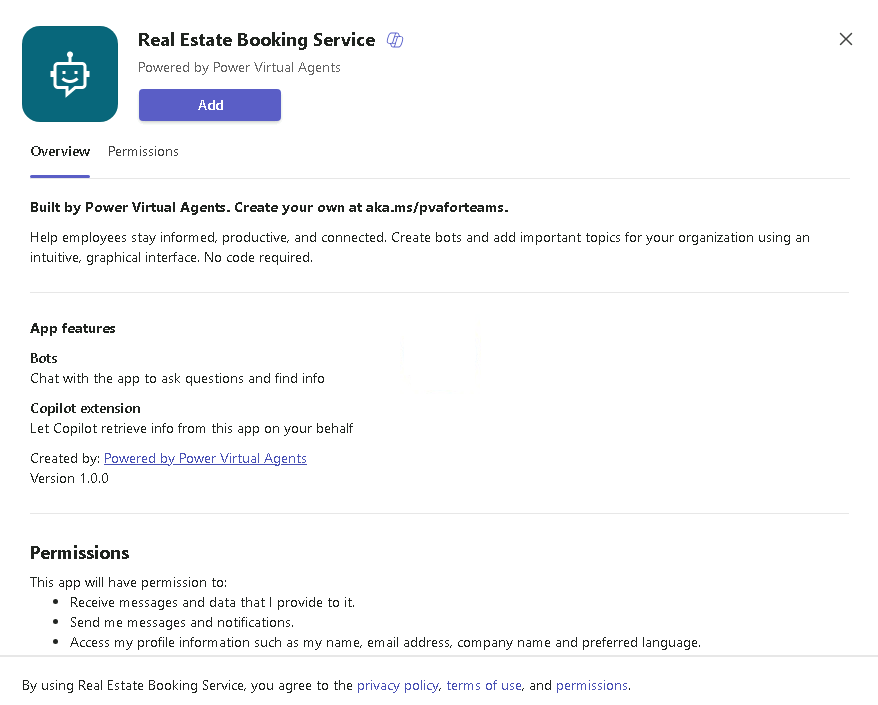
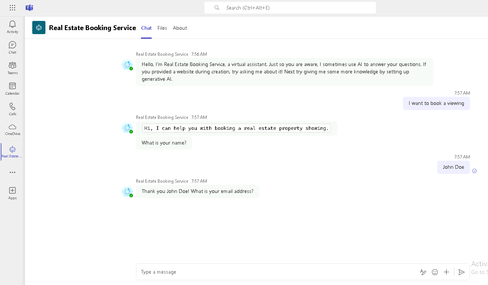

---
lab:
    title: 'Deploy agent to Microsoft Teams'
    module: 'Create an agent with Microsoft Copilot Studio and Dataverse for Teams'
---

# Deploy agent to Microsoft Teams

## Scenario

In this exercise, you will:

- Deploy an agent to the Microsoft Teams channel

This exercise will take approximately **10** minutes to complete.

## What you will learn

- How to deploy an agent to Microsoft Teams

## High-level lab steps

- Publish
- Deploy agent to Microsoft Teams
  
## Prerequisites

- Must have completed **Lab: Use Generative AI in Microsoft Copilot Studio**

## Detailed steps

## Exercise 1 - Publish the agent

### Task 1.1 - Publish the latest content

1. Navigate to the Microsoft Copilot Studio portal `https://copilotstudio.microsoft.com` and ensure you are in the appropriate environment.

1. Select **Agents** from the left navigation pane.

1. Select the agent you created in the earlier lab.

1. Select **Publish** and select **Publish** again.
   > **Note:**
   > Publishing can take a few minutes.

## Exercise 2 - Channels

With your agent published, you can make your agent available to users in Teams. This way you, your teammates, and your broader organization can interact with it.

### Task 2.1 - Microsoft Teams channel

1. With your agent open in Microsoft Copilot Studio, select the **Channels** tab.

1. Select the **Teams and Microsoft 365 Copilot** tile.

1. Select **Add channel**.

1. Select **Availability options**.

    

1. Select **See agent in Teams**

1. Select **Cancel** in the dialog box for **This site is trying to open Microsoft Teams**.

1. In the pop-up, select **Cancel** and select **Use the web app instead**.

1. Select **Add** to add the agent to Teams.

    

1. Select **Open**.

1. Test the agent.

    
