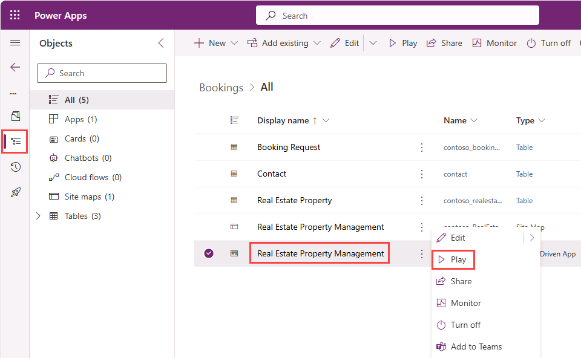

---
lab:
    title: 'Lab 0: Validate lab environment'
    module: 'Module 0: Course Introduction'
---

# Validate lab environment

In this exercise, you’ll use Copilot Studio to create a simple copilot that can answer employee questions about expense policies in a fictional corporation.

This exercise will take approximately **45** minutes to complete.

> **Note**: This exercise assumes you already have a Copilot Studio license or have signed up for a [free trial](https://go.microsoft.com/fwlink/p/?linkid=2252605).

## Exercise 1 – Import solution

In this exercise, you will import a Dataverse solution containing the tables used in the labs into the **Dev One** environment.

### Task 1.1 – Sign in to Power Apps

1. In a new browser tab, navigate to `https://make.powerapps.com`.

1. If prompted for credentials, sign in with the `email address` and `password` provided by the Authorized Lab Host.

1. If prompted for contact information, leave the Country/region as the default value and enter `0123456789` for Phone number and select **Submit**.

1. In the upper-right of the screen, verify that the **Environment** is set to **Dev One**. This is where you will be working for the entirety of this lab. If it is not, select the **Dev One** environment.

    

### Task 1.2 – Download solution

1. Download [**Bookings_1_0_0_0.zip**](../../Allfiles/Bookings_1_0_0_0.zip) from GitHub.

### Task 1.3 – Import solution

1. Navigate to `https://make.powerapps.com`.

1. Make sure you are in the **Dev One** environment.

1. Select **Solutions**.

1. Select **Import solution**.

1. Select **Browse** and locate the **Bookings_1_0_0_0.zip** file and select **Open**.

    

1. Select **Next**.

1. Select **Import**.

    The solution will import in the background. This may take a few minutes.

    

    > **Alert:** Wait until the solution has finished importing before continuing to the next step.

1. When the solution has imported successfully, open the **Bookings** solution.

1. In the solution, select the **Overview** page.

    

1. Select **Publish all customizations**.

### Task 1.4 – Test data

1. In the solution, select the **Objects** page.

1. Select the **ellipsis …** menu for the **Real Estate Property Management** model-driven app, and select **Play**.

    

1. Select **+ New**.

1. Enter the following data:

    - Property Name: `1100 High Villas`
    - Asking Price: `250,000`
    - Street: `Main Avenue`
    - City: `Redmond`
    - Bedrooms: `3`
    - Bathrooms: `2`

    

1. Select **Save & Close**.

1. Select **+ New**.

1. Enter the following data:

    - Property Name: `555 Oak Lane`
    - Asking Price: `300,000`
    - Street: `Oak Lane`
    - City: `Denver`
    - Bedrooms: `4`
    - Bathrooms: `3`

    

1. Select **Save & Close**.
