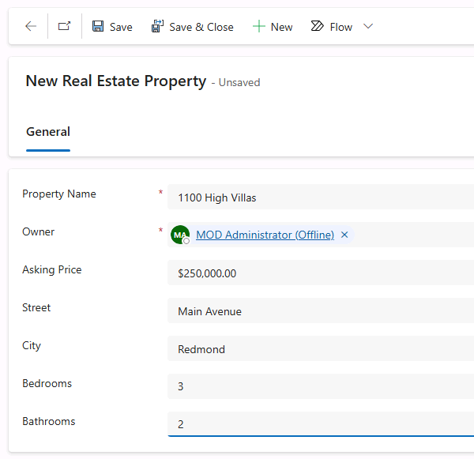

---
lab:
    title: 'Lab 0: Validate lab environment'
    module: 'Module 0: Course Introduction'
---

# Practice Lab 0 - Validate lab environment

> **IMPORTANT:** This lab provides you with a Microsoft 365 tenant and licenses for the Power Platform applications you will be using in this course. You will only be provided with one tenant for the practice labs in this course. The settings and actions you take within this tenant do not roll-back or reset, whereas the virtual machine you are provided with does reset each time you close the lab session. Please be aware that Microsoft 365 and Power Platform are evolving all the time. The instructions in this document may be different from what you experience in your actual tenant. It is also possible to experience a delay of several minutes before the virtual machine has network connectivity to begin the labs.

## WWL Tenants - Terms of Use

If you are being provided with a tenant as a part of an instructor-led training delivery, please note that the tenant is made available for the purpose of supporting the hands-on labs in the instructor-led training.

Tenants should not be shared or used for purposes outside of hands-on labs. The tenant used in this course is a trial tenant and cannot be used or accessed after the class is over and are not eligible for extension.

Tenants must not be converted to a paid subscription. Tenants obtained as a part of this course remain the property of Microsoft Corporation and we reserve the right to obtain access and repossess at any time.

## Exercise 1 – Access Microsoft Copilot Studio

In this exercise, you will verify that you can access Microsoft Copilot Studio.

### Task 1.1 – Sign in to Microsoft Copilot Studio and start a trial

1. Verify that you have your **Microsoft 365 credentials** from the Authorized Lab Host available. The credentials will be in the **Resources** tab.

1. In a new browser tab, navigate to `https://copilotstudio.microsoft.com`.

1. Enter the `email address` provided by the Authorized Lab Host.

1. Select **Next**.

1. Enter the `password` provided by the Authorized Lab Host.

1. Select **Sign in**.

1. Optionally, select **Yes** to stay signed in.

1. In the **Welcome to Copilot Studio** popup, leave the country/region as the default value and select **Start free trial**.

    

1. In the upper-right of the screen, verify that the **Environment** is set to **Dev One**. This is where you will be working for the entirety of this lab. If it is not, select the **Dev One** environment.

    

1. At the **Welcome to Copilot Studio!** popup, select **Skip**.

## Exercise 2 – Import solution

In this exercise, you will import a Dataverse solution containing the tables used in the labs into the **Dev One** environment.

### Task 2.1 – Sign in to Power Apps

1. In a new browser tab, navigate to `https://make.powerapps.com`.

1. If prompted for credentials, sign in with the `email address` and `password` provided by the Authorized Lab Host.

1. If prompted for contact information, leave the Country/region as the default value and enter `0123456789` for Phone number and select **Submit**.

1. In the upper-right of the screen, verify that the **Environment** is set to **Dev One**. This is where you will be working for the entirety of this lab. If it is not, select the **Dev One** environment.

    

### Task 2.2 – Download solution

1. Download [**Bookings_1_0_0_0.zip**](../../Allfiles/Bookings_1_0_0_0.zip) from GitHub.

### Task 2.3 – Import solution

1. Navigate to `https://make.powerapps.com`.

1. Make sure you are in the **Dev One** environment.

1. Select **Solutions**.

1. Select **Import solution**.

1. Select **Browse** and locate the **Bookings_1_0_0_0.zip** file and select **Open**.

    

1. Select **Next**.

1. Select **Import**.

    The solution will import in the background. This may take a few minutes.

    

    > **Alert:** Wait until the solution has finished importing before continuing to the next step.

1. When the solution has imported successfully, open the **Bookings** solution.

1. In the solution, select the **Overview** page.

    

1. Select **Publish all customizations**.

### Task 2.4 – Test data

1. In the solution, select the **Objects** page.

1. Select the **ellipsis …** menu for the **Real Estate Property Management** model-driven app, and select **Play**.

    

1. Select **+ New**.

1. Enter the following data:

    - Property Name: `1100 High Villas`
    - Asking Price: `250,000`
    - Street: `Main Avenue`
    - City: `Redmond`
    - Bedrooms: `3`
    - Bathrooms: `2`

    

1. Select **Save & Close**.

1. Select **+ New**.

1. Enter the following data:

    - Property Name: `555 Oak Lane`
    - Asking Price: `300,000`
    - Street: `Oak Lane`
    - City: `Denver`
    - Bedrooms: `4`
    - Bathrooms: `3`

    

1. Select **Save & Close**.
