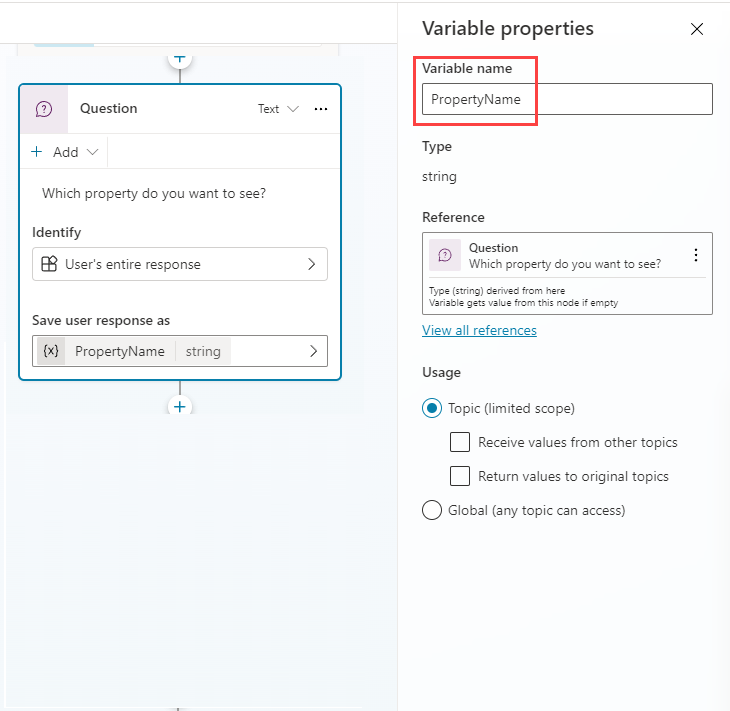

---
lab:
    title: 'Lab 3: Nodes'
    module: 'Module 3: Work with entities and variables in Microsoft Copilot Studio'
---

# Practice Lab 3 - Nodes

## Scenario

In this lab, you will:

- Author the conversational flow

## What you will learn

- How to add nodes to a topic to author the conversational flow

## High-level lab steps

- Configure variable scope
- Create and edit nodes
  
## Prerequisites

- Must have completed **Lab 2: Topics**

## Detailed steps

## Exercise 1 - Variable scope

Variables can be accessed by other topics.

### Task 1.1 - Configure the scope of the variables

1. Navigate to the Microsoft Copilot Studio portal `https://copilotstudio.microsoft.com` and ensure you are in the **Dev One** environment.

1. Select the **Test** button in the upper-right of the screen to close the testing panel if the panel is open.

1. Select **Copilots** from the left navigation pane.

1. Select the copilot you created in the earlier lab.

1. Select the **Topics** tab.

1. Select the **Customer Details** topic.

1. Select the **Variables** icon to open the Variables pane.

    

1. Select the right-hand check boxes for the three topic variables.

1. Select **Save**.

## Exercise 2 - Author topics manually

The conversational flow in a topics can be created manually by adding nodes.

### Task 2.1 - Add a message node

1. Select the **Topics** tab.

1. Select the **Book a Real Estate Showing** topic.

1. Select the the **+** icon under the Trigger node and select **Send a message**.

    

1. In the **Enter a message** field, enter the following text:

    `Hi, I can help you with booking a real estate property showing.`

1. Select **Save**.

### Task 2.2 - Add a Topic management node

1. Select the the **+** icon under the send a message node and select **Add a condition**.

1. Select the **DetailsCorrect** variable.

1. Select **Go to another topic** and select the **Customer Details** topic.

    

1. Select **Save**.

### Task 2.3 - Add condition node

1. Select the the **+** icon under the topic management node and select **Add a condition**.

1. In the **Enter a message** field, enter the following text:

    `Which property do you want to see?`

1. Select **DetailsCorrect** for variable.

1. Select **is equal to**

1. Select **Yes**.

    

1. Select **Save**.

### Task 2.4 - Add question nodes

1. Select the the **+** icon under the left-hand condition node and select **Ask a question**.

1. In the **Enter a message** field, enter the following text:

    `Which property do you want to see?`

1. Select **User's entire response** for **Identify**.

1. Select the variable in **Save user response as** and enter **`PropertyName`** for **Variable name**

    

1. Select **Save**.

1. Select the the **+** icon under the question node and select **Ask a question**.

1. In the **Enter a message** field, enter the following text:

    `What date and time do you want to see the property?`

1. Select **Date and Time** for **Identify**.

1. Select the variable in **Save user response as** and enter **`DateTime`** for **Variable name**

1. Select **Save**.

### Task 2.5 - Test the copilot

1. Select the **Test** button in the upper-right of the screen to open the testing panel.

1. Select the **three dots** at the top of the testing panel in the upper-right of the screen.

    

1. Select **Track between topics**.

1. Select the **Start a new conversation** icon at the top of the testing panel.

1. When the **Conversation Start** message appears, your copilot will start a conversation. In response, enter a trigger phrase for the topic that you've created:

    `I want to book a real estate showing`

1. The copilot responds with the "What is your name?" question, as shown in the following image.

    

1. Enter the following information:

    ```
    Name: <Your name>
    Email address: <Your email address>
    ```

1. After you supply the information, an Adaptive Card displays the information that you entered, a question asking if the information is correct, and options to select **Yes** or **No**.

1. Select **Yes**.

1. Enter `555 Oak Lane, Denver, CO 80203` to the **Which property to you want to see?** prompt

1. Enter `Tomorrow 10:00 AM` to the **What date and time do you want to see the property?** prompt.

    

## Exercise 3 - Deploy copilot

### Task 3.1 - Configure Authentication

1. Select **Settings** in the upper-right of the screen.

1. Select the **Security** tab.

1. Select the **Authentication** tile.

    

1. Select **No authentication**.

1. Select **Save**.

1. Select **Save**.

1. Select **Close**.

1. **Close** the security pane.

### Task 3.2 - Publish the copilot

1. Select **Publish** and select **Publish** again.

### Task 3.3 - Demo Website

1. Select the **three dots** next to the **Settings** button in the upper-right of the screen and select **Go to demo website**.

1. In the **Type your message** text box, enter **`I want to view a property`**.

1. Answer the prompts to test the copilot.
