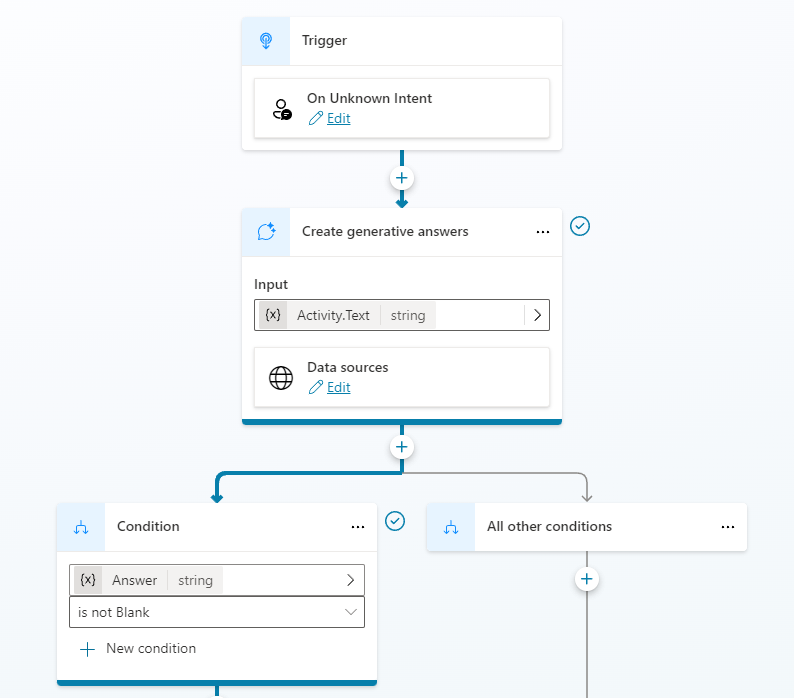

---
lab:
    title: 'Use Generative AI in Microsoft Copilot Studio'
    module: 'Enhance Microsoft Copilot Studio copilots'
---

# Use Generative AI in Microsoft Copilot Studio

## Scenario

In this lab, you will:

- Create copilot actions

## What you will learn

- How to use the Generative answers feature to improve your copilot's responses.

## High-level lab steps

- Enable Generative AI
- Add knowledge
  
## Prerequisites

- Must have completed **Lab: Copilot actions**

## Detailed steps

## Exercise 1 - Configure Generative AI

### Task 1.1 - Enable Generative AI

1. Navigate to the Microsoft Copilot Studio portal `https://copilotstudio.microsoft.com` and ensure you are in the **Dev One** environment.

1. Select the **Test** button in the upper-right of the screen to close the testing panel if the panel is open.

1. Select **Copilots** from the left navigation pane.

1. Select the copilot you created in the earlier lab.

1. Select **Settings** in the upper-right of the screen.

1. Select the **Generative AI** tab.

    

1. Select **Generative** under **How should your copilot decide how to respond**.

1. Select **Medium** for **Copilot content moderation**.

1. Select **Save**.

1. Close the **Settings** pane.

### Task 1.2 - Use generative answers in the Conversational boosting topic

1. Select the **Topics** tab and select **System**.

1. Select the **Conversational boosting** topic.

    

1. Review the **Create generative answers** node.

### Task 1.3 - Enable knowledge

1. Select the **Overview** tab.

1. Verify that general knowledge is enabled.

    

1. You should see the public website added as knowledge in Lab 1.

### Task 1.4 - Configure Authentication

1. Select **Settings** in the upper-right of the screen.

1. Select the **Security** tab.

1. Select the **Authentication** tile.

1. Select **Microsoft Entra ID authentication in Teams and Power Apps**.

1. Select **Save**.

1. Select **Save**.

1. Select **Close**.

1. **Close** the security pane.

1. Select **Publish** and select **Publish** again.

## Exercise 2 - Add knowledge

### Task 2.1 - Add knowledge from Dataverse

1. Select the **Knowledge** tab.

1. Select **+ Add knowledge**.

1. Select **Dataverse**.

1. Select the **Real Estate Property** table

    

1. Select **Next**.

1. Select **Next**.

1. Select **Add**.

### Task 2.2 - Add knowledge from files

1. Download this [Microsoft case study](https://download.microsoft.com/documents/customerevidence/Files/4000007499/SummitRealtyCaseStudy.docx) or [**SummitRealtyCaseStudy.docx**](../../Allfiles/SummitRealtyCaseStudy.docx) from GitHub.

1. Select **+ Add knowledge**.

1. Select **Files**.

1. Browse and select the case study that you downloaded.

    

1. Select **Add**.

    

## Exercise 3 - Configure Fallback topic

### Task 3.1 - Use generative answers in System fallback topic

1. Select the **Topics** tab and select **System**.

1. Select the **Fallback** topic.

    

1. Select the **three dots** in the message node and select **Delete**.

1. Select the the **+** icon under the Condition node, select **Advanced**, and select **Generative answers**.

1. Select **Activity.Text** for the **Input** field.

1. Select **Edit** under **Data sources**.

    

1. Select **Search only selected sources**.

1. Select the **Real Estate Property** Dataverse table.

1. Deselect **Allow the AI to use its own general knowledge**.

1. Select **Medium** for **Content moderation**.

    

1. Select **Save**.

## Exercise 4 - Test Generative AI

### Task 4.1 Test the copilot's knowledge

1. Select the **Test** button in the upper-right of the screen to open the testing panel.

1. Select the **Conversation map** icon at the top of the testing panel in the upper-right of the screen.

    

1. Select **On**..

1. Select the **Start a new conversation** icon at the top of the testing panel.

1. Explore the copilot and see how it uses the knowledge sources.
